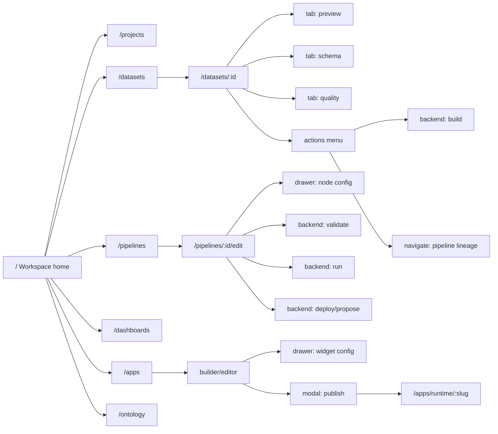

# OpenFoundry Frontend UI Flow Blueprint

This document defines a functional product map, inspired by local Foundry screenshots and grounded on the current `apps/web` frontend. The intent is not to copy screen by screen without judgment, but to build a navigable specification that allows us to code the frontend and then connect each button, modal, drawer, and action to the backend.

## Scope

Sources analyzed:

- Local screenshots in `docs_original_palantir_foundry/foundry-docs`:
  - 7750 images found.
  - Screenshots showing actual product UI were prioritized over purely documentary pages.
- Current router: `apps/web/src/router.tsx`.
- Main components: `AppShell`, `Sidebar`, `Topbar`, `Tabs`, dashboards, datasets, pipelines, ontology, apps, projects, workspace, data connection, builds, workflows, and settings.
- Current APIs in `apps/web/src/lib/api`, especially `datasets.ts`, `pipelines.ts`, `ontology.ts`, `apps.ts`, `workspace.ts`, `data-connection.ts`, `workflows.ts`, `notebooks.ts`, and `notepad.ts`.

Artifacts generated alongside this document:

- `docs/frontend-ui-flow-map.mmd`: Mermaid graph of product flows.
- `docs/frontend-interaction-matrix.json`: structured matrix of screens, interactions, and frontend-backend contracts.

## Reading The Screenshots

The relevant Foundry screenshots show several consistent patterns:

| Reference | Use in blueprint | Applicable observations |
|---|---|---|
| `docs_original_palantir_foundry/foundry-docs/Analytics/Analytical results/Dashboards_assets/img_001.png` | Dashboard runtime | Side panel of parameters, override bar, chart cards in a grid, filters that affect multiple boards. |
| `docs_original_palantir_foundry/foundry-docs/Analytics/Analytical results/Dashboards_assets/img_002.png` | Dashboard editor | Three zones: palette/list on the left, editable central canvas, inspector on the right. Actions: add tab, add section, add text, preview, publish. |
| `docs_original_palantir_foundry/foundry-docs/Data connectivity & integration/Applications/Dataset Preview/Overview_assets/img_001.png` | Dataset detail | Top breadcrumb, sticky tabs, metadata panel on the left, dominant table, SQL preview / analyze / explore pipeline / build actions. |
| `docs_original_palantir_foundry/foundry-docs/Data connectivity & integration/Workflows/Building pipelines/Getting started/Create a dataset batch pipeline with Pipeline Builder_assets/img_001.png` | Pipeline builder | Dark sidebar, dense top toolbar, Edit/Proposals/History tabs, large canvas, connected nodes, targets drawer, save/propose/deploy. |
| `docs_original_palantir_foundry/foundry-docs/Use case development/Application building/Workshop/Used colors_assets/img_001.png` | Workshop/app builder | Visual editor with side panel, section toolbar, central canvas, widgets, version/autosave state, preview/publish. |
| `docs_original_palantir_foundry/foundry-docs/Security & governance/Applications/Compass/Data Catalog_assets/img_001.png` | Projects/data catalog | Navigation across portfolios, projects, files, shared, New button, request data, and resource table/list. |
| `docs_original_palantir_foundry/foundry-docs/Security & governance/Applications/Compass/Use Project navigation panel_assets/img_001.png` | Project detail | Side navigation within a project: cover page, files, autosaved, references, trash, usage, access graph. |

Product rules extracted:

- The global shell must be permanent: sidebar, topbar, breadcrumbs, branch, build status, and global actions.
- First-level navigation leads to galleries or listings: projects, datasets, pipelines, apps, ontology, dashboards.
- Details use tabs for sub-views: preview/schema/files/history/quality, edit/proposals/history, overview/resources/memberships.
- Complex configuration actions open in a modal or drawer, not on new pages.
- Mutating actions must have `idle`, `loading`, `success`, `error`, `empty`, and `permission_denied` states.
- The UI must anticipate permissions, branches, audit, and async states from the design stage.

## "Functional Figma" Mental Model

The blueprint uses this hierarchy:

| Level | Name | Example | Expected implementation |
|---|---|---|---|
| L0 | Shell | Sidebar, topbar, branch, command/search | `AppShell`, `Sidebar`, `Topbar`, future command palette |
| L1 | Gallery/listing | `/datasets`, `/pipelines`, `/apps`, `/projects` | Resource table, filters, bulk actions |
| L2 | Detail | `/datasets/:id`, `/projects/:projectId`, `/dashboards/:id` | Detail page layout with tabs and side panel |
| L3 | Sub-view | Preview, schema, files, runs, config | `TabbedWorkspace` |
| L4 | Overlay | create modal, inspector drawer, actions popover | `Modal`, `Drawer`, `ContextMenu`, `InspectorPanel` |
| L5 | Backend action | save, run, publish, validate, share | Mutation hook with audit, permissions, and feedback |

## Screen Inventory

Status:

- Exists: route and view present.
- Partial: route exists but lacks Foundry-like structure, overlays, or full contract.
- Missing: should exist as a screen/sub-screen to close the flow.

The actual frontend has 88 routes (verified by reading `apps/web/src/router.tsx`). The inventory below covers all 88, with stable ID, exact route, area, reference screenshot when applicable, main components (those already present in `apps/web/src/lib/components/**` or `apps/web/src/routes/**` are marked with `~`; those still to be created are marked `(target)`), status, and priority.

Status:

- Exists: route and view present and functional.
- Partial: route exists but lacks Foundry-like structure, overlays, a full contract, or the parent shell does not enforce consistent patterns (sticky header, tabs, breadcrumbs, contextual save/share, action registry).
- Missing: should exist as a screen/sub-screen to close the flow.

Important note about reusable components: a shared `ResourceTable` component does NOT exist today. The tables for `datasets`, `pipelines`, `apps`, `projects`, `data-connection`, `ontology`, `marketplace`, `streaming`, etc. are implemented locally, generally using ad-hoc markup or utilities from `lib/components/ui/`. The blueprint assumes a future `ResourceTable` that has been extracted and normalized; while it does not exist, the "Main components" column notes it as `(target)`.

| ID | Screen | Current route | Area | Visual reference | Main components | Status | Priority |
|---|---|---|---|---|---|---|---|
| HOME-001 | Workspace home | `/` | core | Compass/Data Catalog | `AppShell` ~, `Sidebar` ~, `Topbar` ~, `ResourceTable (target)`, `ActivityPanel (target)`, `QuickActions (target)` | Partial | P0 |
| SEARCH-001 | Global search page | `/search` | core | Compass Quicksearch | `SearchPage` ~, `CommandPalette (target)`, `SearchResults (target)`, `ObjectCard (target)` | Partial | P0 |
| AUTH-001 | Auth login | `/auth/login` | security | identity docs | `AuthLayout` ~, `LoginPage` ~ | Exists | P0 |
| AUTH-002 | Auth register | `/auth/register` | security | identity docs | `RegisterPage` ~ | Exists | P1 |
| AUTH-003 | Auth MFA | `/auth/mfa` | security | MFA docs | `MfaPage` ~ | Exists | P0 |
| AUTH-004 | Auth callback | `/auth/callback` | security | SSO callback | `CallbackPage` ~ | Exists | P1 |
| PROJECT-001 | Projects gallery | `/projects` | projects | Compass Data Catalog | `ProjectsListPage` ~, `Tabs` ~, `CreateProjectModal (target)` | Partial | P0 |
| PROJECT-002 | Project detail | `/projects/:projectId` | projects | Compass project nav | `ProjectDetailPage` ~, `FolderTree` ~, `ResourceDetailsPanel` ~, `ShareDialog` ~, `ResourcePermissionsDrawer` ~ | Exists | P0 |
| PROJECT-003 | Folder detail | `/projects/:projectId/:folderId` | projects | Compass files | `ProjectFolderPage` ~, `BulkActionsToolbar (target)` | Exists | P1 |
| PROJECT-004 | Resource permissions drawer | overlay | projects/security | Checking permissions | `Drawer` ~, `PrincipalPicker` ~, `AccessGraph` ~, `ResourcePermissionsDrawer` ~ | Exists | P0 |
| DATASET-001 | Datasets catalog | `/datasets` | datasets | Dataset Preview, Data Catalog | `DatasetsListPage` ~, `Facets (target)`, `UploadModal (target)` | Exists | P0 |
| DATASET-002 | Dataset detail | `/datasets/:id` | datasets | Dataset Preview | `DatasetDetailPage` ~, `Tabs` ~, `VirtualizedPreviewTable` ~, `MetadataPanel (target)` | Exists | P0 |
| DATASET-003 | Dataset upload | `/datasets/upload` | datasets | Compass manual upload | `DatasetUploadPage` ~, `FileUpload (target)`, `SchemaInferencePanel (target)` | Exists | P1 |
| DATASET-004 | Dataset branches | `/datasets/:id/branches` | datasets/branching | Global branching | `DatasetBranchesPage` ~, `BranchGraph (target)`, `CreateBranchDialog (target)` | Exists | P1 |
| DATASET-005 | Dataset branch detail | `/datasets/:id/branches/:branch` | datasets/branching | Global branching | `DatasetBranchDetailPage` ~, `CompareTab (target)` | Exists | P2 |
| DATASET-006 | Quality rules drawer | overlay on dataset detail | datasets/quality | Dashboard params/details | `QualityDashboard (target)`, `RuleEditorDrawer (target)` | Partial | P1 |
| PIPE-001 | Pipelines gallery | `/pipelines` | pipelines | Pipeline Builder | `PipelinesPage` ~, `CreatePipelineModal (target)`, `RunHistory (target)` | Exists | P0 |
| PIPE-002 | Pipeline create | `/pipelines/new` | pipelines | Pipeline Builder setup | `PipelineNewPage` ~, `BuildSettings (target)`, `ScheduleConfig (target)` | Exists | P0 |
| PIPE-003 | Pipeline builder | `/pipelines/:id/edit` | pipelines | Pipeline Builder | `PipelineEditPage` ~, `PipelineCanvas` ~, `NodeConfig` ~, `NodePreviewPanel (target)` | Partial | P0 |
| PIPE-004 | Node inspector drawer | overlay on builder | pipelines | Pipeline Builder node detail | `Drawer (target)`, `NodeConfig` ~, `TransformEditor (target)` | Partial | P0 |
| PIPE-005 | Pipeline run detail | overlay/tab on `/pipelines/:id/edit` + `/pipelines/:id/runs/:runId` | pipelines/builds | Build detail/logs | `RunLogs` ~, `LiveLogViewer` ~, `LineageView` ~, `PipelineRunDetailDrawer` ~ | Exists | P1 |
| SCHED-001 | Schedule detail | `/schedules/:rid` | operations | schedule management | `ScheduleDetailPage` ~ | Exists | P1 |
| SCHED-002 | Build schedules | `/build-schedules` | operations | schedule management | `BuildSchedulesPage` ~, `ScheduleConfig (target)`, `ScheduleDiff (target)` | Exists | P1 |
| SCHED-003 | Sweep page | `/build-schedules/sweep` | operations | schedule sweep | `SweepPage` ~ | Exists | P2 |
| BUILD-001 | Builds list | `/builds` | operations | Pipeline run history | `BuildsPage` ~, `StateBadge (target)`, `AbortAction (target)` | Exists | P1 |
| BUILD-002 | Build detail | `/builds/:rid` | operations | run logs | `BuildDetailPage` ~, `RunLogs` ~, `ArtifactsPanel (target)` | Exists | P1 |
| DASH-001 | Dashboard gallery | `/dashboards` | analytics | Dashboard editor left list | `DashboardsListPage` ~, `CreateDashboardModal (target)`, `TemplateGallery (target)` | Exists | P0 |
| DASH-002 | Dashboard runtime/editor | `/dashboards/:id` | analytics | Dashboard runtime/editor | `DashboardDetailPage` ~, `DashboardGrid` ~, `WidgetConfig` ~, `FilterBar (target)` | Partial | P0 |
| DASH-003 | Widget config drawer | overlay on dashboard | analytics | Editor right inspector | `WidgetConfig` ~, `QueryPicker (target)`, `ChartSettings (target)` | Partial | P0 |
| NOTEBOOK-001 | Notebooks gallery | `/notebooks` | developer | JupyterLab/code workspaces | `NotebooksListPage` ~, `KernelSelector (target)`, `WorkspaceFiles (target)` | Exists | P2 |
| NOTEBOOK-002 | Notebook detail | `/notebooks/:id` | developer | JupyterLab/code workspaces | `NotebookDetailPage` ~, `CellEditor (target)`, `CellOutput (target)` | Exists | P2 |
| NOTEPAD-001 | Notepad gallery | `/notepad` | docs/analysis | Notepad doc editor | `NotepadListPage` ~, `Presence (target)` | Exists | P2 |
| NOTEPAD-002 | Notepad editor | `/notepad/:id` | docs/analysis | Notepad document editor | `NotepadDetailPage` ~, `MonacoEditor` ~, `WidgetEmbeds (target)` | Exists | P2 |
| APP-001 | Apps/Workshop gallery+builder | `/apps` (`?selected=:id`) | apps | Workshop, Developer Console | `AppsPage` ~, `AppPagesEditor` ~, `WidgetCatalog (target)`, `ThemePanel (target)` | Partial | P0 |
| APP-002 | App runtime | `/apps/runtime/:slug` | apps | Workshop preview | `AppRuntimePage` ~, `AppRenderer` ~, `AppWidgetRenderer (target)` | Exists | P1 |
| APP-003 | Publish app modal | overlay | apps | Workshop publish | `Modal (target)`, `VersionNotes (target)`, `PermissionSummary (target)` | Partial | P0 |
| DATA-CONN-001 | Data connection home | `/data-connection` | connectivity | Data source/product admin | `DataConnectionPage` ~, `RemoteCatalogBrowser` ~, `AutoRegistrationCard (target)` | Exists | P0 |
| DATA-CONN-002 | New source wizard | `/data-connection/new` | connectivity | connector wizard | `NewSourcePage` ~, `CredentialsPanel (target)`, `TestConnection (target)` | Exists | P0 |
| DATA-CONN-003 | New streaming source | `/data-connection/new/streaming` | connectivity | streaming connector | `NewStreamingSourcePage` ~ | Exists | P1 |
| DATA-CONN-004 | Source detail | `/data-connection/sources/:id` | connectivity | source detail | `SourceDetailPage` ~, `VirtualTablesTab (target)`, `BulkRegisterDialog (target)` | Exists | P1 |
| DATA-CONN-005 | Agents | `/data-connection/agents` | connectivity | agent runtime | `AgentsPage` ~ | Exists | P2 |
| DATA-CONN-006 | Egress policies | `/data-connection/egress-policies` | connectivity | egress | `EgressPoliciesPage` ~ | Exists | P1 |
| ONT-001 | Ontology home | `/ontology` | ontology | Object table/Object explorer | `OntologyHomePage` ~, `OntologySearch` ~, `ObjectExplorer` ~ | Exists | P0 |
| ONT-002 | Object type create/list | `/ontology/types` | ontology | Ontology manager | `CreateObjectTypePage` ~, `TypeEditor (target)` | Exists | P0 |
| ONT-003 | Object type detail | `/ontology/:id` | ontology | Object Table | `ObjectTypeDetailPage` ~, `ObjectExplorer` ~, `PropertyPanel (target)`, `ActionsButtonGroup (target)` | Exists | P0 |
| ONT-004 | Ontology graph | `/ontology/graph` | ontology | graph/cytoscape | `OntologyGraphPage` ~, `CytoscapeCanvas` ~ | Exists | P1 |
| ONT-005 | Object sets | `/ontology/object-sets` | ontology | Object sets docs | `ObjectSetsPage` ~, `ObjectSetFilterBuilder (target)` | Exists | P1 |
| ONT-006 | Object detail drawer | overlay | ontology | Object table side panel | `ObjectDetailDrawer`, `Drawer`, `ObjectCard`, `ActionExecutor`, `InlineEditCell`, `ObjectTimeline` | Exists | P0 |
| ONT-007 | Ontology design | `/ontology-design` | ontology-admin | Ontology design | `OntologyDesignPage` ~ | Exists | P1 |
| ONT-008 | Ontology indexing | `/ontology-indexing` | ontology-admin | Indexing | `OntologyIndexingPage` ~ | Exists | P2 |
| ONT-009 | Ontologies registry | `/ontologies` | ontology-admin | multi-ontology | `OntologiesPage` ~ | Exists | P1 |
| ONT-010 | Object explorer (legacy/global) | `/object-explorer` | ontology | Object explorer | `ObjectExplorerPage` ~ | Exists | P1 |
| ONT-011 | Object views | `/object-views` | ontology | Object views | `ObjectViewsPage` ~ | Exists | P2 |
| ONT-012 | Object monitors | `/object-monitors` | ontology/automation | Monitors | `ObjectMonitorsPage` ~ | Exists | P2 |
| ONT-013 | Object link types | `/object-link-types` | ontology | Link types | `ObjectLinkTypesPage` ~ | Exists | P2 |
| ONT-014 | Object databases | `/object-databases` | ontology | OSv2 databases | `ObjectDatabasesPage` ~ | Exists | P2 |
| ONT-015 | Action types | `/action-types` | ontology | Action types | `ActionTypesPage` ~ | Exists | P1 |
| ONT-016 | Functions | `/functions` | ontology/dev | Foundry functions | `FunctionsPage` ~ | Exists | P1 |
| ONT-017 | Foundry rules | `/foundry-rules` | ontology/governance | Rules engine | `FoundryRulesPage` ~ | Exists | P2 |
| ONT-018 | Interfaces | `/interfaces` | ontology | Interfaces | `InterfacesPage` ~ | Exists | P1 |
| ONTM-001 | Ontology manager | `/ontology-manager` | ontology-admin | Ontology manager | `OntologyManagerPage` ~ | Exists | P0 |
| ONTM-002 | Bindings wizard | `/ontology-manager/bindings` | ontology-admin | Dataset binding wizard | `BindingsWizardPage` ~, `SchemaMapper (target)` | Exists | P1 |
| LINEAGE-001 | Lineage graph | `/lineage` | data/operations | pipeline lineage | `LineagePage` ~, `LineageView (target)`, `GraphView (target)` | Exists | P1 |
| WF-001 | Workflows | `/workflows` | automation | approvals/workflows | `WorkflowsPage` ~, `WorkflowBuilder (target)`, `ApprovalList (target)` | Exists | P1 |
| AUDIT-001 | Audit | `/audit` | security/governance | Audit | `AuditPage` ~ | Exists | P1 |
| QUERIES-001 | Queries | `/queries` | analytics | Saved queries | `QueriesPage` ~ | Exists | P1 |
| REPORTS-001 | Reports | `/reports` | analytics | Reports | `ReportsPage` ~ | Exists | P2 |
| MARKET-001 | Marketplace | `/marketplace` | product delivery | Marketplace listings | `MarketplacePage` ~, `MarketplaceBrowser (target)` | Exists | P2 |
| MARKET-002 | Marketplace product | `/marketplace/:id` | product delivery | Marketplace product | `MarketplaceProductPage` ~, `ListingDetail (target)`, `InstallDialog (target)` | Exists | P2 |
| STREAM-001 | Streaming list | `/streaming` | streaming | Stream catalogs | `StreamingPage` ~ | Exists | P1 |
| STREAM-002 | Streaming detail | `/streaming/:id` | streaming | Stream detail | `StreamingDetailPage` ~ | Exists | P1 |
| VT-001 | Virtual tables | `/virtual-tables` | connectivity | Virtual tables | `VirtualTablesPage` ~ | Exists | P1 |
| VT-002 | Virtual table detail | `/virtual-tables/:rid` | connectivity | Virtual table detail | `VirtualTableDetailPage` ~ | Exists | P2 |
| ICE-001 | Iceberg tables | `/iceberg-tables` | connectivity | Iceberg tables | `IcebergTablesPage` ~ | Exists | P1 |
| ICE-002 | Iceberg table detail | `/iceberg-tables/:id` | connectivity | Iceberg table detail | `IcebergTableDetailPage` ~ | Exists | P2 |
| MEDIA-001 | Media sets | `/media-sets` | data/media | Media set docs | `MediaSetsPage` ~ | Exists | P2 |
| MEDIA-002 | Media set detail | `/media-sets/:rid` | data/media | Media set detail | `MediaSetDetailPage` ~ | Exists | P2 |
| AI-001 | AI platform overview | `/ai` | ai | AIP overview | `AiPage` ~ | Exists | P1 |
| ML-001 | ML platform | `/ml` | ml | Model Studio | `MlPage` ~ | Exists | P1 |
| FUSION-001 | Fusion | `/fusion` | data fusion | Fusion app | `FusionPage` ~ | Exists | P2 |
| NEXUS-001 | Nexus | `/nexus` | federation | Nexus | `NexusPage` ~ | Exists | P2 |
| CONTOUR-001 | Contour | `/contour` | analytics | Contour | `ContourPage` ~ | Exists | P2 |
| QUIVER-001 | Quiver | `/quiver` | analytics | Quiver | `QuiverPage` ~ | Exists | P2 |
| GEO-001 | Geospatial | `/geospatial` | analytics/geo | Geospatial | `GeospatialPage` ~ | Exists | P2 |
| VERTEX-001 | Vertex | `/vertex` | graph | Vertex | `VertexPage` ~ | Exists | P2 |
| MACH-001 | Machinery | `/machinery` | automation | Machinery | `MachineryPage` ~ | Exists | P2 |
| GBR-001 | Global branching | `/global-branching` | branching | Global branching | `GlobalBranchingPage` ~ | Exists | P1 |
| DSCH-001 | Dynamic scheduling | `/dynamic-scheduling` | operations | Dynamic schedules | `DynamicSchedulingPage` ~ | Exists | P2 |
| DEV-001 | Developers | `/developers` | developer toolchain | Developer Console | `DevelopersPage` ~, `ApiExplorer (target)`, `SdkToolkit (target)` | Exists | P2 |
| DEV-002 | Code repos | `/code-repos` | developer toolchain | Code repositories | `CodeReposPage` ~ | Exists | P1 |
| SETTINGS-001 | Settings | `/settings` | security/admin | security settings | `SettingsPage` ~, `UsersSection (target)`, `RolesSection (target)`, `PoliciesSection (target)`, `ApiKeysSection (target)` | Exists | P0 |
| CTRL-001 | Control panel | `/control-panel` | admin | platform control | `ControlPanelPage` ~ | Exists | P1 |
| CTRL-002 | Streaming profiles | `/control-panel/streaming-profiles` | admin/streaming | streaming profiles | `StreamingProfilesPage` ~ | Exists | P2 |
| CTRL-003 | Data health | `/control-panel/data-health` | observability | Data Health dashboard | `DataHealthPage` ~ | Exists | P1 |
| DEMO-001 | Charts demo | `/charts-demo` | dev/demo | n/a | `ChartsDemoPage` ~ | Exists | P3 |
| DEMO-002 | Monaco demo | `/monaco-demo` | dev/demo | n/a | `MonacoDemoPage` ~ | Exists | P3 |
| DEMO-003 | MapLibre demo | `/maplibre-demo` | dev/demo | n/a | `MapLibreDemoPage` ~ | Exists | P3 |
| DEMO-004 | Cytoscape demo | `/cytoscape-demo` | dev/demo | n/a | `CytoscapeDemoPage` ~ | Exists | P3 |
| 404-001 | Not found | `/404` | core | n/a | `NotFound` ~ | Exists | P3 |

### Components That Exist Today

Verified against `apps/web/src/lib/components/**`:

- Shell and layout: `AppShell.tsx`, `Sidebar.tsx`, `Topbar.tsx`, `PageHeader.tsx`, `AuthLayout.tsx`, `Tabs.tsx`, `Pagination.tsx`, `LoadingState.tsx`, `ErrorBanner.tsx`, `Toaster.tsx`, `ConfirmDialog.tsx`, `MonacoEditor.tsx`, `JsonEditor.tsx`, `EChartCanvas.tsx`, `MapLibreCanvas.tsx`, `CytoscapeCanvas.tsx`.
- Domain: 28 subfolders with 188 components (ai, analytics, app-builder, apps, audit, builds, code-repo, dashboard, data, data-connection, dataset, developer, fusion, iceberg, layout, lineage, map, marketplace, nexus, notebook, notepad, ontology, pipeline, quiver, report, streaming, ui, workspace).
- Verified anchors: `PipelineCanvas`, `RunLogs`, `NodeConfig`, `DashboardGrid`, `WidgetConfig`, `ObjectExplorer`, `OntologySearch`, `AppPagesEditor`, `AppRenderer`, `RemoteCatalogBrowser`.

### Components The Blueprint Assumes As Targets That Do Not Yet Exist

- Shared `ResourceTable` (today each screen implements its own table).
- Global `CommandPalette` triggered by `cmd+k`.
- A primitive `Modal` consistent with the Foundry language (today there are `ConfirmDialog` and `Drawer`).
- `PermissionGate`, `AsyncActionButton`, `BackendActionFeedback`, `ActionMenu`.
- Global `BranchSwitcher` that applies to the active resource.
- `MetadataPanel`, `BulkActionsToolbar`, `Facets`.
- `LineageView` as a reusable component (AccessGraph already exists for PROJECT-004).

## Global Navigation Map

Starting point: `/` should work as an operational home. From there:

| Home section | Click | Type | Destination | Backend |
|---|---|---|---|---|
| Projects & files | row/card | Navigation | `/projects` | `GET /ontology/projects`, `GET /workspace/...` |
| Datasets | row/card | Navigation | `/datasets` | `GET /datasets` |
| Pipelines | row/card | Navigation | `/pipelines` | `GET /pipelines` |
| Dashboards | row/card | Navigation | `/dashboards` | local store today, future `GET /dashboards` |
| Workshop/apps | row/card | Navigation | `/apps` | `GET /apps`, `GET /apps/templates` |
| Ontology | row/card | Navigation | `/ontology` or `/ontology-manager` | `GET /ontology/types`, `GET /ontology/projects` |
| Search | topbar/sidebar | Command palette or page | `/search` | `POST /ontology/search`, future global search |
| Branch selector | topbar | Popover | branch switcher | per-domain branch APIs |
| Share | topbar | Modal/drawer | share current resource | `POST /workspace/resources/:kind/:id/share` |
| Save | topbar | Contextual backend action | current resource | contextual endpoint |

Navigation rule:

- Page navigation: changes `route`.
- Tab navigation: changes the local sub-view and may trigger a `GET`.
- Modal: creation, confirmation, publish, share, upload.
- Drawer: configuration, details, permissions, node inspector, object detail.
- Popover: action menus, branch selector, row actions.
- Backend action: save/run/validate/deploy/publish/build/sync/share/delete.

## Figma/FigJam-Style Flows

The full graph lives in `docs/frontend-ui-flow-map.mmd`. Summary:



### Main Dashboard To Apps

1. User enters `/`.
2. Clicks `Workshop`.
3. Navigates to `/apps`.
4. Picks an existing app or `New app`.
5. If selecting an app: loads the definition and opens the editor.
6. Clicks `Pages`: switches tab.
7. Clicks a widget: opens the config drawer.
8. Clicks `Publish`: opens the version modal.
9. Confirms publish: `POST /apps/:appId/publish`.
10. Clicks runtime: navigates to `/apps/runtime/:slug`.

### Datasets

1. `/datasets` lists datasets with filters, facets, and bulk actions.
2. Click on a row: `/datasets/:id`.
3. `Preview` tab: `GET /datasets/:id/preview`.
4. `Schema` tab: `GET /datasets/:id/schema`.
5. `Files` tab: `GET /datasets/:id/files`.
6. `Transactions` tab: `GET /datasets/:id/transactions`.
7. `Quality` tab: `GET /datasets/:id/quality`.
8. `Build` action: creates a build or transaction, async backend.
9. `Explore pipeline` action: navigates to the associated pipeline/lineage.
10. `Branches` action: `/datasets/:id/branches`.

### Pipelines

1. `/pipelines` lists pipelines and recent runs.
2. `New pipeline`: `/pipelines/new` or create modal.
3. Save creation: `POST /pipelines`, then `/pipelines/:id/edit`.
4. In the builder, clicking a node opens the `NodeConfig` drawer.
5. Add dataset/transform: modifies the local DAG.
6. Validate: `POST /pipelines/:id/_validate`.
7. Save: `PUT /pipelines/:id`.
8. Run now: `POST /pipelines/:id/runs`.
9. History: `GET /pipelines/:id/runs`.
10. Future run detail: `/pipelines/:id/runs/:runId` or drawer.

### Ontology

1. `/ontology` shows search and types.
2. Click on an object type: `/ontology/:id`.
3. Object table/list tab: `GET /ontology/types/:id/objects`.
4. Click on an object row: opens the object detail drawer.
5. Click an action: opens the action modal/drawer.
6. Execute action: `POST /ontology/actions/:id/execute`.
7. Inline edit: `POST /ontology/types/:typeId/objects/_inline-edit`.
8. Properties: use `PropertyPanel`.
9. Links: use `LinkEditor`.
10. Timeline: `GET /ontology/types/:typeId/objects/:objectId/revisions`.

### Workshop/Apps

1. `/apps` shows the gallery, templates, and the selected app.
2. `New app`: creates a local draft or `POST /apps`.
3. `From template`: `POST /apps/from-template`.
4. `Pages` tab: visual editor.
5. Click a widget: widget settings drawer.
6. Theme: color/density settings.
7. Slate import/export: `GET/POST /apps/:id/slate-package`.
8. Publish: modal, `POST /apps/:id/publish`.
9. Runtime: `GET /apps/public/:slug`.

### Projects/Files

1. `/projects` shows Projects, Shared with me, and Trash.
2. New project: modal, `POST /ontology/projects`.
3. Project row: `/projects/:projectId`.
4. Folder row: `/projects/:projectId/:folderId`.
5. Resource row: opens the details drawer.
6. Share: modal, `POST /workspace/resources/:kind/:id/share`.
7. Move: modal, `POST /workspace/resources/:kind/:id/move`.
8. Rename: modal, `POST /workspace/resources/:kind/:id/rename`.
9. Delete: confirmation, `DELETE /workspace/resources/:kind/:id`.
10. Permissions: drawer, currently `GET/POST /workspace/resources/:kind/:id/shares` and `DELETE /workspace/shares/:shareId`; future dedicated effective-permissions endpoint.

## Interactions Matrix

The structured source lives in `docs/frontend-interaction-matrix.json`. It should be treated as a product contract. Each interaction defines:

- `origin`: source screen.
- `element`: clickable element.
- `type`: `navigation`, `tab`, `modal`, `drawer`, `popover`, `backend_action`.
- `destination`: route, overlay, or logical endpoint.
- `state`: expected behavior.
- `backend`: current or proposed endpoint.
- `permissions`: functional permission.
- `uiStates`: loading, success, empty, and error states.

## Reusable Components Specification

### Shell

Responsibility:

- Maintain global navigation, topbar, breadcrumbs, branch, build status, and user.
- Expose the current resource context for `Share`, `Save`, `Favorite`, `Branch`.

Suggested props:

```ts
interface ShellContext {
  resource?: { kind: string; id: string; name: string };
  branch?: { name: string; canSwitch: boolean };
  dirty?: boolean;
  buildStatus?: { running: number; passed: number; failed: number };
}
```

States:

- `resource_unknown`
- `dirty`
- `saving`
- `permission_denied`
- `offline_or_backend_unavailable`

### Sidebar

Responsibility:

- Group Core, Apps, Ontology, Platform, Projects & files sections.
- Show active route, access to command/search, language, track/workspace.

Actions:

- Simple navigation.
- `View all` per group.
- Future: collapse/pin.

### Topbar

Responsibility:

- Contextual breadcrumb.
- File/Help menus.
- Branch switcher.
- Contextual undo/redo.
- Contextual save/share/publish.

Each button should resolve its action via `ScreenActionRegistry`, not from local hardcoded code.

### Resource Table

Use:

- Projects, datasets, pipelines, apps, builds, ontology resources.

Capabilities:

- Search, facets, sort, pagination.
- Row click.
- Row action menu.
- Bulk selection.
- Empty/loading/error.

### Preview Table

Use:

- Dataset preview, virtual tables, query results, object tables.

Capabilities:

- Sticky header.
- Row index.
- Column-type row.
- Column search.
- Transaction/version selector.
- Virtualization.
- Cell drawer for complex values.

### Config Panel

Use:

- Dashboard widget config, pipeline node config, app widget config, dataset quality rule.

Pattern:

- Right-hand drawer to edit properties.
- Footer with Cancel/Apply/Save.
- Inline validation.
- Preview when available.

### Modal

Use:

- Create, delete confirmation, publish, share, upload, move, rename.

Must include:

- `title`, `description`, primary/secondary actions.
- `busy`, `error`, `permission_denied`.
- Explicit confirmation on destructive actions.

### Drawer

Use:

- Resource details, object detail, node inspector, permissions, lineage impact.

Must include:

- Header with the resource.
- Internal tabs.
- Optional anchor to a route.
- Read-only mode when permissions are missing.

### Tabbed Workspace

Use:

- Dataset detail, pipeline builder, dashboard editor, project detail, ontology type detail.

Rules:

- Tabs change the sub-view without losing context.
- If a tab loads data, it must cache the result and allow refresh.
- The active tab may sync with a query param if sharing links is desired.

### Pipeline Canvas

Use:

- DAG builder.

Capabilities:

- Node palette.
- Node inspector drawer.
- Edge create/delete.
- Validate.
- Save.
- Run.
- Deploy/propose.
- Preview node output.
- History/proposals.

### Dashboard Widget

Use:

- Runtime and editor.

Capabilities:

- Chart, table, KPI, text, filter/parameter.
- Individual refresh.
- Edit/duplicate/delete in edit mode.
- Query template with parameters.
- Per-widget error.

### Gallery/Card List

Use:

- Apps templates, marketplace, dashboards gallery.

Rules:

- Cards only for repeating items.
- Must offer an alternative compact list when the user needs to scan quickly.

### Detail Page Layout

Structure:

- Compact header.
- Action toolbar.
- Main content with tabs.
- Right/left metadata panel when the Foundry screenshot requires it.
- Overlay registry for drawers/modals.

## Future Frontend-Backend Contract

### Datasets

Current endpoints:

- `GET /datasets`
- `POST /datasets`
- `GET /datasets/:id`
- `PATCH /datasets/:id`
- `DELETE /datasets/:id`
- `GET /datasets/:id/preview`
- `GET /datasets/:id/schema`
- `GET /datasets/:id/files`
- `GET /datasets/:id/transactions`
- `GET /datasets/:id/versions`
- `GET /datasets/:id/quality`
- `POST /datasets/:id/quality/profile`
- `GET/POST /datasets/:id/branches`

Minimal DTO:

```ts
interface DatasetResource {
  id: string;
  name: string;
  description: string;
  format: string;
  row_count: number;
  size_bytes: number;
  active_branch: string;
  current_version: number;
  tags: string[];
  permissions?: ResourcePermissions;
}
```

Recommended missing endpoints:

- `POST /datasets/:id/builds`
- `GET /datasets/:id/lineage`
- `GET /datasets/:id/permissions`
- `PATCH /datasets/:id/tags`

### Pipelines

Current endpoints:

- `GET /pipelines`
- `POST /pipelines`
- `GET /pipelines/:id`
- `PUT /pipelines/:id`
- `DELETE /pipelines/:id`
- `POST /pipelines/_validate`
- `POST /pipelines/:id/_validate`
- `POST /pipelines/:id/runs`
- `GET /pipelines/:id/runs`
- `POST /pipelines/:id/runs/:runId/retry`
- `POST /pipelines/_compile`
- `POST /pipelines/_prune`

Recommended missing endpoints:

- `POST /pipelines/:id/proposals`
- `POST /pipelines/:id/deployments`
- `GET /pipelines/:id/proposals`
- `GET /pipelines/:id/runs/:runId/logs/stream`
- `GET /pipelines/:id/nodes/:nodeId/preview`

Events:

- `pipeline.run.started`
- `pipeline.run.node_updated`
- `pipeline.run.completed`
- `pipeline.validation.updated`

### Dashboards

Current state:

- Most of the dashboard uses a local store.

Recommended endpoints:

- `GET /dashboards`
- `POST /dashboards`
- `GET /dashboards/:id`
- `PATCH /dashboards/:id`
- `DELETE /dashboards/:id`
- `POST /dashboards/:id/widgets`
- `PATCH /dashboards/:id/widgets/:widgetId`
- `DELETE /dashboards/:id/widgets/:widgetId`
- `POST /dashboards/:id/publish`
- `POST /dashboards/:id/share`
- `POST /queries/execute` for widgets.

Minimal DTO:

```ts
interface DashboardDefinitionDto {
  id: string;
  name: string;
  description: string;
  widgets: DashboardWidgetDto[];
  filters: DashboardFilterDto[];
  layout: { density: "default" | "compact" | "stretched" };
  version: number;
  updated_at: string;
}
```

### Apps/Workshop

Current endpoints:

- `GET /apps`
- `GET /apps/templates`
- `GET /widgets/catalog`
- `GET /apps/:id`
- `POST /apps`
- `POST /apps/from-template`
- `PATCH /apps/:id`
- `DELETE /apps/:id`
- `POST/PATCH/DELETE /apps/:id/pages`
- `GET /apps/:id/preview`
- `GET/POST /apps/:id/slate-package`
- `GET /apps/:id/versions`
- `POST /apps/:id/publish`
- `GET /apps/public/:slug`

Recommended missing endpoints:

- `POST /apps/:id/autosave`
- `GET /apps/:id/collaborators/presence`
- `POST /apps/:id/widgets/:widgetId/actions/validate`
- `POST /apps/:id/theme/validate`

Events:

- `app.autosaved`
- `app.version.published`
- `app.collaborator.joined`

### Ontology

Current endpoints, plentiful:

- Object types: `GET/POST/PUT/DELETE /ontology/types`
- Objects: `GET/POST/PATCH/DELETE /ontology/types/:typeId/objects`
- Actions: `GET/POST/PUT/DELETE /ontology/actions`, execute, validate, metrics.
- Interfaces, properties, shared property types, links.
- Object sets evaluate/materialize.
- Projects, branches, proposals, migrations.
- Funnel/indexing.

Recommended missing endpoints:

- `GET /ontology/types/:typeId/objects/:objectId/links`
- `GET /ontology/types/:typeId/objects/:objectId/actions`
- `GET /ontology/types/:typeId/objects/:objectId/permissions`
- `GET /ontology/types/:typeId/table-state`
- `PATCH /ontology/types/:typeId/table-state`

Events:

- `ontology.object.updated`
- `ontology.action.executed`
- `ontology.branch.proposal_updated`

### Projects/Workspace

Current endpoints:

- `GET/POST/PATCH/DELETE /ontology/projects`
- `/ontology/projects/:id/folders`
- `/ontology/projects/:id/resources`
- `/ontology/projects/:id/memberships`
- `/workspace/resources/:kind/:id/share`
- `/workspace/resources/:kind/:id/move`
- `/workspace/resources/:kind/:id/rename`
- `/workspace/resources/:kind/:id/restore`
- `/workspace/resources/:kind/:id/purge`
- `/workspace/resources/batch`

Recommended missing endpoints:

- `GET /workspace/resources/:kind/:id/permissions`
- `PATCH /workspace/resources/:kind/:id/permissions`
- `GET /workspace/resources/:kind/:id/activity`
- `GET /workspace/resources/:kind/:id/access-graph`

### Data Connection

Current endpoints:

- `GET /data-connection/catalog`
- `GET/POST/PATCH/DELETE /data-connection/sources`
- `POST /data-connection/sources/:id/test-connection`
- discovery/bulk registrations.
- credentials, egress policies, syncs, media set syncs.

Recommended missing endpoints:

- `GET /data-connection/sources/:id/health`
- `GET /data-connection/syncs/:syncId/logs`
- `POST /data-connection/sources/:id/preview`

### Other Domains

Each has its client in `apps/web/src/lib/api/<domain>.ts` and its exhaustive detail in `docs/frontend-interaction-matrix.json` -> `backendContracts`. Summary:

- `builds` (`buildsV1.ts`): `GET /builds`, `GET /builds/:rid`, `POST /builds/:runId/run`, `POST /builds/:runId/abort`. Recommended: `GET /builds/:rid/logs/stream`, `GET /builds/:rid/artifacts`.
- `schedules` (`schedules.ts`): `GET /schedules`, `PATCH /schedules/:id`, `POST /schedules/:id/pause|resume|run`, `POST /schedules/:id/convert-to-project-scope`.
- `workflows` (`workflows.ts`): CRUD `/workflows`, `POST /workflows/:id/runs/manual`, `POST /workflows/approvals/:id/decision`. Recommended: `GET /workflows/:id/runs/:runId/logs`.
- `notebooks` (`notebooks.ts`): CRUD `/notebooks`, `POST /notebooks/:id/sessions`, `POST /notebooks/:id/cells/:cellId/execute`, `GET /notebooks/:id/workspace-files`. Recommended: `GET /notebooks/:id/sessions/:sessionId/logs/stream`.
- `notepad` (`notepad.ts`): CRUD `/notepad/documents`, `GET /notepad/documents/:id/export`.
- `marketplace` (`marketplace.ts`): `GET /marketplace/listings(/:id)`, `POST /marketplace/listings/:id/install`, `POST /marketplace/products/:id/versions`, fleets.
- `streaming` (`streaming.ts`): CRUD `/streaming/streams`, `POST /streaming/streams/:id/events`, `GET /streaming/streams/:id/dlq`, profiles.
- `virtual-tables` (`virtual-tables.ts`): `GET/POST /virtual-tables`, `GET /virtual-tables/:rid`, `DELETE /virtual-tables/:rid`.
- `iceberg-tables` (`icebergTables.ts`): `GET /iceberg-tables(/:id)`, `GET /iceberg-tables/:id/snapshots`.
- `media-sets` (`mediaSets.ts`): CRUD `/media-sets`, `GET/POST /media-sets/:rid/items`, branches.
- `ai` (`ai.ts`): `GET /ai/overview`, `GET /ai/providers`, CRUD `/ai/prompts`, `/ai/agents`, `POST /ai/agents/:id/execute`, `POST /ai/copilot/ask`, `POST /ai/guardrails/evaluate`.
- `ml` (`ml.ts`): `GET /ml/overview`, CRUD `/ml/experiments`, `/ml/models`, `/ml/features`, `/ml/deployments`.
- `audit` (`audit.ts`): `GET /audit/overview`, `GET/POST /audit/events`, `GET /audit/policies`, `POST /audit/sensitive-data/scan`, `POST /audit/subjects/:id/erase`.
- `queries` (`queries.ts`): `POST /queries/execute`, `POST /queries/explain`, `POST /queries/saved`.
- `reports` (`reports.ts`): `GET /reports(/:id)`, `POST /reports/:id/generate`, `GET /reports/:id/executions/:executionId/download`.
- `code-repos` (`code-repos.ts`): `GET /code-repos(/:id)`, `GET /code-repos/:id/branches`, `POST /code-repos/:id/merge-requests`, `POST /code-repos/:id/ci/runs`.
- `monitoring` (`monitoring.ts`): `GET /monitoring/views`, `GET/POST /monitoring/rules`, `POST /monitoring/rules/:id/pause|resume`.
- `fusion` (`fusion.ts`): `GET /fusion/overview`, CRUD `/fusion/rules`, `/fusion/jobs`, `GET /fusion/merge-strategies`, `GET /fusion/review-queue`.
- `nexus` (`nexus.ts`): `GET /nexus/overview`, CRUD `/nexus/peers`, `/nexus/spaces`, `/nexus/contracts`, `POST /nexus/queries`.
- `control-panel` (`control-panel.ts`): `GET /control-panel`, `PATCH /control-panel`, `GET /control-panel/upgrade-readiness`, streaming profiles, health rules.
- `parameterized` (`parameterized.ts`): `enableParameterized`, `createDeployment`, `listDeployments`, `runDeployment`.
- `notifications` (`notifications.ts`): `GET /notifications`, `POST /notifications/:id/read`, ticket socket.
- `global-branches` (`global-branches.ts`): `GET/POST /global-branches`, `POST /global-branches/:id/promote`.

Any new domain must add its entry under `backendContracts` in the JSON before the screen is implemented.

## Recommended Implementation

### Phase 1: Flow registry

Create a source registry in TypeScript:

```ts
interface UiFlowScreen {
  id: string;
  route: string;
  area: string;
  status: "exists" | "partial" | "missing";
  priority: "P0" | "P1" | "P2";
  actions: UiFlowAction[];
}

interface UiFlowAction {
  id: string;
  element: string;
  type: "navigation" | "tab" | "modal" | "drawer" | "popover" | "backend_action";
  destination: string;
  endpoint?: string;
  permission?: string;
}
```

That registry can initially be derived from `docs/frontend-interaction-matrix.json`.

### Phase 2: UI Map Route

Create a future internal route:

- `/ui-map`

Features:

- View the screen graph.
- Click on a node to see child screens.
- Click on an action to see endpoint, permissions, and states.
- Export Mermaid/JSON.
- Mark screens as `implemented`, `needs_backend`, `needs_design`.

### Phase 3: Base Components

Normalize:

- `ResourceTable`
- `DetailPageLayout`
- `TabbedWorkspace`
- `InspectorDrawer`
- `CreateResourceModal`
- `ActionMenu`
- `PermissionGate`
- `AsyncActionButton`
- `BackendActionFeedback`

### Phase 4: Backend Synchronization

Every button must flow through:

1. `PermissionGate`.
2. `ActionRegistry`.
3. `Mutation hook`.
4. `Audit event`.
5. `Toast/inline feedback`.
6. `Refresh/cache invalidation`.

## Definition Of Done

A screen is considered done when:

- It is in the inventory with route, priority, and status.
- It has its tabs, modals, and drawers defined.
- Every important button has a destination or endpoint.
- The loading/error/empty/success states are designed.
- The required permission is defined.
- There is a clear backend story: DTO, endpoint, and event when applicable.
- It can be represented in `frontend-ui-flow-map.mmd`.
- It can be serialized in `frontend-interaction-matrix.json`.
