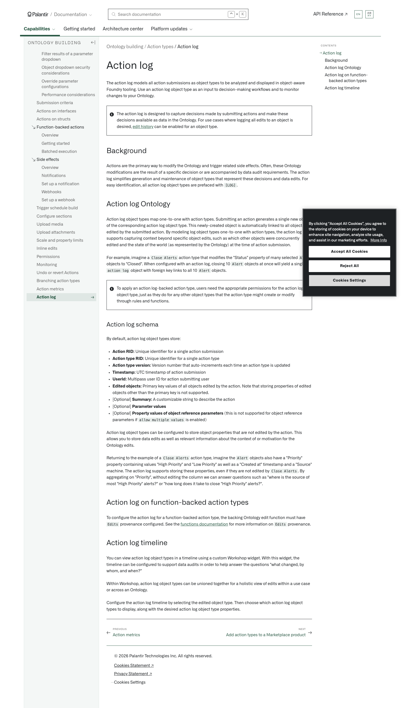

# Palantir

## Captura de pantalla

---

Search

[Palantir](//www.palantir.com)

- Documentation

  - [Documentation](/docs/foundry/)
  - [Apollo](/docs/apollo/)
  - [Gotham](/docs/gotham/)

Search documentation

Search

karat

+

K

[API Reference ↗](/docs/foundry/api-reference/)Send feedback

en

enjpkrzh

ABXY

ABXYABXYABXYABXYABXYABXY

- Capabilities

  - [AI Platform (AIP)](/docs/foundry/aip/overview/)
  - [Data connectivity & integration](/docs/foundry/data-integration/overview/)
  - [Model connectivity & development](/docs/foundry/model-integration/overview/)
  - [Ontology building](/docs/foundry/ontology/overview/)
  - [Developer toolchain](/docs/foundry/dev-toolchain/overview/)
  - [Use case development](/docs/foundry/app-building/overview/)
  - [Observability](/docs/foundry/observability/overview/)
  - [Analytics](/docs/foundry/analytics/overview/)
  - [Product delivery](/docs/foundry/devops/overview/)
  - [Security & governance](/docs/foundry/security/overview/)
  - [Management & enablement](/docs/foundry/administration/overview/)
- [Getting started](/docs/foundry/getting-started/overview/)
- [Architecture center](/docs/foundry/architecture-center/overview/)
- Platform updates

  - [Announcements](/docs/foundry/announcements/)
  - [Release notes](/docs/foundry/announcements/release-notes/)

[Ontology building](/docs/foundry/ontology/overview/)[Action types](/docs/foundry/action-types/overview/)[Action log](/docs/foundry/action-types/action-log/)

# Action log

The action log models all action submissions as object types to be analyzed and displayed in object-aware Foundry tooling. Use an action log object type as an input to decision-making workflows and to monitor changes to your Ontology.

The action log is designed to capture decisions made by submitting actions and make these decisions available as data in the Ontology. For use cases where
logging all edits to an object is desired, [edit history](/docs/foundry/object-edits/user-edit-history/) can be enabled for an object type.

## Background

Actions are the primary way to modify the Ontology and trigger related side effects. Often, these Ontology modifications are the result of a specific decision or are accompanied by data audit requirements. The action log simplifies generation and maintenance of object types that represent these decisions and data edits. For easy identification, all action log object types are prefaced with `[LOG]`.

## Action log Ontology

Action log object types map one-to-one with action types. Submitting an action generates a single new object of the corresponding action log object type. This newly-created object is automatically linked to all objects edited by the submitted action. By modeling log object types one-to-one with action types, the action log supports capturing context beyond specific object edits, such as which other objects were concurrently edited and the state of the world (as represented by the Ontology) at the time of action submission.

For example, imagine a `Close Alerts` action type that modifies the "Status" property of many selected `Alert` objects to "Closed". When configured with an action log, closing 10 `Alert` objects at once will yield a single `action log` object with foreign key links to all 10 `Alert` objects.

To apply an action log-backed action type, users need the appropriate permissions for the action log object type, just as they do for any other object types that the action type might create or modify through rules and functions.

### Action log schema

By default, action log object types store:

- **Action RID:** Unique identifier for a single action submission
- **Action type RID:** Unique identifier for a single action type
- **Action type version:** Version number that auto-increments each time an action type is updated
- **Timestamp:** UTC timestamp of action submission
- **UserId:** Multipass user ID for action submitting user
- **Edited objects:** Primary key values of all objects edited by the action. Note that storing properties of edited objects other than the primary key is not supported.
- [Optional] **Summary:** A customizable string to describe the action
- [Optional] **Parameter values**
- [Optional] **Property values of object reference parameters** (this is not supported for object reference parameters if `allow multiple values` is enabled)

Action log object types can be configured to store object properties that are not edited by the action. This allows you to store data edits as well as relevant information about the context of or motivation for the Ontology edits.

Returning to the example of a `Close Alerts` action type, imagine the `Alert` objects also have a "Priority" property containing values "High Priority" and "Low Priority" as well as a "Created at" timestamp and a "Source" machine. The action log supports storing these properties, even if they are not edited by `Close Alerts`. By aggregating on "Priority", without editing the column we can answer questions such as "where is the source of most "High Priority" alerts?" or "how long does it take to close "High Priority" alerts?".

## Action log on function-backed action types

To configure the action log for a function-backed action type, the backing Ontology edit function must have `Edits` provenance configured. See the [functions documentation](/docs/foundry/functions/edits-overview/) for more information on `Edits` provenance.

## Action log timeline

You can view action log object types in a timeline using a custom Workshop widget. With this widget, the timeline can be configured to support data audits in order to help answer the questions "what changed, by whom, and when?"

Within Workshop, action log object types can be unioned together for a holistic view of edits within a use case or across an Ontology.

Configure the action log timeline by selecting the edited object type. Then choose which action log object types to display, along with the desired action log object type properties.

[←

PREVIOUSAction metrics](/docs/foundry/action-types/action-metrics/)

[NEXTAdd action types to a Marketplace product

→](/docs/foundry/action-types/marketplace-action-types/)

By clicking “Accept All Cookies”, you agree to the storing of cookies on your device to enhance site navigation, analyze site usage, and assist in our marketing efforts. [More Info](https://www.palantir.com/cookie-statement/)

Accept All Cookies Reject All

Cookies Settings

.png)

## Privacy Preference Center

- ### Your Privacy
- ### Strictly Necessary Cookies
- ### Targeting Cookies

#### Your Privacy

When you visit any website, it may store or retrieve information on your browser, mostly in the form of cookies. This information might be about you, your preferences, or your device, and is mostly used to make the site work as you expect. The information does not usually identify you directly, but it can give you a more personalized web experience. Because we respect your right to privacy, you can choose not to allow some types of cookies. Click on the different category headings to learn more and change our default settings. Blocking some types of cookies may impact your experience of the site and the services we are able to offer.
\
[More information](https://www.palantir.com/cookie-statement/)

#### Strictly Necessary Cookies

Always Active

These cookies are necessary for the website to function and cannot be switched off in our systems. They are usually only set in response to actions made by you which amount to a request for services, such as setting your privacy preferences, logging in or filling in forms. You can set your browser to block or alert you about these cookies, but some parts of the site will not then work. These cookies do not store any personally identifiable information.

Cookies Details

#### Targeting Cookies

Targeting Cookies

These cookies may be set through our site by our advertising partners. They may be used by those companies to build a profile of your interests and show you relevant adverts on other sites. They do not store directly personal information, but are based on uniquely identifying your browser and internet device. If you do not allow these cookies, you will experience less targeted advertising.

Cookies Details

Back Button

### Cookie List

Consent Leg.Interest

checkbox label label

checkbox label label

checkbox label label

Clear

- checkbox label label

Apply Cancel

Confirm My Choices

Reject All Allow All

