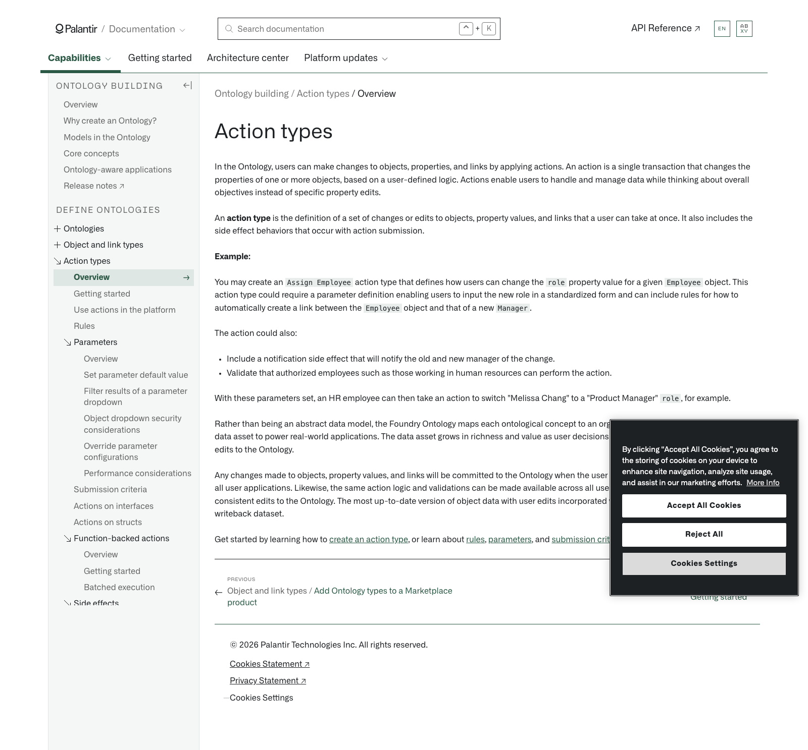

# Palantir

## Captura de pantalla

---

Search

[Palantir](//www.palantir.com)

- Documentation

  - [Documentation](/docs/foundry/)
  - [Apollo](/docs/apollo/)
  - [Gotham](/docs/gotham/)

Search documentation

Search

karat

+

K

[API Reference ↗](/docs/foundry/api-reference/)Send feedback

en

enjpkrzh

ABXY

ABXYABXYABXYABXYABXYABXY

- Capabilities

  - [AI Platform (AIP)](/docs/foundry/aip/overview/)
  - [Data connectivity & integration](/docs/foundry/data-integration/overview/)
  - [Model connectivity & development](/docs/foundry/model-integration/overview/)
  - [Ontology building](/docs/foundry/ontology/overview/)
  - [Developer toolchain](/docs/foundry/dev-toolchain/overview/)
  - [Use case development](/docs/foundry/app-building/overview/)
  - [Observability](/docs/foundry/observability/overview/)
  - [Analytics](/docs/foundry/analytics/overview/)
  - [Product delivery](/docs/foundry/devops/overview/)
  - [Security & governance](/docs/foundry/security/overview/)
  - [Management & enablement](/docs/foundry/administration/overview/)
- [Getting started](/docs/foundry/getting-started/overview/)
- [Architecture center](/docs/foundry/architecture-center/overview/)
- Platform updates

  - [Announcements](/docs/foundry/announcements/)
  - [Release notes](/docs/foundry/announcements/release-notes/)

[Ontology building](/docs/foundry/ontology/overview/)[Action types](/docs/foundry/action-types/overview/)[Overview](/docs/foundry/action-types/overview/)

# Action types

In the Ontology, users can make changes to objects, properties, and links by applying actions. An action is a single transaction that changes the properties of one or more objects, based on a user-defined logic. Actions enable users to handle and manage data while thinking about overall objectives instead of specific property edits.

An **action type** is the definition of a set of changes or edits to objects, property values, and links that a user can take at once. It also includes the side effect behaviors that occur with action submission.

**Example:**

You may create an `Assign Employee` action type that defines how users can change the `role` property value for a given `Employee` object. This action type could require a parameter definition enabling users to input the new role in a standardized form and can include rules for how to automatically create a link between the `Employee` object and that of a new `Manager`.

The action could also:

- Include a notification side effect that will notify the old and new manager of the change.
- Validate that authorized employees such as those working in human resources can perform the action.

With these parameters set, an HR employee can then take an action to switch "Melissa Chang" to a "Product Manager" `role`, for example.

Rather than being an abstract data model, the Foundry Ontology maps each ontological concept to an organization's actual data, enabling this data asset to power real-world applications. The data asset grows in richness and value as user decisions and insights are captured in the form of edits to the Ontology.

Any changes made to objects, property values, and links will be committed to the Ontology when the user takes the action and will be reflected in all user applications. Likewise, the same action logic and validations can be made available across all user-facing applications, ensuring consistent edits to the Ontology. The most up-to-date version of object data with user edits incorporated will be captured in an object type's writeback dataset.

Get started by learning how to [create an action type](/docs/foundry/action-types/getting-started/), or learn about [rules](/docs/foundry/action-types/rules/), [parameters](/docs/foundry/action-types/parameter-overview/), and [submission criteria](/docs/foundry/action-types/submission-criteria/).

[←

PREVIOUSObject and link types / Add Ontology types to a Marketplace product](/docs/foundry/object-link-types/marketplace-ontology-types/)

[NEXTGetting started

→](/docs/foundry/action-types/getting-started/)

By clicking “Accept All Cookies”, you agree to the storing of cookies on your device to enhance site navigation, analyze site usage, and assist in our marketing efforts. [More Info](https://www.palantir.com/cookie-statement/)

Accept All Cookies Reject All

Cookies Settings

.png)

## Privacy Preference Center

- ### Your Privacy
- ### Strictly Necessary Cookies
- ### Targeting Cookies

#### Your Privacy

When you visit any website, it may store or retrieve information on your browser, mostly in the form of cookies. This information might be about you, your preferences, or your device, and is mostly used to make the site work as you expect. The information does not usually identify you directly, but it can give you a more personalized web experience. Because we respect your right to privacy, you can choose not to allow some types of cookies. Click on the different category headings to learn more and change our default settings. Blocking some types of cookies may impact your experience of the site and the services we are able to offer.
\
[More information](https://www.palantir.com/cookie-statement/)

#### Strictly Necessary Cookies

Always Active

These cookies are necessary for the website to function and cannot be switched off in our systems. They are usually only set in response to actions made by you which amount to a request for services, such as setting your privacy preferences, logging in or filling in forms. You can set your browser to block or alert you about these cookies, but some parts of the site will not then work. These cookies do not store any personally identifiable information.

Cookies Details

#### Targeting Cookies

Targeting Cookies

These cookies may be set through our site by our advertising partners. They may be used by those companies to build a profile of your interests and show you relevant adverts on other sites. They do not store directly personal information, but are based on uniquely identifying your browser and internet device. If you do not allow these cookies, you will experience less targeted advertising.

Cookies Details

Back Button

### Cookie List

Consent Leg.Interest

checkbox label label

checkbox label label

checkbox label label

Clear

- checkbox label label

Apply Cancel

Confirm My Choices

Reject All Allow All

