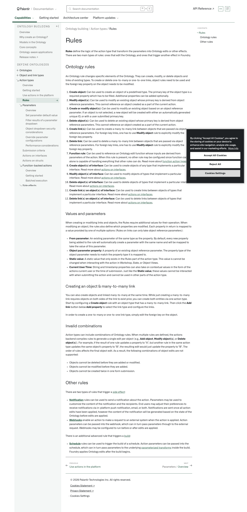

# Palantir

## Captura de pantalla

---

Search

[Palantir](//www.palantir.com)

- Documentation

  - [Documentation](/docs/foundry/)
  - [Apollo](/docs/apollo/)
  - [Gotham](/docs/gotham/)

Search documentation

Search

karat

+

K

[API Reference ↗](/docs/foundry/api-reference/)Send feedback

en

enjpkrzh

ABXY

ABXYABXYABXYABXYABXYABXY

- Capabilities

  - [AI Platform (AIP)](/docs/foundry/aip/overview/)
  - [Data connectivity & integration](/docs/foundry/data-integration/overview/)
  - [Model connectivity & development](/docs/foundry/model-integration/overview/)
  - [Ontology building](/docs/foundry/ontology/overview/)
  - [Developer toolchain](/docs/foundry/dev-toolchain/overview/)
  - [Use case development](/docs/foundry/app-building/overview/)
  - [Observability](/docs/foundry/observability/overview/)
  - [Analytics](/docs/foundry/analytics/overview/)
  - [Product delivery](/docs/foundry/devops/overview/)
  - [Security & governance](/docs/foundry/security/overview/)
  - [Management & enablement](/docs/foundry/administration/overview/)
- [Getting started](/docs/foundry/getting-started/overview/)
- [Architecture center](/docs/foundry/architecture-center/overview/)
- Platform updates

  - [Announcements](/docs/foundry/announcements/)
  - [Release notes](/docs/foundry/announcements/release-notes/)

[Ontology building](/docs/foundry/ontology/overview/)[Action types](/docs/foundry/action-types/overview/)[Rules](/docs/foundry/action-types/rules/)

# Rules

**Rules** define the logic of the action type that transform the parameters into Ontology edits or other effects. There are two main types of rules: ones that edit the Ontology, and ones that trigger another effect in Foundry.

## Ontology rules

An Ontology rule changes specific elements of the Ontology. They can create, modify, or delete objects and links of existing types. To create or delete one-to-many or one-to-one links, object rules need to be used and the foreign key property on the object needs to be modified.

1. **Create object:** Can be used to create an object of a predefined type. The primary key of the object type is a required property which has to be filled. Additional properties can be added optionally.
2. **Modify object(s):** Can be used to modify an existing object whose primary key is derived from object reference parameters. This cannot reference an object created as a part of the current action.
3. **Create or modify object(s):** Can be used to modify an existing object based on an object reference parameter. If an object is not selected, a new object will be created with either an automatically generated unique ID, or with a user submitted primary key.
4. **Delete object(s):** Can be used to delete an existing object whose primary key is derived from object reference parameters. This cannot reference an object created as a part of the current action.
5. **Create link(s):** Can be used to create a many-to-many link between objects that are passed via object reference parameters. For foreign key links, one has to use **Modify object** rule to explicitly modify the foreign key property.
6. **Delete link:** Can be used to delete a many-to-many link between objects that are passed via object reference parameters. For foreign key links, one has to use **Modify object** rule to explicitly modify the foreign key property.
7. **Function rule:** Can be used to reference an Ontology edit function whose inputs are derived from parameters of the action. When this rule is present, no other rule may be configured since function code alone is capable of handling everything that other rules can do. Read more about [function action types](/docs/foundry/action-types/function-actions-overview/).
8. **Create object(s) of interface:** Can be used to create objects of any type that implements a particular interface. Read more about [actions on interfaces](/docs/foundry/action-types/actions-on-interfaces/).
9. **Modify object(s) of interface:** Can be used to modify objects of types that implement a particular interface. Read more about [actions on interfaces](/docs/foundry/action-types/actions-on-interfaces/).
10. **Delete object(s) of interface:** Can be used to delete objects of types that implement a particular interface. Read more about [actions on interfaces](/docs/foundry/action-types/actions-on-interfaces/).
11. **Create link(s) on object(s) of interface:** Can be used to create links between objects of types that implement a particular interface. Read more about [actions on interfaces](/docs/foundry/action-types/actions-on-interfaces/).
12. **Delete link(s) on object(s) of interface:** Can be used to delete links between objects of types that implement a particular interface. Read more about [actions on interfaces](/docs/foundry/action-types/actions-on-interfaces/).

### Values and parameters

When creating or modifying links and objects, the Rules require additional values for their operation. When modifying an object, the rules also define which properties are modified. Each property in return is mapped to a value provided by one of multiple options (Rules on links can only take object reference parameters):

- **From parameter:** An existing parameter of the same type as the property. By default, every new property being added to the rule will automatically create a parameter with the same name and will be mapped to take the value of this parameter.
- **Object parameter property:** A property of an existing object reference parameter. The property type of the object parameter needs to match the property type it is mapped to.
- **Static value:** A static value that only exists in the Rules part of the action type. This value is cannot be changed when interacting with the action in Workshop, Slate, or Object Views.
- **Current User/Time:** String and timestamp properties can also take on contextual values in the form of the actions current user or the time of submission. Just like the **Static value**, these values cannot be interacted with when submitting the action and cannot be used in other parts of the action type.

### Creating an object & many-to-many link

You can also create objects and linked many-to-many at the same time. While just creating a many-to-many link requires objects on both sides of the link to exist prior, you can create both entities via one action type. Start by configuring a **Create object** rule with an object type that has a many-to-many link. Then click the **Add link** button below **Add property** to select the link type and configure the links.

In order to create a one-to-many or one-to-one link type, simply edit the foreign key on the object.

### Invalid combinations

Action types can include combinations of Ontology rules. When multiple rules are defined, the actions backend compiles rules to generate a single edit per object (e.g., **Add object**, **Modify object(s)**, or **Delete object(s)**). For example, if the result of one rule updates a property to "A", but another rule in the same action type updates the same object's property to "B", the resulting edit would just update the property to "B". The order of rules affects the final object edit. As a result, the following combinations of object edits are not supported:

- Objects cannot be deleted before they are added or modified.
- Objects cannot be modified before they are added.
- Objects cannot be created twice in one form submission.

## Other rules

There are two types of rules that trigger a [side effect](/docs/foundry/action-types/side-effects-overview/):

- [**Notification**](/docs/foundry/action-types/notifications/) rules can be used to send a notification about the action. Parameters may be used to customize the content of the notification and the recipients. End users may adjust their preferences to receive notifications via in-platform push notification, email, or both. Notifications are sent once all action edits have been applied, however the content of the notification will be generated based on the state of the Ontology before edits are applied.
- [**Webhooks**](/docs/foundry/action-types/webhooks/) enable an action to make a request to an external system when the action is applied. Action parameters can be passed into the webhook, which can in turn pass parameters through to the external request. Webhooks may be configured to run before or after edits are applied.

There is an additional advanced rule that triggers a [build](/docs/foundry/data-integration/builds/):

- [**Schedule**](/docs/foundry/action-types/trigger-schedule-build/) rules can be used to trigger the build of a schedule. Action parameters can be passed into the schedule, which can in turn pass parameters to the underlying [parameterized transforms](/docs/foundry/building-pipelines/parameterization/) inside the build. Foundry applies Ontology edits after the build begins.

[←

PREVIOUSUse actions in the platform](/docs/foundry/action-types/use-actions/)

[NEXTParameters / Overview

→](/docs/foundry/action-types/parameter-overview/)

By clicking “Accept All Cookies”, you agree to the storing of cookies on your device to enhance site navigation, analyze site usage, and assist in our marketing efforts. [More Info](https://www.palantir.com/cookie-statement/)

Accept All Cookies Reject All

Cookies Settings

.png)

## Privacy Preference Center

- ### Your Privacy
- ### Strictly Necessary Cookies
- ### Targeting Cookies

#### Your Privacy

When you visit any website, it may store or retrieve information on your browser, mostly in the form of cookies. This information might be about you, your preferences, or your device, and is mostly used to make the site work as you expect. The information does not usually identify you directly, but it can give you a more personalized web experience. Because we respect your right to privacy, you can choose not to allow some types of cookies. Click on the different category headings to learn more and change our default settings. Blocking some types of cookies may impact your experience of the site and the services we are able to offer.
\
[More information](https://www.palantir.com/cookie-statement/)

#### Strictly Necessary Cookies

Always Active

These cookies are necessary for the website to function and cannot be switched off in our systems. They are usually only set in response to actions made by you which amount to a request for services, such as setting your privacy preferences, logging in or filling in forms. You can set your browser to block or alert you about these cookies, but some parts of the site will not then work. These cookies do not store any personally identifiable information.

Cookies Details

#### Targeting Cookies

Targeting Cookies

These cookies may be set through our site by our advertising partners. They may be used by those companies to build a profile of your interests and show you relevant adverts on other sites. They do not store directly personal information, but are based on uniquely identifying your browser and internet device. If you do not allow these cookies, you will experience less targeted advertising.

Cookies Details

Back Button

### Cookie List

Consent Leg.Interest

checkbox label label

checkbox label label

checkbox label label

Clear

- checkbox label label

Apply Cancel

Confirm My Choices

Reject All Allow All

