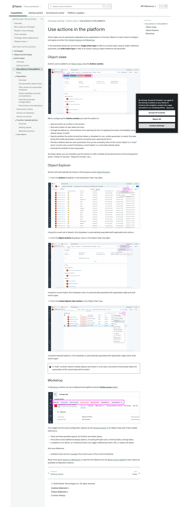
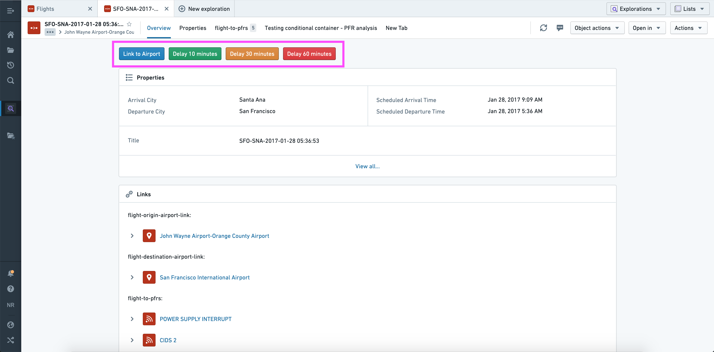
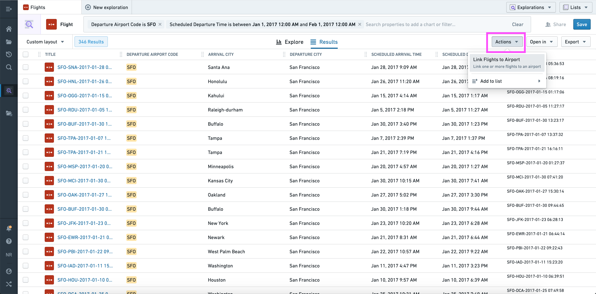
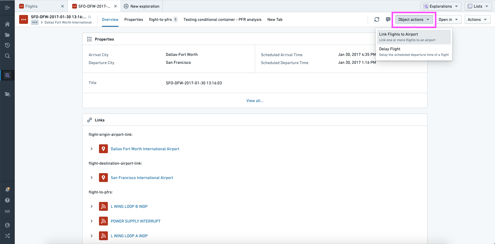
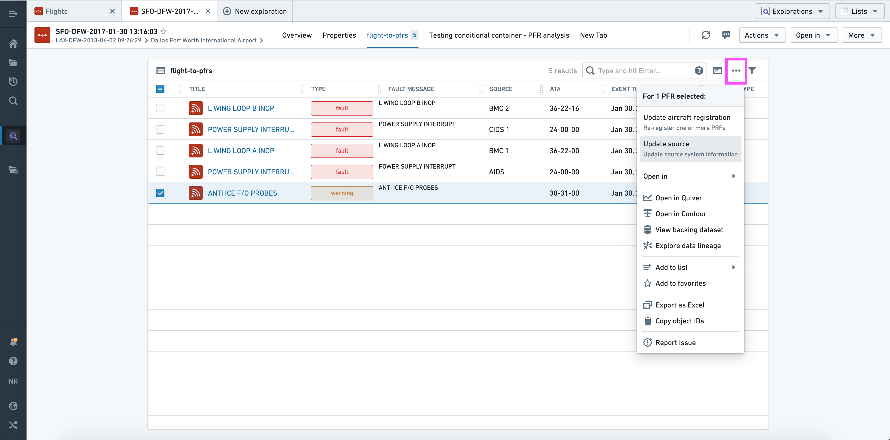
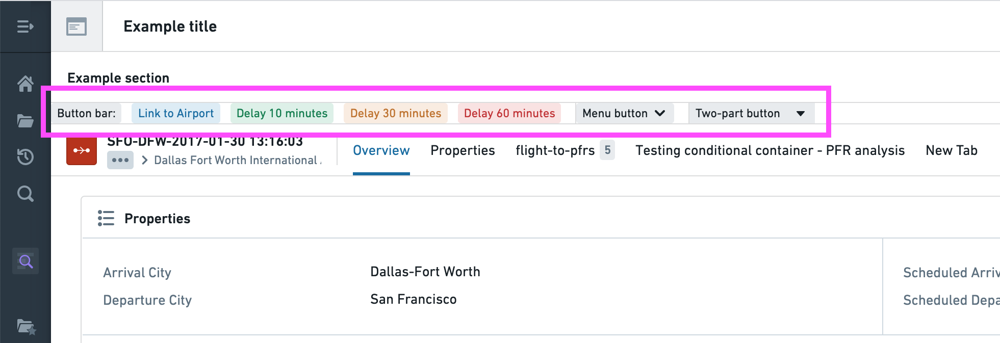

# Palantir

## Captura de pantalla

---

Search

[Palantir](//www.palantir.com)

- Documentation

  - [Documentation](/docs/foundry/)
  - [Apollo](/docs/apollo/)
  - [Gotham](/docs/gotham/)

Search documentation

Search

karat

+

K

[API Reference ↗](/docs/foundry/api-reference/)Send feedback

en

enjpkrzh

ABXY

ABXYABXYABXYABXYABXYABXY

- Capabilities

  - [AI Platform (AIP)](/docs/foundry/aip/overview/)
  - [Data connectivity & integration](/docs/foundry/data-integration/overview/)
  - [Model connectivity & development](/docs/foundry/model-integration/overview/)
  - [Ontology building](/docs/foundry/ontology/overview/)
  - [Developer toolchain](/docs/foundry/dev-toolchain/overview/)
  - [Use case development](/docs/foundry/app-building/overview/)
  - [Observability](/docs/foundry/observability/overview/)
  - [Analytics](/docs/foundry/analytics/overview/)
  - [Product delivery](/docs/foundry/devops/overview/)
  - [Security & governance](/docs/foundry/security/overview/)
  - [Management & enablement](/docs/foundry/administration/overview/)
- [Getting started](/docs/foundry/getting-started/overview/)
- [Architecture center](/docs/foundry/architecture-center/overview/)
- Platform updates

  - [Announcements](/docs/foundry/announcements/)
  - [Release notes](/docs/foundry/announcements/release-notes/)

[Ontology building](/docs/foundry/ontology/overview/)[Action types](/docs/foundry/action-types/overview/)[Use actions in the platform](/docs/foundry/action-types/use-actions/)

# Use actions in the platform

Action types can be seamlessly integrated across applications in Foundry. Read on to learn how to configure and apply an action from [Object Explorer](/docs/foundry/object-explorer/overview/) and [Workshop](/docs/foundry/workshop/overview/).

In the examples below, we use the term **single action type** to refer to an action type using an object reference parameter, and **bulk action type** to refer to an action using an object reference list parameter.

## Object views

Actions can be added to an [Object View](/docs/foundry/object-views/overview/) using the **Actions section**.

When configuring the **Actions section** you have the option to:

- Add any action as a button in the section.
- Give each button its own label and color.
- Change the default on-click behavior from opening the form to applying the action immediately using the default values (if valid).
- Specify whether the button should be hidden or disabled if a non-visible parameter is invalid (the idea being that visible parameters could be corrected upon opening the form).
- Provide a default value for each parameter; this can be a property value of the current object or a "local" value (current user, current timestamp, current object, or a manually entered value).
- Override the visibility of each parameter.

As shown above, you can therefore use this section to offer multiple structured versions of the same generic action ("Delay 10 minutes", "Delay 30 minutes", etc.).

## Object Explorer

Actions will automatically be shown in three places across [Object Explorer](/docs/foundry/object-explorer/overview/):

1. From the **Actions** dropdown in the Exploration View (top right).

Using the current set of objects, this dropdown is automatically populated with applicable bulk actions.

2. From the **Object Actions** dropdown menu in the Object View (top right).

Using the current object, this dropdown menu is automatically populated with applicable single and bulk action types.

3. From the **Linked objects view section** in the Object View (top).

Using the selected object(s), this dropdown is automatically populated with applicable single and/or bulk action types.

In "bulk" contexts (where multiple objects are shown in a list view), only actions that accept object list parameters of the correct type will be shown.

## Workshop

In [Workshop](/docs/foundry/workshop/overview/), Actions can be configured and applied using the [**Button group** widget](/docs/foundry/workshop/widgets-button-group/).

This widget has the same configuration options as the [Actions section](#object-views) in an Object View, with a few notable extensions:

- There are three possible layouts, all of which are shown above.
- The buttons have additional display options, including left/right icons, minimal styles, and tag styles.
- In addition to an Action, an individual button can trigger a Workshop event, URL, or object set export.

And one difference:

- A default value can be a [variable](/docs/foundry/workshop/concepts-variables/), the current user, or the current timestamp

Read more about [Actions in Workshop](/docs/foundry/workshop/actions-overview/), or read the full reference for the [Button Group widget](/docs/foundry/workshop/widgets-button-group/) to learn about all available configuration options.

[←

PREVIOUSGetting started](/docs/foundry/action-types/getting-started/)

[NEXTRules

→](/docs/foundry/action-types/rules/)

By clicking “Accept All Cookies”, you agree to the storing of cookies on your device to enhance site navigation, analyze site usage, and assist in our marketing efforts. [More Info](https://www.palantir.com/cookie-statement/)

Accept All Cookies Reject All

Cookies Settings

.png)

## Privacy Preference Center

- ### Your Privacy
- ### Strictly Necessary Cookies
- ### Targeting Cookies

#### Your Privacy

When you visit any website, it may store or retrieve information on your browser, mostly in the form of cookies. This information might be about you, your preferences, or your device, and is mostly used to make the site work as you expect. The information does not usually identify you directly, but it can give you a more personalized web experience. Because we respect your right to privacy, you can choose not to allow some types of cookies. Click on the different category headings to learn more and change our default settings. Blocking some types of cookies may impact your experience of the site and the services we are able to offer.
\
[More information](https://www.palantir.com/cookie-statement/)

#### Strictly Necessary Cookies

Always Active

These cookies are necessary for the website to function and cannot be switched off in our systems. They are usually only set in response to actions made by you which amount to a request for services, such as setting your privacy preferences, logging in or filling in forms. You can set your browser to block or alert you about these cookies, but some parts of the site will not then work. These cookies do not store any personally identifiable information.

Cookies Details

#### Targeting Cookies

Targeting Cookies

These cookies may be set through our site by our advertising partners. They may be used by those companies to build a profile of your interests and show you relevant adverts on other sites. They do not store directly personal information, but are based on uniquely identifying your browser and internet device. If you do not allow these cookies, you will experience less targeted advertising.

Cookies Details

Back Button

### Cookie List

Consent Leg.Interest

checkbox label label

checkbox label label

checkbox label label

Clear

- checkbox label label

Apply Cancel

Confirm My Choices

Reject All Allow All

