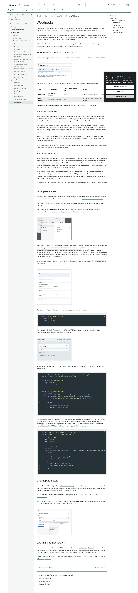
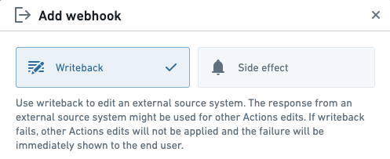
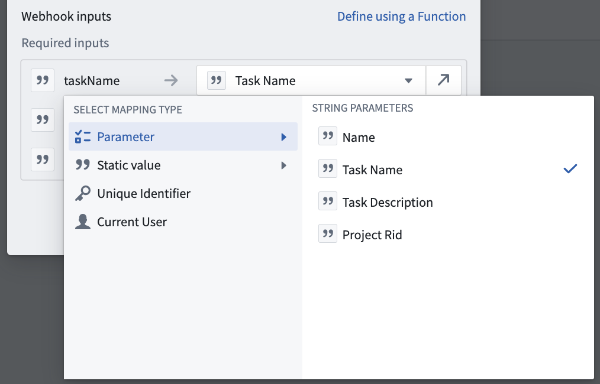
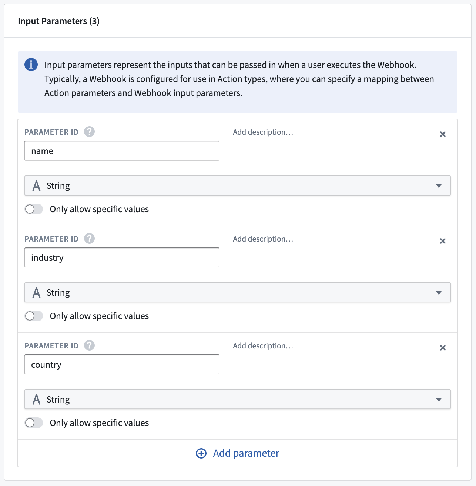
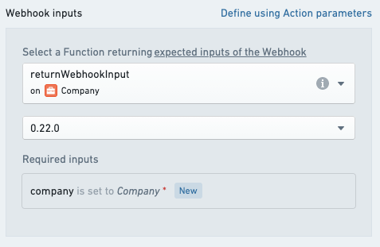
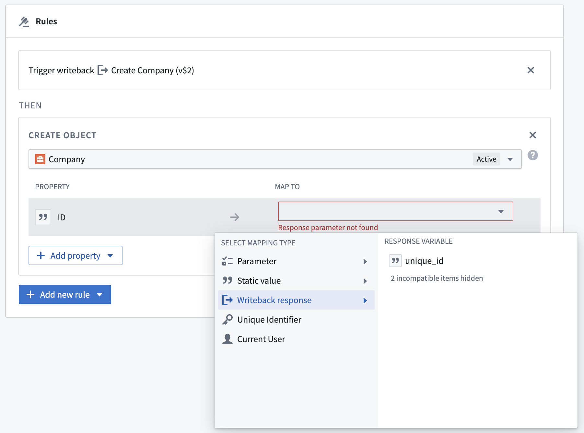

# Palantir

## Captura de pantalla



---

Search

[Palantir](//www.palantir.com)

- Documentation

  - [Documentation](/docs/foundry/)
  - [Apollo](/docs/apollo/)
  - [Gotham](/docs/gotham/)

Search documentation

Search

karat

+

K

[API Reference ↗](/docs/foundry/api-reference/)Send feedback

en

enjpkrzh

ABXY

ABXYABXYABXYABXYABXYABXY

- Capabilities

  - [AI Platform (AIP)](/docs/foundry/aip/overview/)
  - [Data connectivity & integration](/docs/foundry/data-integration/overview/)
  - [Model connectivity & development](/docs/foundry/model-integration/overview/)
  - [Ontology building](/docs/foundry/ontology/overview/)
  - [Developer toolchain](/docs/foundry/dev-toolchain/overview/)
  - [Use case development](/docs/foundry/app-building/overview/)
  - [Observability](/docs/foundry/observability/overview/)
  - [Analytics](/docs/foundry/analytics/overview/)
  - [Product delivery](/docs/foundry/devops/overview/)
  - [Security & governance](/docs/foundry/security/overview/)
  - [Management & enablement](/docs/foundry/administration/overview/)
- [Getting started](/docs/foundry/getting-started/overview/)
- [Architecture center](/docs/foundry/architecture-center/overview/)
- Platform updates

  - [Announcements](/docs/foundry/announcements/)
  - [Release notes](/docs/foundry/announcements/release-notes/)

[Ontology building](/docs/foundry/ontology/overview/)[Action types](/docs/foundry/action-types/overview/)[Side effects](/docs/foundry/action-types/side-effects-overview/)[Webhooks](/docs/foundry/action-types/webhooks/)

# Webhooks

A [webhook](/docs/foundry/data-connection/webhooks-overview/) is a concept in Data Connection that enables sending a request to an external system, such as Salesforce, SAP, or any configured HTTP server, typically to modify data in that external system.

By setting up a webhook and then configuring it for use in an action, you can send data to an external system when end users apply an action in Foundry. This enables workflows in Foundry to connect directly with source systems and write back data and decisions into those systems.

This section details the various options available for configuring webhooks in an action. For a step-by-step tutorial, see the documentation on [how to add a webhook in an action](/docs/foundry/action-types/set-up-webhook/).

## Webhooks: Writeback vs. side effect

There are two ways that webhooks can be configured for use in an action: as a **writeback** or as a **side effect**.



For convenience, below is a table comparing the behavior of writeback and side effect webhooks.

| Type | When applied | Failure shown to end user? | Timing |
| --- | --- | --- | --- |
| **Writeback** | Before object changes | Yes | Before user sees success or failure |
| **Side effect** | After object changes | No | May be after user sees success message |

The following sections describe writeback webhooks and side effect webhooks in more detail.

### Writeback webhooks

When configured as a **writeback**, the webhook will be executed *before* any other rules are evaluated; if the webhook execution fails, no other changes will be made. If you want to ensure that changes are not made in Foundry before the external system, you should set up your webhook as a writeback.

This behavior enables some degree of transactionality between Foundry and the external system. Using a writeback webhook guarantees that if the request to the external system fails, no changes will be applied to the Foundry Ontology. However, it is still possible that the external request may succeed but Ontology changes could fail.

Because the action stops being applied when a writeback webhook fails, you can only configure a single webhook as a writeback. If this webhook fails when the action is applied, an error will be shown to the end user describing the failure.

When a webhook is configured as a writeback, its output parameters can be used in subsequent rules. See the [output parameters](#output-parameters) section below for more details.

### Side effect webhooks

When configured as a **side effect**, a webhook will be executed *after* other rules are evaluated. This means that modifications to Foundry objects will occur before side effects are applied. You can configure multiple side effect webhooks in a single action, and they will be executed in no particular order. In an action with side effect webhooks, the end user will see a success message after Foundry objects are modified; executing the side effects may happen after the success message is shown.

If you need to call a webhook multiple times from a single action, this can be achieved with a side effect webhook by providing a list of payloads as an input. This will trigger the webhook as many times as there are payloads in the list provided and will be processed in no guaranteed order. An example of this can be found below in the [input parameters](#input-parameters) section.

You should use side effect webhooks when you want to send best-effort notifications or write back to multiple external systems.

## Input parameters

In order to configure a Webhook in an Action, you must populate all of its required input parameters. General reference material about Webhook input parameters is available in the [Data Connection documentation](/docs/foundry/data-connection/webhooks-reference/#input-parameters).

There are two ways to configure Webhook input parameters: by mapping to Action parameters, or by using a Function.

When mapping to **Action parameters**, each required Webhook input must be set to either an Action parameter of the same type, a static value, or a property of an object parameter.



When using a [Function](/docs/foundry/functions/overview/), you must select a Function that returns a custom type that includes all of the required Webhook input parameters and strongly matches the Webhook type, otherwise you will receive an `OntologyMetadata:ActionWebhookInputsDoNotHaveExpectedType` error. Using a Function to populate Webhook input parameters can be useful when you want to use logic to populate inputs, especially if this logic is based on Ontology objects. For example, you can retrieve linked objects and pull property values from those objects to prepopulate Webhook inputs.

As an example, suppose you have a Webhook which takes three input parameters with IDs `name`, `industry`, and `country`:



You can write a Function that returns a custom interface of the same structure:

```
Copied!

1export interface MyWebhookInput {
2    name: string;
3    industry: string;
4    country: string;
5}
```

Then, you can select this Function when configuring Webhook inputs in an Action, mapping Action parameters to the parameters required by the Function:



Below is a full code example of a Function that loads data from an Ontology object and uses it to populate Webhook inputs.

```
Copied!

1import { Function, UserFacingError } from "@foundry/functions-api";
2import { Company } from "@foundry/ontology-api";
3
4export interface MyWebhookInput {
5    name: string;
6    industry: string;
7    country: string;
8}
9
10export class MyWebhookFunctions {
11    @Function()
12    public returnWebhookInput(company: Company): MyWebhookInput {
13        if (!company.name || !company.industry || !company.country) {
14            throw new UserFacingError("Some required fields are not set.");
15        }
16        return {
17            name: company.name,
18            industry: company.industry,
19            country: company.country,
20        }
21    }
22}
```

A side effect Webhook may be called multiple times by returning a list of payloads from a Function. Below is an example Function which takes two companies as inputs, and returns a list containing two payloads matching the input parameters expected by a Webhook. If this Function is used from Actions to return the inputs for a side effect Webhook, it will result in two separate Webhook executions.

```
Copied!

1import { Function } from "@foundry/functions-api";
2import { Company } from "@foundry/ontology-api";
3
4export interface MyWebhookInput {
5    arg1: string;
6    arg2: string;
7}
8
9export class MyFunctions {
10    @Function()
11    public createWebhookRequest(company1: Company, company2: Company): MyWebhookInput[] {
12        return [
13        {
14           arg1: company1.someProperty,
15           arg2: company1.someOtherProperty,
16        },
17        {
18           arg1: company2.someProperty,
19           arg2: company2.someOtherProperty,
20        }
21        ];
22    }
23}
```

## Output parameters

When a Webhook is configured as a [writeback Webhook](#writeback-webhooks), you can use its output parameters in subsequent rules. This is useful when the external system returns data that you want to immediately write into a Foundry object or use in a subsequent [notification](/docs/foundry/action-types/notifications/) or [side effect Webhook](#side-effect-webhooks).

General reference material about Webhook output parameters is available in the [Data Connection documentation](/docs/foundry/data-connection/webhooks-reference/#output-parameters).

To use an output parameter in a subsequent logic rule, select **Writeback response** when populating the value for a logic rule, then select the specific output you wish to use:



## OAuth 2.0 authentication

When a webhook is configured on a REST API source that uses an [outbound application](/docs/foundry/administration/configure-outbound-applications/) for authentication, Foundry manages the OAuth 2.0 authorization flow on behalf of the user. Developers do not need to handle token acquisition or refresh. Foundry passes the correct access token with every webhook call.

For a full overview of OAuth 2.0 outbound application support across Foundry workflows, see the [OAuth 2.0 outbound applications](/docs/foundry/administration/configure-outbound-applications/) documentation.

[←

PREVIOUSSet up a notification](/docs/foundry/action-types/set-up-notification/)

[NEXTSet up a webhook

→](/docs/foundry/action-types/set-up-webhook/)

By clicking “Accept All Cookies”, you agree to the storing of cookies on your device to enhance site navigation, analyze site usage, and assist in our marketing efforts. [More Info](https://www.palantir.com/cookie-statement/)

Accept All Cookies Reject All

Cookies Settings

.png)

## Privacy Preference Center

- ### Your Privacy
- ### Strictly Necessary Cookies
- ### Targeting Cookies

#### Your Privacy

When you visit any website, it may store or retrieve information on your browser, mostly in the form of cookies. This information might be about you, your preferences, or your device, and is mostly used to make the site work as you expect. The information does not usually identify you directly, but it can give you a more personalized web experience. Because we respect your right to privacy, you can choose not to allow some types of cookies. Click on the different category headings to learn more and change our default settings. Blocking some types of cookies may impact your experience of the site and the services we are able to offer.
\
[More information](https://www.palantir.com/cookie-statement/)

#### Strictly Necessary Cookies

Always Active

These cookies are necessary for the website to function and cannot be switched off in our systems. They are usually only set in response to actions made by you which amount to a request for services, such as setting your privacy preferences, logging in or filling in forms. You can set your browser to block or alert you about these cookies, but some parts of the site will not then work. These cookies do not store any personally identifiable information.

Cookies Details

#### Targeting Cookies

Targeting Cookies

These cookies may be set through our site by our advertising partners. They may be used by those companies to build a profile of your interests and show you relevant adverts on other sites. They do not store directly personal information, but are based on uniquely identifying your browser and internet device. If you do not allow these cookies, you will experience less targeted advertising.

Cookies Details

Back Button

### Cookie List

Consent Leg.Interest

checkbox label label

checkbox label label

checkbox label label

Clear

- checkbox label label

Apply Cancel

Confirm My Choices

Reject All Allow All

[](https://www.onetrust.com/products/cookie-consent/)
