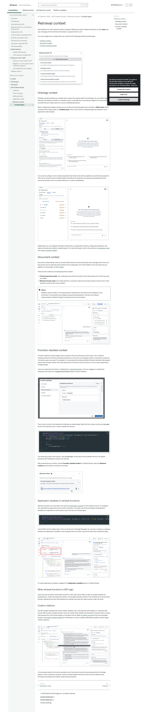
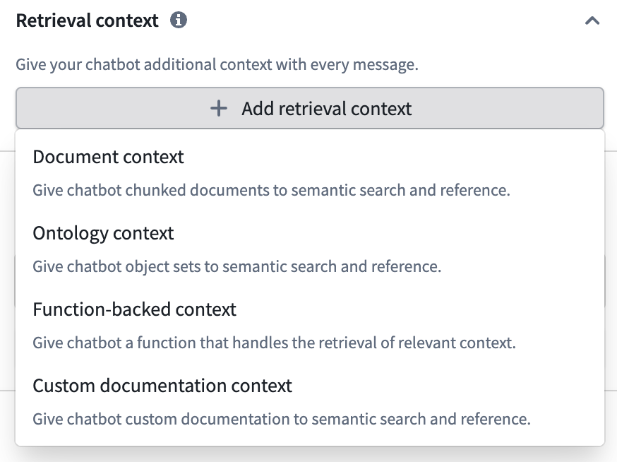
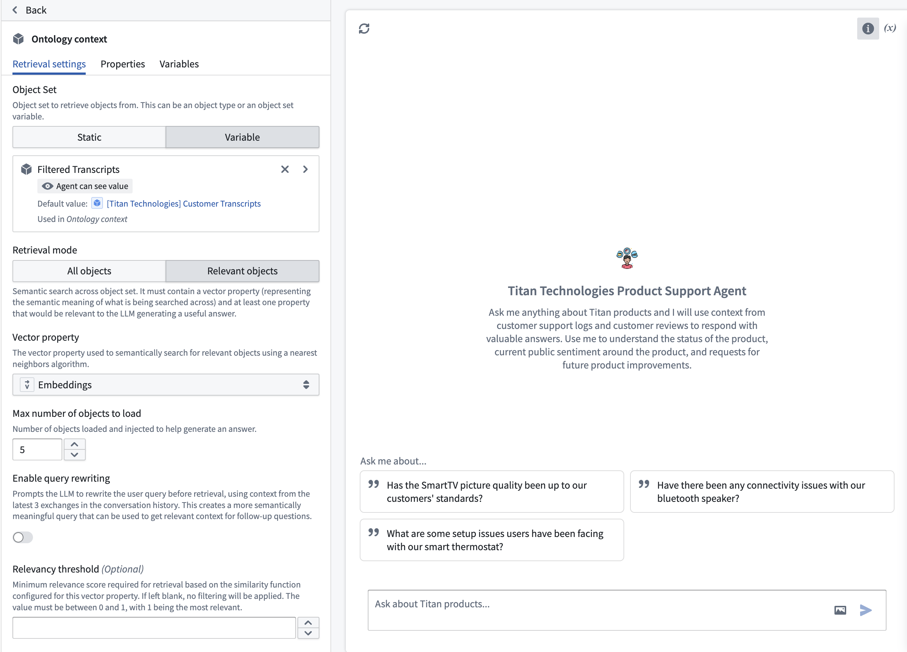
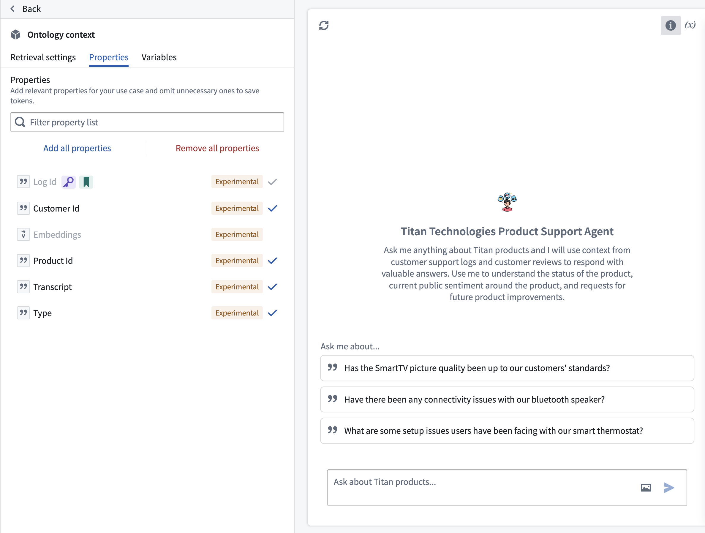
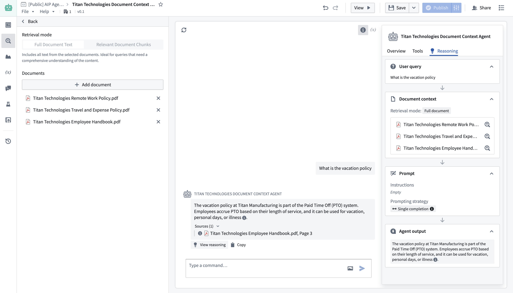
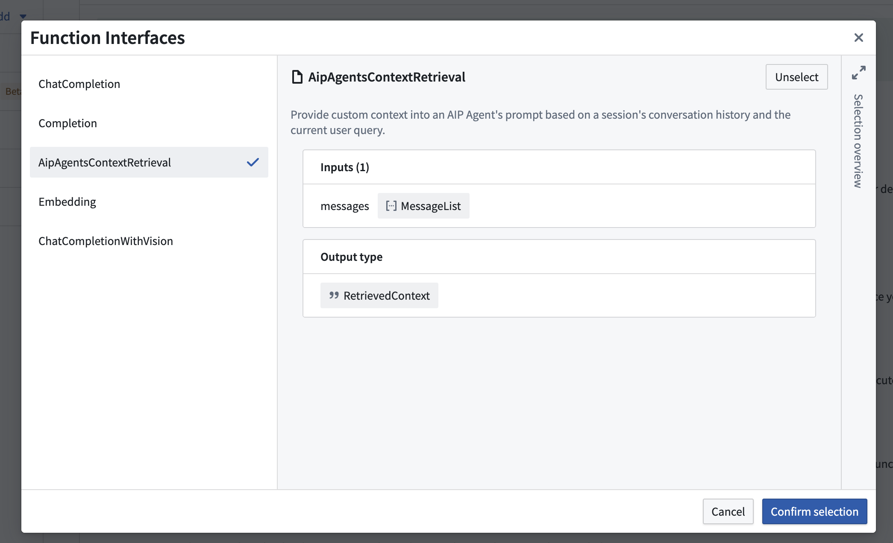
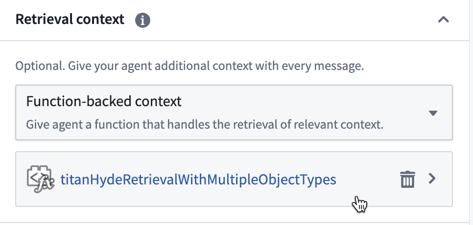

# Palantir

## Captura de pantalla



---

Search

[Palantir](//www.palantir.com)

- Documentation

  - [Documentation](/docs/foundry/)
  - [Apollo](/docs/apollo/)
  - [Gotham](/docs/gotham/)

Search documentation

Search

karat

+

K

[API Reference ↗](/docs/foundry/api-reference/)Send feedback

en

enjpkrzh

ABXY

ABXYABXYABXYABXYABXYABXY

- Capabilities

  - [AI Platform (AIP)](/docs/foundry/aip/overview/)
  - [Data connectivity & integration](/docs/foundry/data-integration/overview/)
  - [Model connectivity & development](/docs/foundry/model-integration/overview/)
  - [Ontology building](/docs/foundry/ontology/overview/)
  - [Developer toolchain](/docs/foundry/dev-toolchain/overview/)
  - [Use case development](/docs/foundry/app-building/overview/)
  - [Observability](/docs/foundry/observability/overview/)
  - [Analytics](/docs/foundry/analytics/overview/)
  - [Product delivery](/docs/foundry/devops/overview/)
  - [Security & governance](/docs/foundry/security/overview/)
  - [Management & enablement](/docs/foundry/administration/overview/)
- [Getting started](/docs/foundry/getting-started/overview/)
- [Architecture center](/docs/foundry/architecture-center/overview/)
- Platform updates

  - [Announcements](/docs/foundry/announcements/)
  - [Release notes](/docs/foundry/announcements/release-notes/)

[AI Platform (AIP)](/docs/foundry/aip/overview/)[AIP Chatbot Studio](/docs/foundry/chatbot-studio/overview/)Retrieval context[Context types](/docs/foundry/chatbot-studio/retrieval-context/)

# Retrieval context

AIP Chatbots can have retrieval context configured. Retrieval context is deterministically run with **every** new user message and the retrieved information is passed into the LLM.

You may configure your chatbot with any number of the following retrieval context types:

- [Ontology context](#ontology-context)
- [Document context](#document-context)
- [Function-backed context](#function-backed-context)



## Ontology context

Ontology context provides your chatbot with context from objects within the Ontology. You can either supply a fixed set of *N* objects or perform a semantic search to identify the *K* most relevant objects to a user query, provided that your object type has a vector embedding property.

When configuring Ontology context, you can choose the starting object set to be either a **Static input**, which includes the full object type, or a **Variable input**, which may consist of a filtered object set passed in as an application state variable.



You can also configure a list of object properties that determines which properties are printed and passed to the LLM as context for each retrieved object. By default, all properties are selected, excluding those that cannot be printed (such as a media reference or a vector embedding).



Additionally, you can integrate Ontology context with your application state by configuring variables for the object set output and citation variable output. For more information, refer to the sections on [application state](/docs/foundry/chatbot-studio/application-state/) and [citation variable updates](/docs/foundry/chatbot-studio/citations/#citation-variable-updates).

## Document context

Document context allows users to include relevant text from documents with each message sent to the LLM. Documents can be selected and included in the configuration of an AIP Chatbot in the same way they are added to a conversation in [AIP Threads](/docs/foundry/threads/getting-started/#interact-with-documents).

There are two modes for providing document context:

1. **Full document text mode:** This mode gives the entire text content of the document to the LLM to be used as context.
2. **Relevant chunks mode:** This mode performs a semantic search over the documents to return the *K* most relevant chunks to the LLM as context.

Beta

Relevant chunks mode is in the [beta](/docs/foundry/platform-overview/development-life-cycle/) phase of development and may not be available on your enrollment. Functionality may change during active development. Contact your Palantir representative or Palantir Support to request access to this feature.



## Function-backed context

Function-backed context enables users to perform their own retrieval on each query. This is ideal for situations where the retrieval methods provided out-of-the-box via Ontology context or document context do not satisfy a given use case. For example, if a user wanted to combine different retrieval methods, like keyword search and semantic search, then they would write a function to do that since it is not currently supported in Chatbot Studio.

Users can write these functions in TypeScript in [Code Repositories](/docs/foundry/code-repositories/overview/). To do so, navigate to a TypeScript repository and import the `AipAgentsContextRetrieval` function interface.



Then, write a function that satisfies the interface as shown below. Note that the function must have `messages` as the only required input in order to satisfy the contract.

```
Copied!

1@AipAgentsContextRetrieval()
2public exampleRetrievalFunction(messages: MessageList): RetrievedContext {
3    let combinedText: string[] = [];
4    messages.forEach((message) => {
5        ...
6    })
7    return {
8        retrievedPrompt: "..."
9    }
10}
```

The retrieval function must output a `retrievedPrompt` string, which will be pasted into the LLM system prompt by AIP Chatbots to answer user queries.

After publishing your function, choose **Function-backed context** in Chatbot Studio under the **Retrieval context** panel to select a function for retrieval.



### Application variables in retrieval functions

Retrieval functions can also take in the values of [application variables](/docs/foundry/chatbot-studio/application-state/) on the chatbot as input. To configure this, add optional arguments to the function definition. Currently, only string and object set application variables are supported, so the function input must be one of these types.

```
Copied!

1@AipAgentsContextRetrieval()
2public movieRetrievalFunction(messages: MessageList, movieTitle?: string, movieSet?: ObjectSet<Movie>): RetrievedContext {
3    ...
4}
```

Use the API name for object types. This can be found in Ontology Manager. You can then configure a mapping between the application variables on the chatbot and the function inputs that match their respective types.


To create application variables, navigate to the **Application variables** panel in Chatbot Studio.

### Write retrieval functions in AIP Logic

Users will soon be able to write these functions in AIP Logic, which offers a walk-up usable interface for developing no-code LLM-powered functions. To leverage retrieval functions in the meantime, we recommend writing a TypeScript function that satisfies the interface and calls the Logic function under the hood.

### Custom citations

The AIP Chatbot interface will render citation bubbles if the LLM responds with citations in a specific XML format. With function-backed context, users can render these citations by having their function return a string that prompts the LLM to write citations in this given format. Refer to [citation formats](/docs/foundry/chatbot-studio/citations/#citation-formats) for the list of provided formats, and [citation variable updates](/docs/foundry/chatbot-studio/citations/#citation-variable-updates) for information on how to update a Workshop variable on each object citation selection.


In the example above, the function accepts a set of document chunks that are represented as Ontology objects. It then conducts a semantic search on these objects and returns the five most relevant ones, formatted according to the citation style mentioned above.

[←

PREVIOUSApplication state](/docs/foundry/chatbot-studio/application-state/)

[NEXTCitations

→](/docs/foundry/chatbot-studio/citations/)

By clicking “Accept All Cookies”, you agree to the storing of cookies on your device to enhance site navigation, analyze site usage, and assist in our marketing efforts. [More Info](https://www.palantir.com/cookie-statement/)

Accept All Cookies Reject All

Cookies Settings

.png)

## Privacy Preference Center

- ### Your Privacy
- ### Strictly Necessary Cookies
- ### Targeting Cookies

#### Your Privacy

When you visit any website, it may store or retrieve information on your browser, mostly in the form of cookies. This information might be about you, your preferences, or your device, and is mostly used to make the site work as you expect. The information does not usually identify you directly, but it can give you a more personalized web experience. Because we respect your right to privacy, you can choose not to allow some types of cookies. Click on the different category headings to learn more and change our default settings. Blocking some types of cookies may impact your experience of the site and the services we are able to offer.
\
[More information](https://www.palantir.com/cookie-statement/)

#### Strictly Necessary Cookies

Always Active

These cookies are necessary for the website to function and cannot be switched off in our systems. They are usually only set in response to actions made by you which amount to a request for services, such as setting your privacy preferences, logging in or filling in forms. You can set your browser to block or alert you about these cookies, but some parts of the site will not then work. These cookies do not store any personally identifiable information.

Cookies Details

#### Targeting Cookies

Targeting Cookies

These cookies may be set through our site by our advertising partners. They may be used by those companies to build a profile of your interests and show you relevant adverts on other sites. They do not store directly personal information, but are based on uniquely identifying your browser and internet device. If you do not allow these cookies, you will experience less targeted advertising.

Cookies Details

Back Button

### Cookie List

Consent Leg.Interest

checkbox label label

checkbox label label

checkbox label label

Clear

- checkbox label label

Apply Cancel

Confirm My Choices

Reject All Allow All

[](https://www.onetrust.com/products/cookie-consent/)
