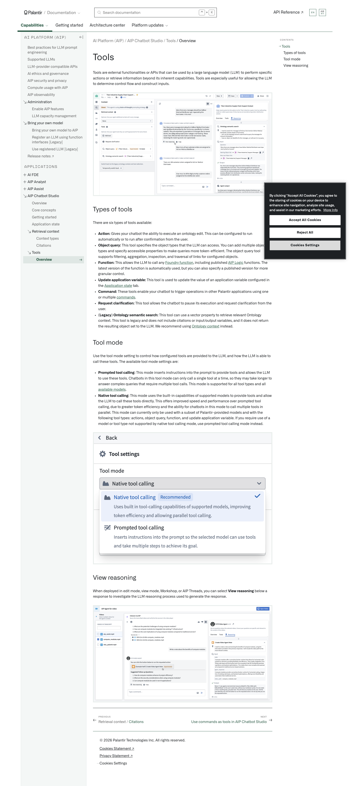
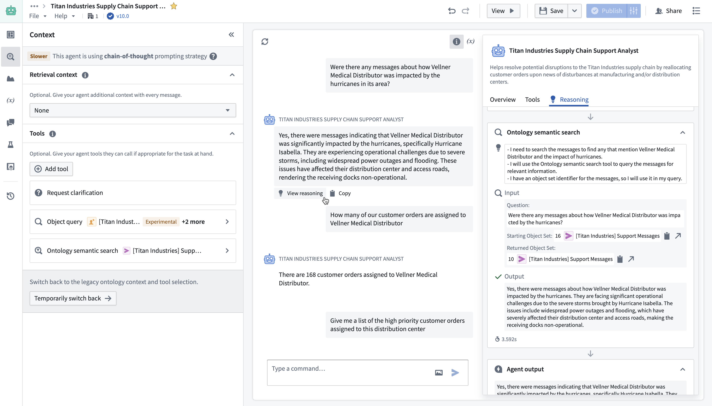
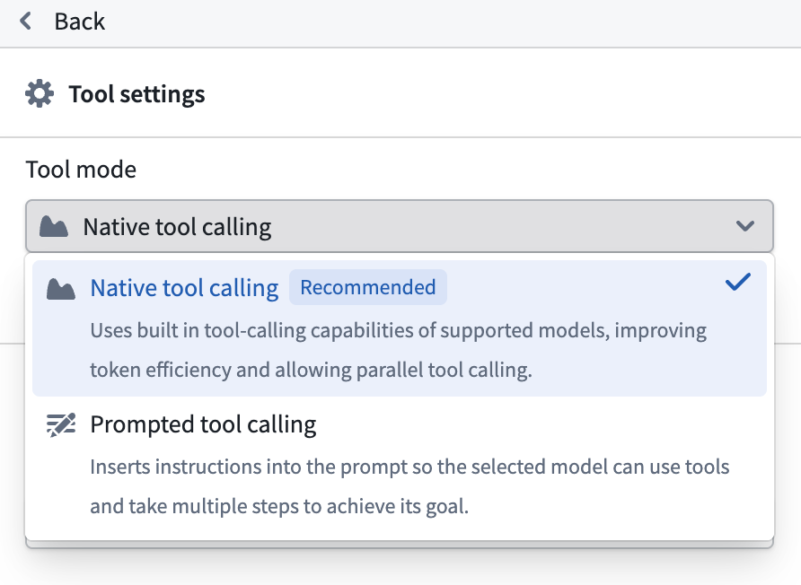
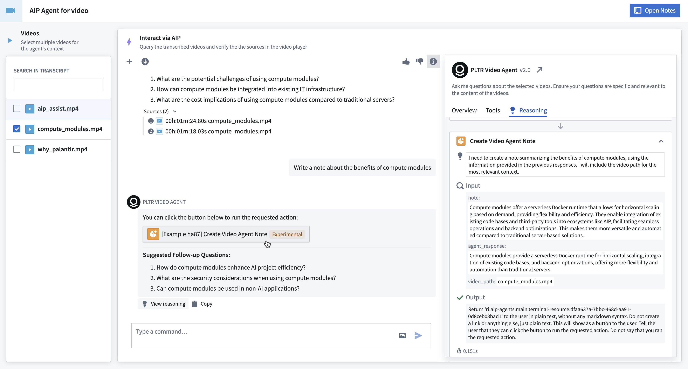

# Palantir

## Captura de pantalla

---

Search

[Palantir](//www.palantir.com)

- Documentation

  - [Documentation](/docs/foundry/)
  - [Apollo](/docs/apollo/)
  - [Gotham](/docs/gotham/)

Search documentation

Search

karat

+

K

[API Reference ↗](/docs/foundry/api-reference/)Send feedback

en

enjpkrzh

ABXY

ABXYABXYABXYABXYABXYABXY

- Capabilities

  - [AI Platform (AIP)](/docs/foundry/aip/overview/)
  - [Data connectivity & integration](/docs/foundry/data-integration/overview/)
  - [Model connectivity & development](/docs/foundry/model-integration/overview/)
  - [Ontology building](/docs/foundry/ontology/overview/)
  - [Developer toolchain](/docs/foundry/dev-toolchain/overview/)
  - [Use case development](/docs/foundry/app-building/overview/)
  - [Observability](/docs/foundry/observability/overview/)
  - [Analytics](/docs/foundry/analytics/overview/)
  - [Product delivery](/docs/foundry/devops/overview/)
  - [Security & governance](/docs/foundry/security/overview/)
  - [Management & enablement](/docs/foundry/administration/overview/)
- [Getting started](/docs/foundry/getting-started/overview/)
- [Architecture center](/docs/foundry/architecture-center/overview/)
- Platform updates

  - [Announcements](/docs/foundry/announcements/)
  - [Release notes](/docs/foundry/announcements/release-notes/)

[AI Platform (AIP)](/docs/foundry/aip/overview/)[AIP Chatbot Studio](/docs/foundry/chatbot-studio/overview/)[Tools](/docs/foundry/chatbot-studio/tools/)[Overview](/docs/foundry/chatbot-studio/tools/)

# Tools

Tools are external functionalities or APIs that can be used by a large language model (LLM) to perform specific actions or retrieve information beyond its inherent capabilities. Tools are especially useful for allowing the LLM to determine control flow and construct inputs.

## Types of tools

There are six types of tools available:

- **Action:** Gives your chatbot the ability to execute an ontology edit. This can be configured to run automatically or to run after confirmation from the user.
- **Object query:** This tool specifies the object types that the LLM can access. You can add multiple object types and specify accessible properties to make queries more token-efficient. The object query tool supports filtering, aggregation, inspection, and traversal of links for configured objects.
- **Function:** This allows the LLM to call any [Foundry function](/docs/foundry/functions/overview/), including published [AIP Logic](/docs/foundry/logic/overview/) functions. The latest version of the function is automatically used, but you can also specify a published version for more granular control.
- **Update application variable:** This tool is used to update the value of an application variable configured in the [Application state](/docs/foundry/chatbot-studio/application-state/#update-application-variables-with-chatbots) tab.
- **Command:** These tools enable your chatbot to trigger operations in other Palantir applications using one or multiple [commands](/docs/foundry/chatbot-studio/commands-as-tools/).
- **Request clarification:** This tool allows the chatbot to pause its execution and request clarification from the user.
- **(Legacy) Ontology semantic search:** This tool can use a vector property to retrieve relevant Ontology context. This tool is legacy and does not include citations or input/output variables, and it does not return the resulting object set to the LLM. We recommend using [Ontology context](/docs/foundry/chatbot-studio/retrieval-context/#ontology-context) instead.

## Tool mode

Use the tool mode setting to control how configured tools are provided to the LLM, and how the LLM is able to call these tools. The available tool mode settings are:

- **Prompted tool calling:** This mode inserts instructions into the prompt to provide tools and allows the LLM to use these tools. Chatbots in this tool mode can only call a single tool at a time, so they may take longer to answer complex queries that require multiple tool calls. This mode is supported for all tool types and all [available models](/docs/foundry/chatbot-studio/getting-started/#choose-a-large-language-model-llm).
- **Native tool calling:** This mode uses the built-in capabilities of supported models to provide tools and allow the LLM to call these tools directly. This offers improved speed and performance over prompted tool calling, due to greater token efficiency and the ability for chatbots in this mode to call multiple tools in parallel. This mode can currently only be used with a subset of Palantir-provided models and with the following tool types: actions, object query, function, and update application variable. If you require use of a model or tool type not supported by native tool calling mode, use prompted tool calling mode instead.

## View reasoning

When deployed in edit mode, view mode, Workshop, or AIP Threads, you can select **View reasoning** below a response to investigate the LLM reasoning process used to generate the response.

[←

PREVIOUSRetrieval context / Citations](/docs/foundry/chatbot-studio/citations/)

[NEXTUse commands as tools in AIP Chatbot Studio

→](/docs/foundry/chatbot-studio/commands-as-tools/)

By clicking “Accept All Cookies”, you agree to the storing of cookies on your device to enhance site navigation, analyze site usage, and assist in our marketing efforts. [More Info](https://www.palantir.com/cookie-statement/)

Accept All Cookies Reject All

Cookies Settings

.png)

## Privacy Preference Center

- ### Your Privacy
- ### Strictly Necessary Cookies
- ### Targeting Cookies

#### Your Privacy

When you visit any website, it may store or retrieve information on your browser, mostly in the form of cookies. This information might be about you, your preferences, or your device, and is mostly used to make the site work as you expect. The information does not usually identify you directly, but it can give you a more personalized web experience. Because we respect your right to privacy, you can choose not to allow some types of cookies. Click on the different category headings to learn more and change our default settings. Blocking some types of cookies may impact your experience of the site and the services we are able to offer.
\
[More information](https://www.palantir.com/cookie-statement/)

#### Strictly Necessary Cookies

Always Active

These cookies are necessary for the website to function and cannot be switched off in our systems. They are usually only set in response to actions made by you which amount to a request for services, such as setting your privacy preferences, logging in or filling in forms. You can set your browser to block or alert you about these cookies, but some parts of the site will not then work. These cookies do not store any personally identifiable information.

Cookies Details

#### Targeting Cookies

Targeting Cookies

These cookies may be set through our site by our advertising partners. They may be used by those companies to build a profile of your interests and show you relevant adverts on other sites. They do not store directly personal information, but are based on uniquely identifying your browser and internet device. If you do not allow these cookies, you will experience less targeted advertising.

Cookies Details

Back Button

### Cookie List

Consent Leg.Interest

checkbox label label

checkbox label label

checkbox label label

Clear

- checkbox label label

Apply Cancel

Confirm My Choices

Reject All Allow All

