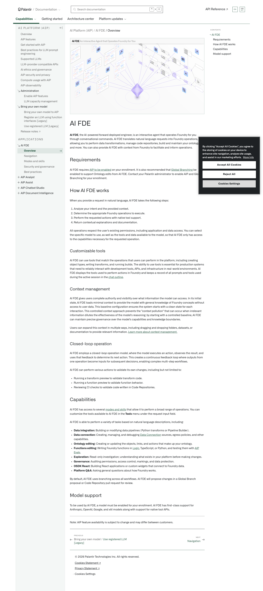
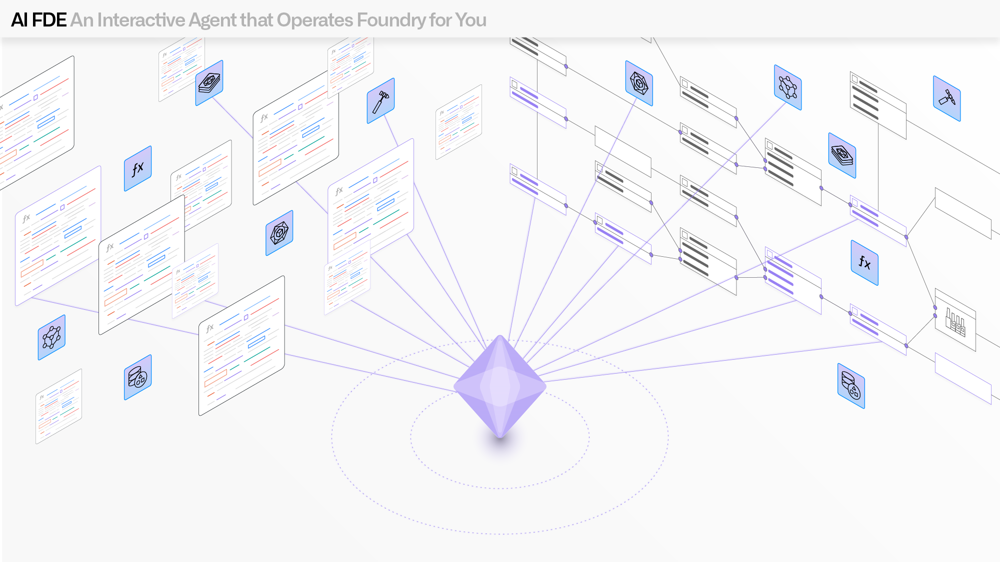

# Palantir

## Captura de pantalla

---

Search

[Palantir](//www.palantir.com)

- Documentation

  - [Documentation](/docs/foundry/)
  - [Apollo](/docs/apollo/)
  - [Gotham](/docs/gotham/)

Search documentation

Search

karat

+

K

[API Reference ↗](/docs/foundry/api-reference/)Send feedback

en

enjpkrzh

ABXY

ABXYABXYABXYABXYABXYABXY

- Capabilities

  - [AI Platform (AIP)](/docs/foundry/aip/overview/)
  - [Data connectivity & integration](/docs/foundry/data-integration/overview/)
  - [Model connectivity & development](/docs/foundry/model-integration/overview/)
  - [Ontology building](/docs/foundry/ontology/overview/)
  - [Developer toolchain](/docs/foundry/dev-toolchain/overview/)
  - [Use case development](/docs/foundry/app-building/overview/)
  - [Observability](/docs/foundry/observability/overview/)
  - [Analytics](/docs/foundry/analytics/overview/)
  - [Product delivery](/docs/foundry/devops/overview/)
  - [Security & governance](/docs/foundry/security/overview/)
  - [Management & enablement](/docs/foundry/administration/overview/)
- [Getting started](/docs/foundry/getting-started/overview/)
- [Architecture center](/docs/foundry/architecture-center/overview/)
- Platform updates

  - [Announcements](/docs/foundry/announcements/)
  - [Release notes](/docs/foundry/announcements/release-notes/)

[AI Platform (AIP)](/docs/foundry/aip/overview/)[AI FDE](/docs/foundry/ai-fde/overview/)[Overview](/docs/foundry/ai-fde/overview/)

# AI FDE

**AI FDE**, the AI-powered forward deployed engineer, is an interactive agent that operates Foundry for you through conversational commands. AI FDE translates natural language requests into Foundry operations, allowing you to perform data transformations, manage code repositories, build and maintain your ontology, and more. You can also provide AI FDE with context from Foundry to facilitate and inform operations.

## Requirements

AI FDE requires [AIP to be enabled](/docs/foundry/aip/enable-aip-features/) on your enrollment. It is also recommended that [Global Branching](/docs/foundry/global-branching/overview/) be enabled to support Ontology edits from AI FDE. Contact your Palantir administrator to enable AIP and Global Branching for your enrollment.

## How AI FDE works

When you provide a request in natural language, AI FDE takes the following steps:

1. Analyze your intent and the provided context.
2. Determine the appropriate Foundry operations to execute.
3. Perform the requested actions with native tool support.
4. Return contextual explanations and documentation.

All operations respect the user’s existing permissions, including application and data access. You can select the specific model to use, as well as the tools and data available to the model, so that AI FDE only has access to the capabilities necessary for the requested operation.

### Customizable tools

AI FDE can use tools that match the operations that users can perform in the platform, including creating object types, writing transforms, and running builds. The ability to use tools is essential for production systems that need to reliably interact with development tools, APIs, and infrastructure in real-world environments. AI FDE displays the tools used to perform actions in Foundry and keeps a record of all prompts and tools used during the active session in the [chat outline](/docs/foundry/ai-fde/navigation/#chat-outline).

### Context management

AI FDE gives users complete authority and visibility over what information the model can access. In its initial state, AI FDE loads minimal context to provide the model with general knowledge of Foundry concepts without access to user data. This baseline configuration ensures the system starts with a clean state for each interaction. This controlled context approach prevents the "context pollution" that can occur when irrelevant information dilutes the effectiveness of the model's reasoning; by starting with a controlled baseline, AI FDE can maintain precise governance over the model's capabilities and knowledge boundaries.

Users can expand this context in multiple ways, including dragging and dropping folders, datasets, or documentation to provide relevant information. [Learn more about context management.](/docs/foundry/ai-fde/navigation/#manage-context)

### Closed-loop operation

AI FDE employs a *closed-loop* operation model, where the model executes an action, observes the result, and uses that feedback to determine its next action. This creates a continuous feedback loop where outputs from one operation become inputs for subsequent decisions, enabling complex multi-step workflows.

AI FDE can perform various actions to validate its own changes, including but not limited to:

- Running a transform preview to validate transform code.
- Running a function preview to validate function behavior.
- Reviewing CI checks to validate code written in Code Repositories.

## Capabilities

AI FDE has access to several [modes and skills](/docs/foundry/ai-fde/modes-and-skills/) that allow it to perform a broad range of operations. You can customize the tools available to AI FDE in the **Tools** menu under the request input field.

AI FDE is able to perform a variety of tasks based on natural language descriptions, including:

- **Data integration:** Building or modifying data pipelines (Python transforms or Pipeline Builder).
- **Data connection:** Creating, managing, and debugging [Data Connection](/docs/foundry/data-connection/core-concepts/) sources, egress policies, and other capabilities.
- **Ontology editing:** Creating or updating the objects, links, and actions that make up your ontology.
- **Functions editing:** Writing Foundry functions in [Logic](/docs/foundry/logic/overview/), TypeScript, or Python, and testing them with [AIP Evals](/docs/foundry/aip-evals/overview/).
- **Exploration:** Read-only investigation; understanding what exists in your platform before making changes.
- **Governance:** Auditing permissions, access control, markings, and data protection.
- **OSDK React:** Building React applications or custom widgets that connect to Foundry data.
- **Platform Q&A:** Asking general questions about how Foundry works.

By default, AI FDE uses branching across all workflows. AI FDE will propose changes in a Global Branch proposal or Code Repository pull request for review.

## Model support

To be used by AI FDE, a model must be enabled for your enrollment. AI FDE has first-class support for Anthropic, OpenAI, Google, and xAI models along with support for native tool APIs.

---

Note: AIP feature availability is subject to change and may differ between customers.

[←

PREVIOUSBring your own model / Use registered LLM [Legacy]](/docs/foundry/aip/use-registered-llm/)

[NEXTNavigation

→](/docs/foundry/ai-fde/navigation/)

By clicking “Accept All Cookies”, you agree to the storing of cookies on your device to enhance site navigation, analyze site usage, and assist in our marketing efforts. [More Info](https://www.palantir.com/cookie-statement/)

Accept All Cookies Reject All

Cookies Settings

.png)

## Privacy Preference Center

- ### Your Privacy
- ### Strictly Necessary Cookies
- ### Targeting Cookies

#### Your Privacy

When you visit any website, it may store or retrieve information on your browser, mostly in the form of cookies. This information might be about you, your preferences, or your device, and is mostly used to make the site work as you expect. The information does not usually identify you directly, but it can give you a more personalized web experience. Because we respect your right to privacy, you can choose not to allow some types of cookies. Click on the different category headings to learn more and change our default settings. Blocking some types of cookies may impact your experience of the site and the services we are able to offer.
\
[More information](https://www.palantir.com/cookie-statement/)

#### Strictly Necessary Cookies

Always Active

These cookies are necessary for the website to function and cannot be switched off in our systems. They are usually only set in response to actions made by you which amount to a request for services, such as setting your privacy preferences, logging in or filling in forms. You can set your browser to block or alert you about these cookies, but some parts of the site will not then work. These cookies do not store any personally identifiable information.

Cookies Details

#### Targeting Cookies

Targeting Cookies

These cookies may be set through our site by our advertising partners. They may be used by those companies to build a profile of your interests and show you relevant adverts on other sites. They do not store directly personal information, but are based on uniquely identifying your browser and internet device. If you do not allow these cookies, you will experience less targeted advertising.

Cookies Details

Back Button

### Cookie List

Consent Leg.Interest

checkbox label label

checkbox label label

checkbox label label

Clear

- checkbox label label

Apply Cancel

Confirm My Choices

Reject All Allow All

