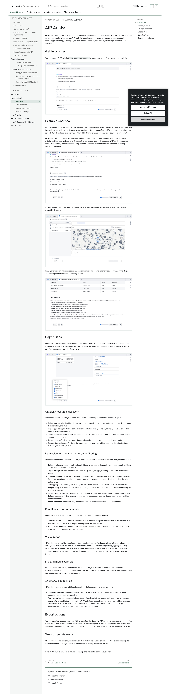
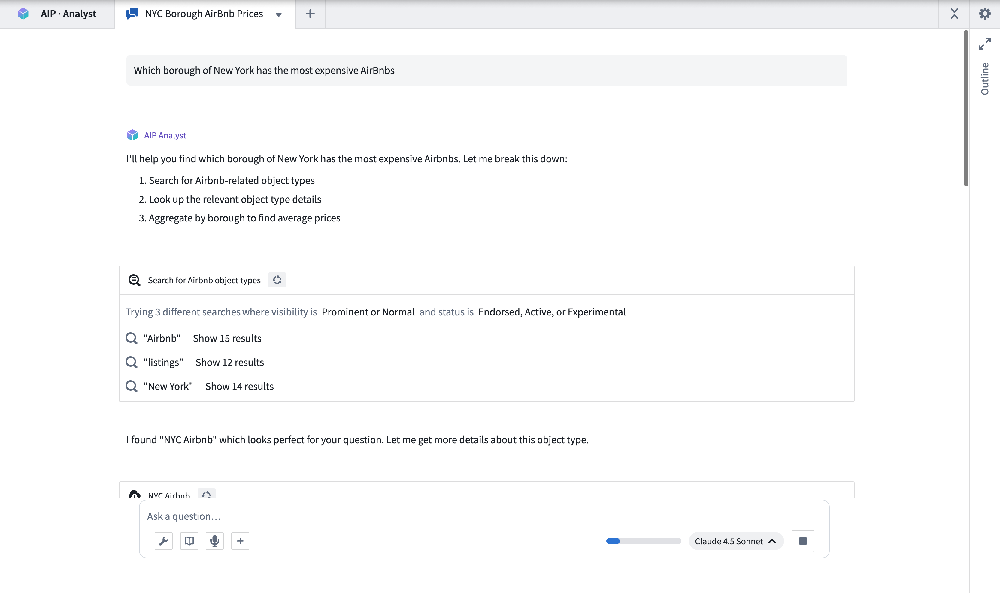
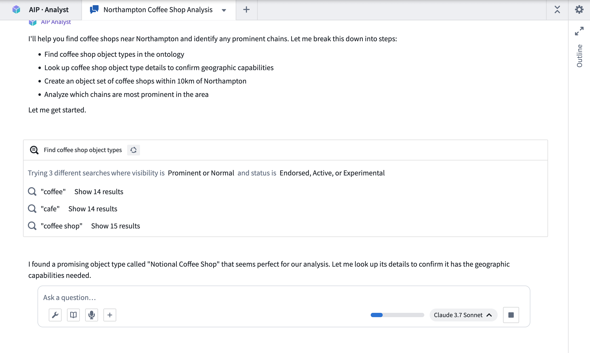
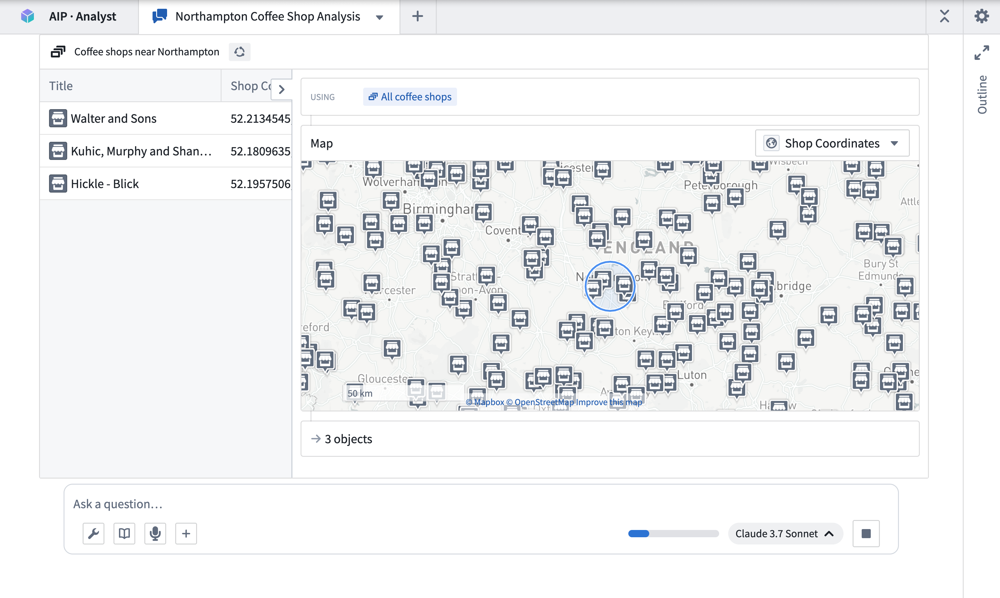
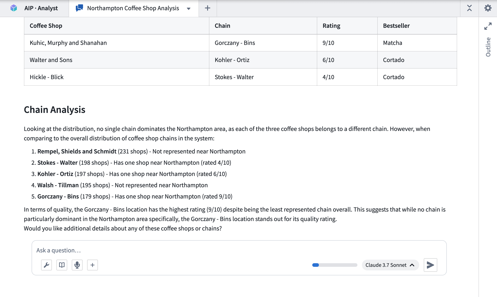
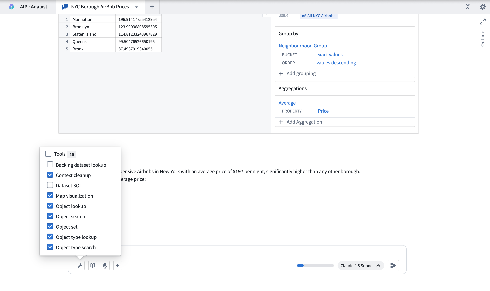

# Palantir

## Captura de pantalla

---

Search

[Palantir](//www.palantir.com)

- Documentation

  - [Documentation](/docs/foundry/)
  - [Apollo](/docs/apollo/)
  - [Gotham](/docs/gotham/)

Search documentation

Search

karat

+

K

[API Reference ↗](/docs/foundry/api-reference/)Send feedback

en

enjpkrzh

ABXY

ABXYABXYABXYABXYABXYABXY

- Capabilities

  - [AI Platform (AIP)](/docs/foundry/aip/overview/)
  - [Data connectivity & integration](/docs/foundry/data-integration/overview/)
  - [Model connectivity & development](/docs/foundry/model-integration/overview/)
  - [Ontology building](/docs/foundry/ontology/overview/)
  - [Developer toolchain](/docs/foundry/dev-toolchain/overview/)
  - [Use case development](/docs/foundry/app-building/overview/)
  - [Observability](/docs/foundry/observability/overview/)
  - [Analytics](/docs/foundry/analytics/overview/)
  - [Product delivery](/docs/foundry/devops/overview/)
  - [Security & governance](/docs/foundry/security/overview/)
  - [Management & enablement](/docs/foundry/administration/overview/)
- [Getting started](/docs/foundry/getting-started/overview/)
- [Architecture center](/docs/foundry/architecture-center/overview/)
- Platform updates

  - [Announcements](/docs/foundry/announcements/)
  - [Release notes](/docs/foundry/announcements/release-notes/)

[AI Platform (AIP)](/docs/foundry/aip/overview/)[AIP Analyst](/docs/foundry/aip-analyst/overview/)[Overview](/docs/foundry/aip-analyst/overview/)

# AIP Analyst

AIP Analyst is an interface for agentic workflows that lets you use natural language to perform ad-hoc analyses across your ontology. You can ask AIP Analyst a question, and the agent will answer by autonomously searching your ontology, creating object sets, and transforming data before generating summaries and visualizations.

## Getting started

You can access AIP Analyst at `/workspace/aip-analyst` to begin asking questions about your ontology.

## Example workflow

As an example, imagine a user that runs a coffee chain and wants to perform a competitive analysis. They want to examine whether it is viable to open a new location in Northampton, England. To start an analysis, this user can ask "Which coffee shops are within 10km of Northampton? Are any chains particularly prominent?"

AIP Analyst will then traverse the ontology, find the coffee shop data, and identify the shops that meet the criteria. It will then derive insights on their relative ratings and best selling products. AIP Analyst searches across your ontology for relevant data using multiple search terms to increase the likelihood of finding a relevant object type.

Having found some coffee shops, AIP Analyst examines the data and applies a geospatial filter centered around Northampton.

Finally, after performing some additional aggregations on the chains, it generates a summary of the shops within the specified area and competing chains.

## Capabilities

AIP Analyst leverages several categories of tools during analysis to iteratively find, analyze, and present the answer to a natural language query. You can customize the tools that are available for AIP Analyst to use by selecting checkboxes from the **Tools** menu.

### Ontology resource discovery

These tools enable AIP Analyst to discover the relevant object types and datasets for the request.

- **Object type search:** Identifies relevant object types based on object type metadata, such as display name, ID, description, or status.
- **Object type lookup:** Retrieves comprehensive metadata for a *specific object type*, including properties and links to related object types.
- **Object search:** Searches across the entire ontology or specified object types, returning matched objects grouped by object type.
- **Dataset lookup:** Finds and previews datasets, including schema information and sample data.
- **Backing dataset lookup:** Retrieves the backing dataset for a given object type, enabling direct dataset-level analysis of ontology data.

### Data selection, transformation, and filtering

With the correct context defined, AIP Analyst can use the following tools to explore and analyze retrieved data.

- **Object set:** Creates an object set, optionally filtered or transformed by applying operations such as filters, search-arounds, or semantic search.
- **Object lookup:** Retrieves a specific object from a given object type, returning all property values for that object.
- **Ontology aggregation:** Performs aggregation operations on object sets with optional grouping properties. Supported operations include count, sum, average, min, max, percentile, cardinality, standard deviation, and variance.
- **Ontology SQL:** Executes SQL queries against object sets, returning tabular data that can be used for complex analysis or chained into further queries. Queries can be chained, with each query referencing the results of a previous one.
- **Dataset SQL:** Executes SQL queries against datasets to retrieve and analyze data, returning tabular data that can be used for further analysis or chained into subsequent queries. Supports referencing multiple dataset branches.
- **Import object set:** Imports existing object sets from Foundry into the current analysis context.

### Function and action execution

AIP Analyst can execute Foundry functions and ontology actions during analysis.

- **Function execution:** Executes Foundry functions to perform computations or data transformations. You can provide inputs and review outputs directly within the analysis session.
- **Action type execution:** Executes ontology actions to create or modify objects. Actions require approval before execution, and can be reverted if needed.

### Visualization

AIP Analyst can present its outputs using data visualization tools. The **Create Visualization** tool allows you to use Vega charts to build interactive visualizations from tabular data including ontology aggregations, SQL results, or dataset queries. The **Map Visualization** tool lets you visualize geospatial data. AIP Analyst also supports **Mermaid diagrams** for rendering flowcharts, sequence diagrams, and other structured diagram types.

### File and media support

You can upload files directly into the analysis for AIP Analyst to process. Supported formats include spreadsheets (Excel, CSV), documents (Word, DOCX), images, and PDF files. You can also attach media items from Foundry media sets as analysis context.

### Additional capabilities

AIP Analyst includes several additional capabilities that support the analysis workflow:

- **Clarifying questions:** When a query is ambiguous, AIP Analyst may ask clarifying questions to refine its analysis approach before proceeding.
- **Audio input:** You can record audio input directly from the chat interface, enabling voice-driven analysis.
- **Memory:** When enabled on your ontology, AIP Analyst can remember patterns and context from previous interactions to improve future analyses. Memories can be viewed, edited, and managed through a dedicated dialog. To enable memories, contact Palantir support.

## Export options

You can export an analysis session to PDF by selecting the **Export to PDF** option from the session header. The export dialog lets you select which context items to include, expand or collapse tool results, and preview the document before printing. This uses your browser's print dialog, allowing you to save the output as a PDF file.

## Session persistence

AIP Analyst does not currently retain conversation history after a session is closed. Users are encouraged to save their queries and Vega-Lite visualization code to pick up where they left off.

---

Note: AIP feature availability is subject to change and may differ between customers.

[←

PREVIOUSAI FDE / Best practices](/docs/foundry/ai-fde/best-practices/)

[NEXTCore concepts

→](/docs/foundry/aip-analyst/core-concepts/)

By clicking “Accept All Cookies”, you agree to the storing of cookies on your device to enhance site navigation, analyze site usage, and assist in our marketing efforts. [More Info](https://www.palantir.com/cookie-statement/)

Accept All Cookies Reject All

Cookies Settings

.png)

## Privacy Preference Center

- ### Your Privacy
- ### Strictly Necessary Cookies
- ### Targeting Cookies

#### Your Privacy

When you visit any website, it may store or retrieve information on your browser, mostly in the form of cookies. This information might be about you, your preferences, or your device, and is mostly used to make the site work as you expect. The information does not usually identify you directly, but it can give you a more personalized web experience. Because we respect your right to privacy, you can choose not to allow some types of cookies. Click on the different category headings to learn more and change our default settings. Blocking some types of cookies may impact your experience of the site and the services we are able to offer.
\
[More information](https://www.palantir.com/cookie-statement/)

#### Strictly Necessary Cookies

Always Active

These cookies are necessary for the website to function and cannot be switched off in our systems. They are usually only set in response to actions made by you which amount to a request for services, such as setting your privacy preferences, logging in or filling in forms. You can set your browser to block or alert you about these cookies, but some parts of the site will not then work. These cookies do not store any personally identifiable information.

Cookies Details

#### Targeting Cookies

Targeting Cookies

These cookies may be set through our site by our advertising partners. They may be used by those companies to build a profile of your interests and show you relevant adverts on other sites. They do not store directly personal information, but are based on uniquely identifying your browser and internet device. If you do not allow these cookies, you will experience less targeted advertising.

Cookies Details

Back Button

### Cookie List

Consent Leg.Interest

checkbox label label

checkbox label label

checkbox label label

Clear

- checkbox label label

Apply Cancel

Confirm My Choices

Reject All Allow All

