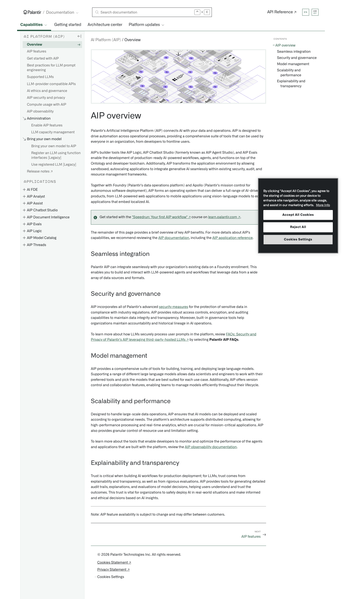
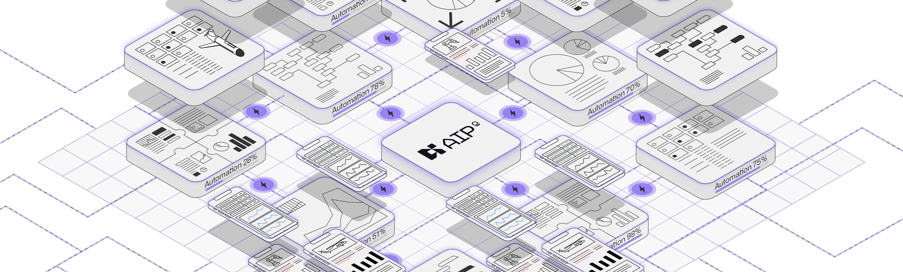

# Palantir

## Captura de pantalla

---

Search

[Palantir](//www.palantir.com)

- Documentation

  - [Documentation](/docs/foundry/)
  - [Apollo](/docs/apollo/)
  - [Gotham](/docs/gotham/)

Search documentation

Search

karat

+

K

[API Reference ↗](/docs/foundry/api-reference/)Send feedback

en

enjpkrzh

ABXY

ABXYABXYABXYABXYABXYABXY

- Capabilities

  - [AI Platform (AIP)](/docs/foundry/aip/overview/)
  - [Data connectivity & integration](/docs/foundry/data-integration/overview/)
  - [Model connectivity & development](/docs/foundry/model-integration/overview/)
  - [Ontology building](/docs/foundry/ontology/overview/)
  - [Developer toolchain](/docs/foundry/dev-toolchain/overview/)
  - [Use case development](/docs/foundry/app-building/overview/)
  - [Observability](/docs/foundry/observability/overview/)
  - [Analytics](/docs/foundry/analytics/overview/)
  - [Product delivery](/docs/foundry/devops/overview/)
  - [Security & governance](/docs/foundry/security/overview/)
  - [Management & enablement](/docs/foundry/administration/overview/)
- [Getting started](/docs/foundry/getting-started/overview/)
- [Architecture center](/docs/foundry/architecture-center/overview/)
- Platform updates

  - [Announcements](/docs/foundry/announcements/)
  - [Release notes](/docs/foundry/announcements/release-notes/)

[AI Platform (AIP)](/docs/foundry/aip/overview/)[Overview](/docs/foundry/aip/overview/)

# AIP overview

Palantir's Artificial Intelligence Platform (AIP) connects AI with your data and operations. AIP is designed to drive automation across operational processes, providing a comprehensive suite of tools that can be used by everyone in an organization, from developers to frontline users.

AIP's builder tools like AIP Logic, AIP Chatbot Studio (formerly known as AIP Agent Studio), and AIP Evals enable the development of production-ready AI-powered workflows, agents, and functions on top of the Ontology and developer toolchain. Additionally, AIP transforms the application environment by allowing sandboxed, autoscaling applications to integrate generative AI seamlessly within existing security, audit, and resource management frameworks.

Together with Foundry (Palantir's data operations platform) and Apollo (Palantir's mission control for autonomous software deployment), AIP forms an operating system that can deliver a full range of AI-driven products, from LLM-powered web applications to mobile applications using vision-language models to edge applications that embed localized AI.

Get started with the ["Speedrun: Your first AIP workflow" ↗](https://learn.palantir.com/speedrun-your-e2e-aip-workflow) course on [learn.palantir.com ↗](https://learn.palantir.com).

The remainder of this page provides a brief overview of key AIP benefits. For more details about AIP's capabilities, we recommend reviewing the [AIP documentation](/docs/foundry/aip/aip-features/), including the [AIP application reference](/docs/foundry/aip/aip-features/#aip-application-reference).

## Seamless integration

Palantir AIP can integrate seamlessly with your organization's existing data on a Foundry enrollment. This enables you to build and interact with LLM-powered agents and workflows that leverage data from a wide array of data sources and formats.

## Security and governance

AIP incorporates all of Palantir's advanced [security measures](/docs/foundry/security/overview/) for the protection of sensitive data in compliance with industry regulations. AIP provides robust access controls, encryption, and auditing capabilities to maintain data integrity and transparency. Moreover, built-in governance tools help organizations maintain accountability and historical lineage in AI operations.

To learn more about how LLMs securely process user prompts in the platform, review [FAQs: Security and Privacy of Palantir's AIP leveraging third-party-hosted LLMs ↗](https://palantir.safebase.us/?itemName=data_privacy&source=click) by selecting **Palantir AIP FAQs**.

## Model management

AIP provides a comprehensive suite of tools for building, training, and deploying large language models. Supporting a range of different large language models allows data scientists and engineers to work with their preferred tools and pick the models that are best suited for each use case. Additionally, AIP offers version control and collaboration features, enabling teams to manage models efficiently throughout their lifecycle.

## Scalability and performance

Designed to handle large-scale data operations, AIP ensures that AI models can be deployed and scaled according to organizational needs. The platform's architecture supports distributed computing, allowing for high-performance processing and real-time analytics, which are crucial for mission-critical applications. AIP also provides granular control of resource use and limitation setting.

To learn more about the tools that enable developers to monitor and optimize the performance of the agents and applications that are built with the platform, review the [AIP observability documentation](/docs/foundry/aip-observability/overview/).

## Explainability and transparency

Trust is critical when building AI workflows for production deployment; for LLMs, trust comes from explainability and transparency, as well as from rigorous evaluations. AIP provides tools for generating detailed audit trails, explanations, and evaluations of model decisions, helping users understand and trust the outcomes. This trust is vital for organizations to safely deploy AI in real-world situations and make informed and ethical decisions based on AI insights.

---

Note: AIP feature availability is subject to change and may differ between customers.

[NEXTAIP features

→](/docs/foundry/aip/aip-features/)

By clicking “Accept All Cookies”, you agree to the storing of cookies on your device to enhance site navigation, analyze site usage, and assist in our marketing efforts. [More Info](https://www.palantir.com/cookie-statement/)

Accept All Cookies Reject All

Cookies Settings

.png)

## Privacy Preference Center

- ### Your Privacy
- ### Strictly Necessary Cookies
- ### Targeting Cookies

#### Your Privacy

When you visit any website, it may store or retrieve information on your browser, mostly in the form of cookies. This information might be about you, your preferences, or your device, and is mostly used to make the site work as you expect. The information does not usually identify you directly, but it can give you a more personalized web experience. Because we respect your right to privacy, you can choose not to allow some types of cookies. Click on the different category headings to learn more and change our default settings. Blocking some types of cookies may impact your experience of the site and the services we are able to offer.
\
[More information](https://www.palantir.com/cookie-statement/)

#### Strictly Necessary Cookies

Always Active

These cookies are necessary for the website to function and cannot be switched off in our systems. They are usually only set in response to actions made by you which amount to a request for services, such as setting your privacy preferences, logging in or filling in forms. You can set your browser to block or alert you about these cookies, but some parts of the site will not then work. These cookies do not store any personally identifiable information.

Cookies Details

#### Targeting Cookies

Targeting Cookies

These cookies may be set through our site by our advertising partners. They may be used by those companies to build a profile of your interests and show you relevant adverts on other sites. They do not store directly personal information, but are based on uniquely identifying your browser and internet device. If you do not allow these cookies, you will experience less targeted advertising.

Cookies Details

Back Button

### Cookie List

Consent Leg.Interest

checkbox label label

checkbox label label

checkbox label label

Clear

- checkbox label label

Apply Cancel

Confirm My Choices

Reject All Allow All

