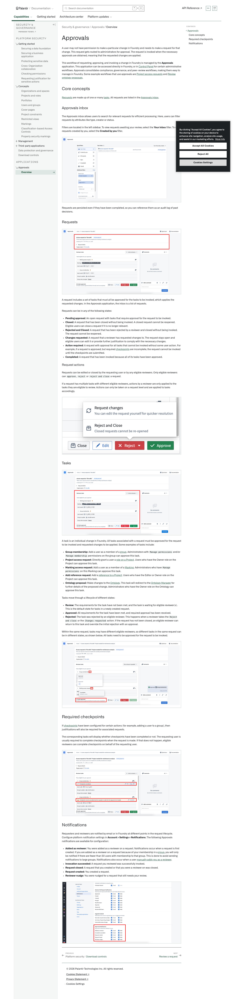
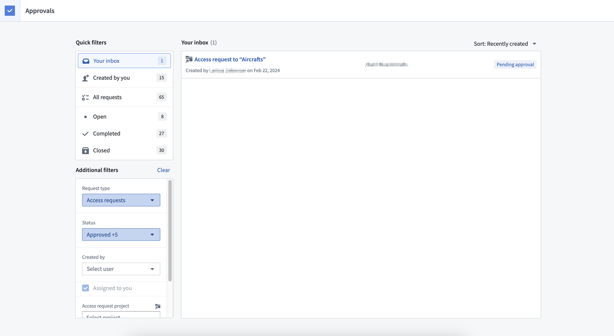
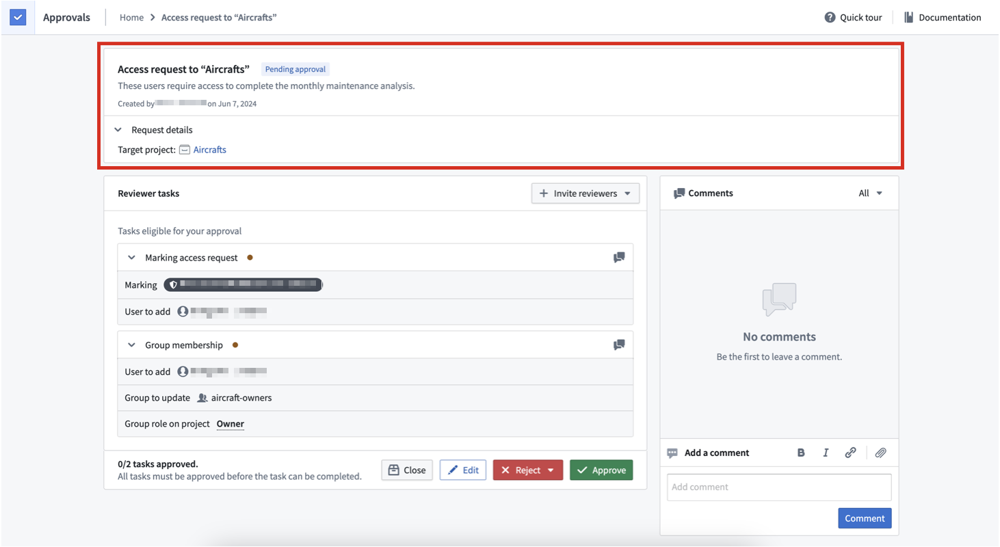
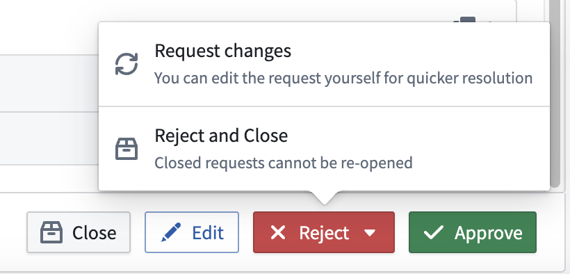
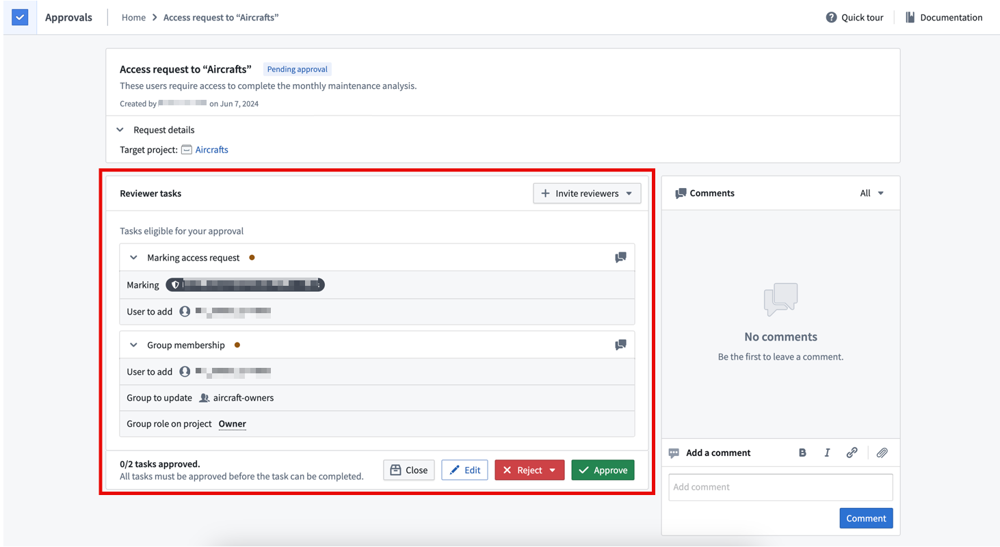
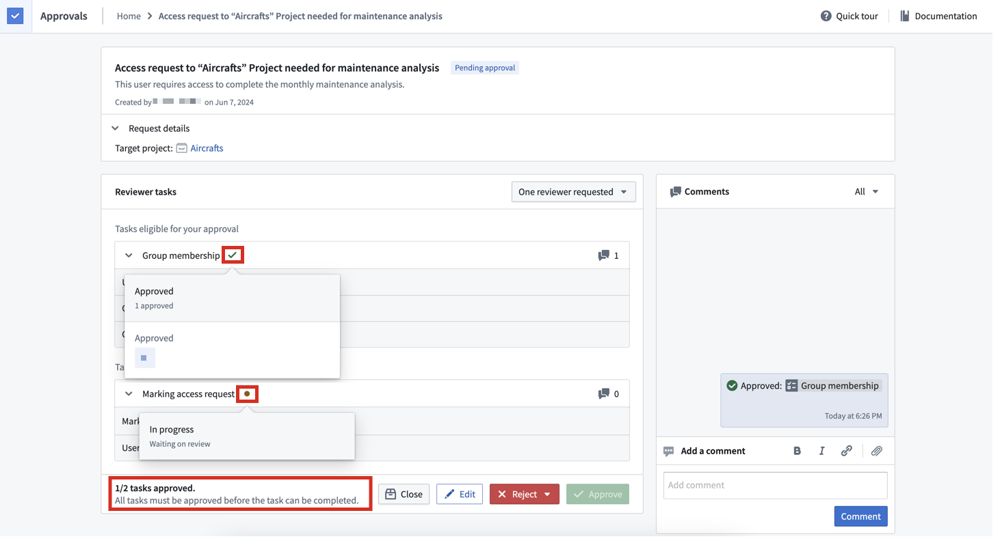
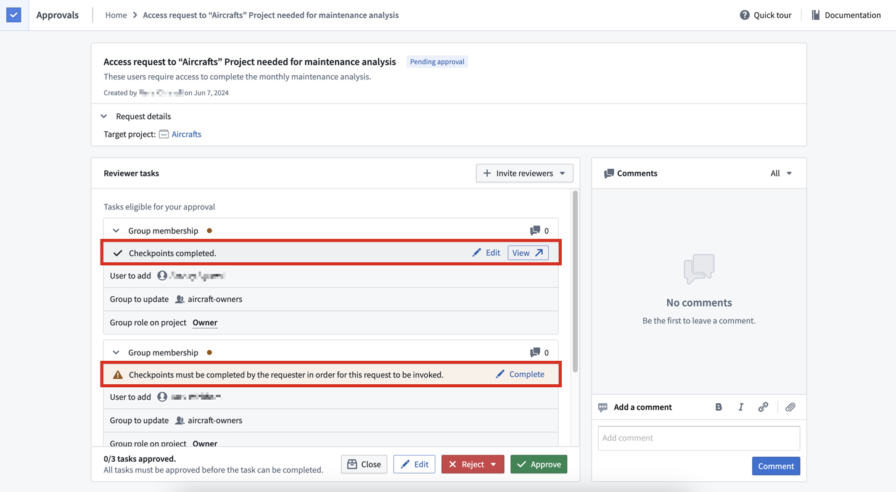

# Palantir

## Captura de pantalla

---

Search

[Palantir](//www.palantir.com)

- Documentation

  - [Documentation](/docs/foundry/)
  - [Apollo](/docs/apollo/)
  - [Gotham](/docs/gotham/)

Search documentation

Search

karat

+

K

[API Reference ↗](/docs/foundry/api-reference/)Send feedback

en

enjpkrzh

ABXY

ABXYABXYABXYABXYABXYABXY

- Capabilities

  - [AI Platform (AIP)](/docs/foundry/aip/overview/)
  - [Data connectivity & integration](/docs/foundry/data-integration/overview/)
  - [Model connectivity & development](/docs/foundry/model-integration/overview/)
  - [Ontology building](/docs/foundry/ontology/overview/)
  - [Developer toolchain](/docs/foundry/dev-toolchain/overview/)
  - [Use case development](/docs/foundry/app-building/overview/)
  - [Observability](/docs/foundry/observability/overview/)
  - [Analytics](/docs/foundry/analytics/overview/)
  - [Product delivery](/docs/foundry/devops/overview/)
  - [Security & governance](/docs/foundry/security/overview/)
  - [Management & enablement](/docs/foundry/administration/overview/)
- [Getting started](/docs/foundry/getting-started/overview/)
- [Architecture center](/docs/foundry/architecture-center/overview/)
- Platform updates

  - [Announcements](/docs/foundry/announcements/)
  - [Release notes](/docs/foundry/announcements/release-notes/)

[Security & governance](/docs/foundry/security/overview/)[Approvals](/docs/foundry/approvals/overview/)[Overview](/docs/foundry/approvals/overview/)

# Approvals

A user may not have permission to make a particular change in Foundry and needs to make a request for that change. This request gets routed to administrators for approval. The request is invoked when the necessary approvals are obtained, meaning that the requested changes are applied.

This workflow of requesting, approving, and invoking a change in Foundry is managed by the **Approvals** application. This application can be accessed directly in Foundry, or in [Control Panel](/docs/foundry/administration/control-panel-approvals/) for certain administrative workflows. Approvals consolidates compliance, governance, and peer-review workflows, making them easy to manage in Foundry. Some example workflows that use approvals are [Project access requests](/docs/foundry/security/projects-and-roles/#request-access-to-a-project) and [Review ontology proposals](/docs/foundry/ontologies/review-ontology-proposals/).

## Core concepts

[Requests](#requests) are made up of one or many [tasks](#tasks). All requests are listed in the [Approvals inbox](#approvals-inbox).

### Approvals inbox

The Approvals inbox allows users to search for relevant requests for efficient processing. Here, users can filter requests by attributes like type, creator or status.

Filters are located in the left sidebar. To view requests awaiting your review, select the **Your inbox** filter. To view requests created by you, select the **Created by you** filter.

Requests are persisted even if they have been completed, so you can reference them as an audit log of past decisions.

### Requests

A request includes a set of tasks that must *all* be approved for the tasks to be invoked, which applies the requested changes. In the Approvals application, the inbox is a list of requests.

Requests can be in any of the following states:

- **Pending approval:** An open request with tasks that require approval for the request to be invoked.
- **Closed:** A request that has been closed without being invoked. A closed request cannot be reopened. Eligible users can close a request if it is no longer relevant.
- **Rejected and Closed:** A request that has been rejected by a reviewer and closed without being invoked. The request cannot be reopened.
- **Changes requested:** A request that a reviewer has requested changes to. The request stays open and eligible users can edit it or provide further justification to comply with the necessary changes.
- **Action required:** A request with approval for all tasks that cannot be invoked without some user action. For example, if a request is approved, but required [checkpoints](#required-checkpoints) are incomplete, the request cannot be invoked until the checkpoints are submitted.
- **Completed:** A request that has been invoked because all of its tasks have been approved.

#### Request actions

Requests can be edited or closed by the requesting user or by any eligible reviewers. Only eligible reviewers can `approve`, `reject` or `reject and close` a request.

If a request has multiple tasks with different eligible reviewers, actions by a reviewer are only applied to the tasks they are eligible to review. Actions can only be taken on a request level and are applied to tasks accordingly.

### Tasks

A task is an individual change in Foundry. *All* tasks associated with a request must be approved for the request to be invoked and requested changes to be applied. Some examples of tasks include:

- **Group membership:** Add a user as a member of a [group](/docs/foundry/security/users-and-groups/#groups). Administrators with `Manage permissions` and/or `Manage membership` permissions on the group can approve this task.
- **Project access request:** Directly grant a user a [role on a Project](/docs/foundry/security/projects-and-roles/). Users who have the Owner role on the Project can approve this task.
- **Marking access request:** Add a user as a member of a [Marking](/docs/foundry/security/markings/). Administrators who have `Manage permissions` on this Marking can approve this task.
- **Add reference request:** Add a [reference to a Project](/docs/foundry/security/projects-and-roles/#references). Users who have the Editor or Owner role on the Project can approve this task.
- **Ontology proposal:** Make changes to the [Ontology](/docs/foundry/ontology/overview/). This task will redirect to the [Ontology Manager](/docs/foundry/ontology-manager/overview/) for further details of the proposed change. Administrators who have the Owner role on the Ontology can approve this task.

Tasks move through a lifecycle of different states:

- **Review:** The requirements for the task have not been met, and the task is waiting for eligible reviewer(s). This is the default state for tasks in a newly created request.
- **Approved:** All requirements for the task have been met, and required approval has been received.
- **Rejected:** The task was rejected by an eligible reviewer. This happens when a reviewer takes the `Reject and close` or the `Changes requested` action. If the request has not been closed, an eligible reviewer can return to this task and override the initial rejection with an approval.

Within the same request, tasks may have different eligible reviewers, so different tasks in the same request can be in different states, as shown below. All tasks need to be approved for the request to be invoked.

## Required checkpoints

If [checkpoints](/docs/foundry/checkpoints/overview/) have been configured for certain actions (for example, adding a user to a group), then justifications will also be required for associated requests.

The corresponding tasks will display whether checkpoints have been completed or not. The requesting user is usually required to complete checkpoints when the request is made. If that does not happen, eligible reviewers can complete checkpoints on behalf of the requesting user.

## Notifications

Requesters and reviewers are notified by email or in Foundry at different points in the request lifecycle. Configure platform notification settings in **Account > Settings > Notifications**. The following Approvals notifications are available for configuration:

- **Added as reviewer:** You were added as a reviewer on a request. Notifications occur when a request is first created. If you are added as a reviewer on a request because of your membership in a [group](/docs/foundry/security/users-and-groups/#groups), you will only be notified if there are fewer than 50 users with membership to that group. This is done to avoid sending notifications to large groups. Notifications also occur when a user [manually adds you as a reviewer](/docs/foundry/approvals/review-a-request/#add-reviewer).
- **Invocation succeeded:** A request you reviewed was successfully invoked.
- **Request closed:** A request that you created or that you were a reviewer on was closed.
- **Request created:** You created a request.
- **Reviewer nudge:** You were nudged for a request that still needs your review.

[←

PREVIOUSPlatform security / Download controls](/docs/foundry/security/download-controls/)

[NEXTReview a request

→](/docs/foundry/approvals/review-a-request/)

By clicking “Accept All Cookies”, you agree to the storing of cookies on your device to enhance site navigation, analyze site usage, and assist in our marketing efforts. [More Info](https://www.palantir.com/cookie-statement/)

Accept All Cookies Reject All

Cookies Settings

.png)

## Privacy Preference Center

- ### Your Privacy
- ### Strictly Necessary Cookies
- ### Targeting Cookies

#### Your Privacy

When you visit any website, it may store or retrieve information on your browser, mostly in the form of cookies. This information might be about you, your preferences, or your device, and is mostly used to make the site work as you expect. The information does not usually identify you directly, but it can give you a more personalized web experience. Because we respect your right to privacy, you can choose not to allow some types of cookies. Click on the different category headings to learn more and change our default settings. Blocking some types of cookies may impact your experience of the site and the services we are able to offer.
\
[More information](https://www.palantir.com/cookie-statement/)

#### Strictly Necessary Cookies

Always Active

These cookies are necessary for the website to function and cannot be switched off in our systems. They are usually only set in response to actions made by you which amount to a request for services, such as setting your privacy preferences, logging in or filling in forms. You can set your browser to block or alert you about these cookies, but some parts of the site will not then work. These cookies do not store any personally identifiable information.

Cookies Details

#### Targeting Cookies

Targeting Cookies

These cookies may be set through our site by our advertising partners. They may be used by those companies to build a profile of your interests and show you relevant adverts on other sites. They do not store directly personal information, but are based on uniquely identifying your browser and internet device. If you do not allow these cookies, you will experience less targeted advertising.

Cookies Details

Back Button

### Cookie List

Consent Leg.Interest

checkbox label label

checkbox label label

checkbox label label

Clear

- checkbox label label

Apply Cancel

Confirm My Choices

Reject All Allow All

