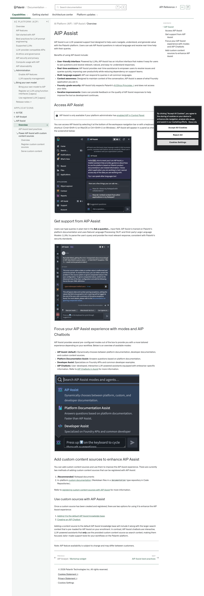
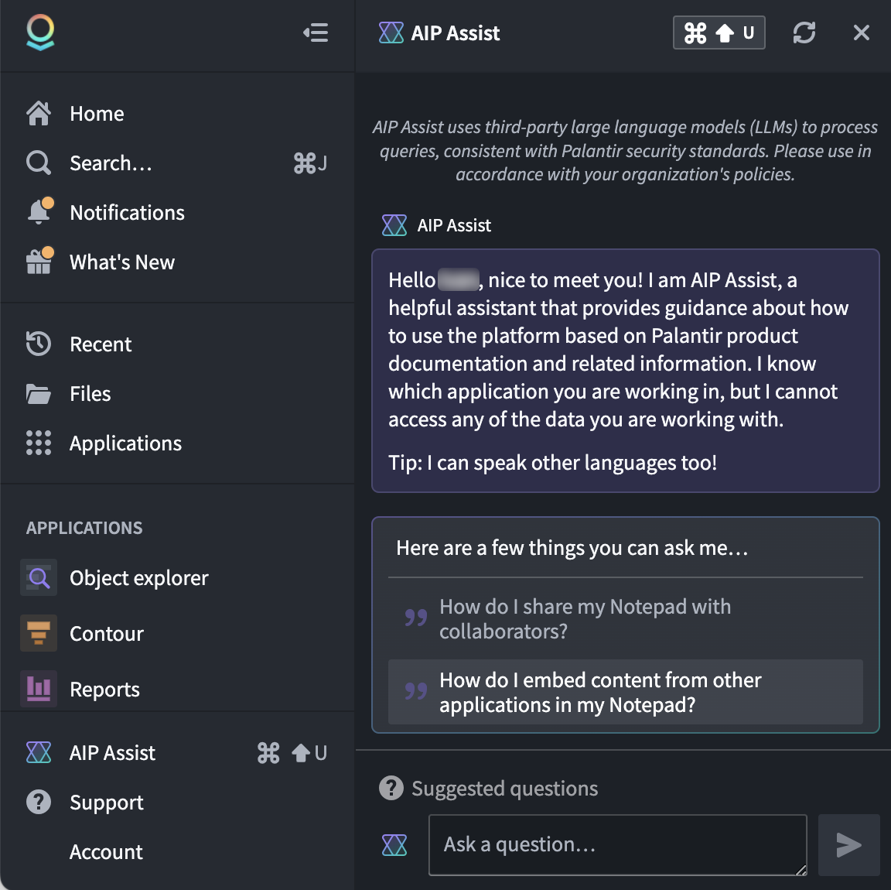
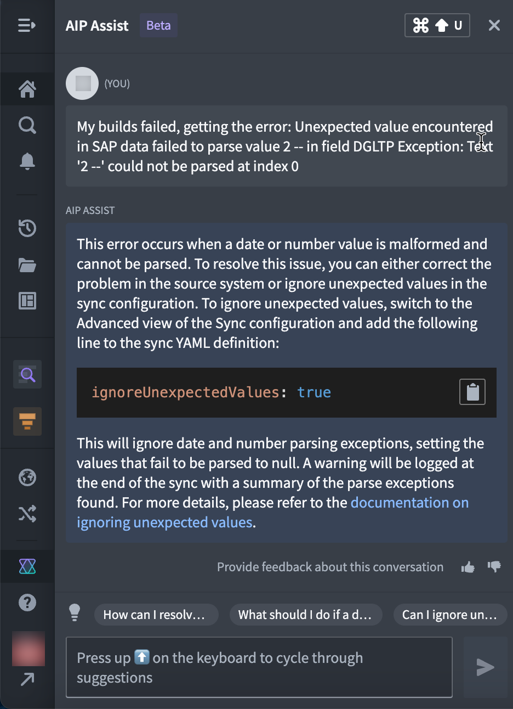
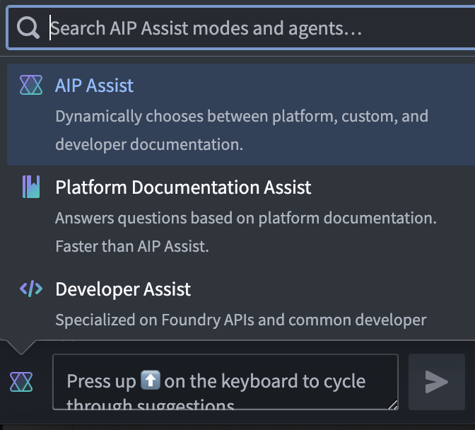

# Palantir

## Captura de pantalla

---

Search

[Palantir](//www.palantir.com)

- Documentation

  - [Documentation](/docs/foundry/)
  - [Apollo](/docs/apollo/)
  - [Gotham](/docs/gotham/)

Search documentation

Search

karat

+

K

[API Reference ↗](/docs/foundry/api-reference/)Send feedback

en

enjpkrzh

ABXY

ABXYABXYABXYABXYABXYABXY

- Capabilities

  - [AI Platform (AIP)](/docs/foundry/aip/overview/)
  - [Data connectivity & integration](/docs/foundry/data-integration/overview/)
  - [Model connectivity & development](/docs/foundry/model-integration/overview/)
  - [Ontology building](/docs/foundry/ontology/overview/)
  - [Developer toolchain](/docs/foundry/dev-toolchain/overview/)
  - [Use case development](/docs/foundry/app-building/overview/)
  - [Observability](/docs/foundry/observability/overview/)
  - [Analytics](/docs/foundry/analytics/overview/)
  - [Product delivery](/docs/foundry/devops/overview/)
  - [Security & governance](/docs/foundry/security/overview/)
  - [Management & enablement](/docs/foundry/administration/overview/)
- [Getting started](/docs/foundry/getting-started/overview/)
- [Architecture center](/docs/foundry/architecture-center/overview/)
- Platform updates

  - [Announcements](/docs/foundry/announcements/)
  - [Release notes](/docs/foundry/announcements/release-notes/)

[AI Platform (AIP)](/docs/foundry/aip/overview/)[AIP Assist](/docs/foundry/assist/overview/)[Overview](/docs/foundry/assist/overview/)

# AIP Assist

AIP Assist is an LLM-powered support tool designed to help users navigate, understand, and generate value with the Palantir platform. Users can ask AIP Assist questions in natural language and receive real-time help with their queries.

Benefits of using AIP Assist include:

- **User-friendly interface:** Powered by LLMs, AIP Assist has an intuitive interface that makes it easy for users to ask questions and receive relevant, natural, and easy-to-understand responses.
- **Real-time assistance:** AIP Assist provides real-time assistance to empower users to resolve issues and queries quickly, improving user productivity while reducing dependency on support teams.
- **Multi-language support:** AIP can respond to queries in all common languages.
- **Context awareness:** Designed to maintain context of the conversation, AIP Assist is aware of what Foundry application you are in.
- **Foundry-grade security:** AIP Assist fully respects Palantir’s [AI Ethics Principles ↗](https://www.palantir.com/pcl/palantir-ai-ethics/) and does not access your data.
- **Iterative improvements:** Users can provide feedback on the quality of AIP Assist responses to help improve the tool as development continues.

## Access AIP Assist

AIP Assist is only available if your platform administrator has [enabled AIP in Control Panel](/docs/foundry/aip/enable-aip-features/).

You can access AIP Assist by selecting it at the bottom of the workspace navigation bar or with a keyboard shortcut (Cmd+Shift+U on MacOS or Ctrl+Shift+U on Windows). AIP Assist will appear in a panel as shown in the screenshot below:

## Get support from AIP Assist

Users can type queries in plain text in the **Ask a question...** input field. AIP Assist is trained on Palantir's platform documentation and uses Natural Language Processing (NLP) and third-party Large Language Models (LLMs) to parse the user's query and provide the most relevant response, consistent with Palantir's security standards.

## Focus your AIP Assist experience with modes and AIP Chatbots

AIP Assist provides several pre-configured modes out of the box to provide you with a more tailored experience depending on your workflow. Below is an overview of available modes:

- **AIP Assist (default):** Dynamically chooses between platform documentation, developer documentation, and custom content sources.
- **Platform Documentation Assist:** Answers questions based on platform documentation.
- **Developer Assist:** Specializes on Foundry APIs and common developer examples.
- **AIP Chatbots:** User-developed, interactive LLM-powered assistants equipped with enterprise-specific information. Refer to [AIP Chatbots in Assist](/docs/foundry/assist/agents-in-aip-assist/) for more information.

## Add custom content sources to enhance AIP Assist

You can add custom content sources and use them to improve the AIP Assist experience. There are currently two methods of adding custom content sources that can be registered with AIP Assist:

1. **(Recommended)** Notepad documents
2. In-platform [custom documentation](/docs/foundry/custom-docs/overview/) (Markdown files in a `documentation` type repository in Code Repositories).

Refer to [registering custom content sources with AIP Assist](/docs/foundry/assist/aip-assist-registering-content/) for more information.

### Use custom sources with AIP Assist

Once a custom source has been created and registered, there are two options for using it to enhance the AIP Assist experience:

1. [Adding it to the default AIP Assist knowledge base](/docs/foundry/assist/adding-documentation-to-aip-assist/).
2. [Creating an AIP Chatbot](/docs/foundry/assist/agents-in-aip-assist/).

Adding a content source to the default AIP Assist knowledge base will include it along with the larger search context that is pre-loaded for AIP Assist on your enrollment. In contrast, AIP Assist chatbots are interactive, LLM-powered assistants that **only** use the provided custom content source as search context, making them focused, tailor-made support tools for your workflows on the Palantir platform.

---

Note: AIP feature availability is subject to change and may differ between customers.

[←

PREVIOUSAIP Analyst / Workshop widget](/docs/foundry/aip-analyst/workshop-widget/)

[NEXTAIP Assist best practices

→](/docs/foundry/assist/aip-best-practices/)

By clicking “Accept All Cookies”, you agree to the storing of cookies on your device to enhance site navigation, analyze site usage, and assist in our marketing efforts. [More Info](https://www.palantir.com/cookie-statement/)

Accept All Cookies Reject All

Cookies Settings

.png)

## Privacy Preference Center

- ### Your Privacy
- ### Strictly Necessary Cookies
- ### Targeting Cookies

#### Your Privacy

When you visit any website, it may store or retrieve information on your browser, mostly in the form of cookies. This information might be about you, your preferences, or your device, and is mostly used to make the site work as you expect. The information does not usually identify you directly, but it can give you a more personalized web experience. Because we respect your right to privacy, you can choose not to allow some types of cookies. Click on the different category headings to learn more and change our default settings. Blocking some types of cookies may impact your experience of the site and the services we are able to offer.
\
[More information](https://www.palantir.com/cookie-statement/)

#### Strictly Necessary Cookies

Always Active

These cookies are necessary for the website to function and cannot be switched off in our systems. They are usually only set in response to actions made by you which amount to a request for services, such as setting your privacy preferences, logging in or filling in forms. You can set your browser to block or alert you about these cookies, but some parts of the site will not then work. These cookies do not store any personally identifiable information.

Cookies Details

#### Targeting Cookies

Targeting Cookies

These cookies may be set through our site by our advertising partners. They may be used by those companies to build a profile of your interests and show you relevant adverts on other sites. They do not store directly personal information, but are based on uniquely identifying your browser and internet device. If you do not allow these cookies, you will experience less targeted advertising.

Cookies Details

Back Button

### Cookie List

Consent Leg.Interest

checkbox label label

checkbox label label

checkbox label label

Clear

- checkbox label label

Apply Cancel

Confirm My Choices

Reject All Allow All

