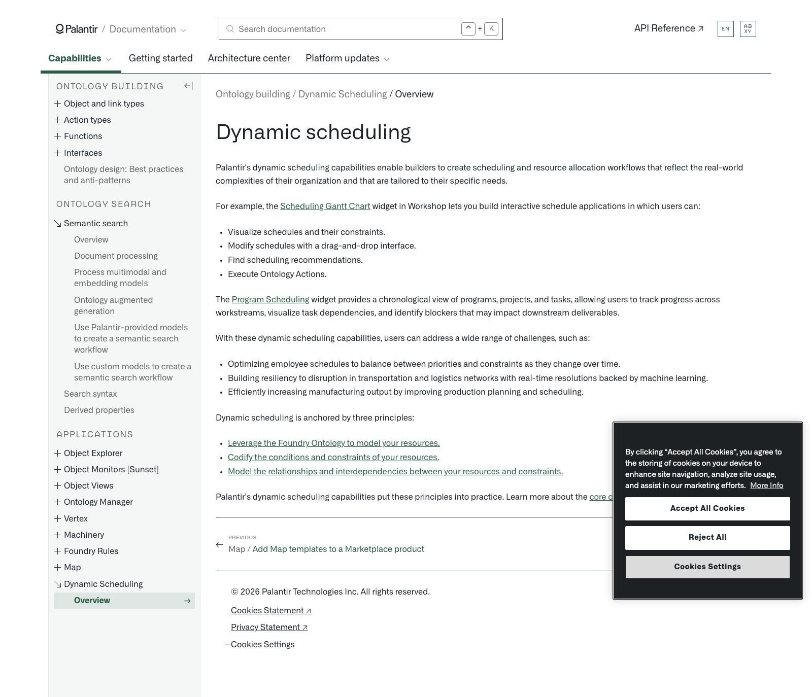

# Palantir

## Captura de pantalla

---

Search

[Palantir](//www.palantir.com)

- Documentation

  - [Documentation](/docs/foundry/)
  - [Apollo](/docs/apollo/)
  - [Gotham](/docs/gotham/)

Search documentation

Search

karat

+

K

[API Reference ↗](/docs/foundry/api-reference/)Send feedback

en

enjpkrzh

ABXY

ABXYABXYABXYABXYABXYABXY

- Capabilities

  - [AI Platform (AIP)](/docs/foundry/aip/overview/)
  - [Data connectivity & integration](/docs/foundry/data-integration/overview/)
  - [Model connectivity & development](/docs/foundry/model-integration/overview/)
  - [Ontology building](/docs/foundry/ontology/overview/)
  - [Developer toolchain](/docs/foundry/dev-toolchain/overview/)
  - [Use case development](/docs/foundry/app-building/overview/)
  - [Observability](/docs/foundry/observability/overview/)
  - [Analytics](/docs/foundry/analytics/overview/)
  - [Product delivery](/docs/foundry/devops/overview/)
  - [Security & governance](/docs/foundry/security/overview/)
  - [Management & enablement](/docs/foundry/administration/overview/)
- [Getting started](/docs/foundry/getting-started/overview/)
- [Architecture center](/docs/foundry/architecture-center/overview/)
- Platform updates

  - [Announcements](/docs/foundry/announcements/)
  - [Release notes](/docs/foundry/announcements/release-notes/)

[Ontology building](/docs/foundry/ontology/overview/)[Dynamic Scheduling](/docs/foundry/dynamic-scheduling/scheduling-overview/)[Overview](/docs/foundry/dynamic-scheduling/scheduling-overview/)

# Dynamic scheduling

Palantir's dynamic scheduling capabilities enable builders to create scheduling and resource allocation workflows that reflect the real-world complexities of their organization and that are tailored to their specific needs.

For example, the [Scheduling Gantt Chart](/docs/foundry/dynamic-scheduling/scheduling-gantt-chart-widget/) widget in Workshop lets you build interactive schedule applications in which users can:

- Visualize schedules and their constraints.
- Modify schedules with a drag-and-drop interface.
- Find scheduling recommendations.
- Execute Ontology Actions.

The [Program Scheduling](/docs/foundry/dynamic-scheduling/program-scheduling-overview/) widget provides a chronological view of programs, projects, and tasks, allowing users to track progress across workstreams, visualize task dependencies, and identify blockers that may impact downstream deliverables.

With these dynamic scheduling capabilities, users can address a wide range of challenges, such as:

- Optimizing employee schedules to balance between priorities and constraints as they change over time.
- Building resiliency to disruption in transportation and logistics networks with real-time resolutions backed by machine learning.
- Efficiently increasing manufacturing output by improving production planning and scheduling.

Dynamic scheduling is anchored by three principles:

- [Leverage the Foundry Ontology to model your resources.](/docs/foundry/dynamic-scheduling/scheduling-ontology-primitives/)
- [Codify the conditions and constraints of your resources.](/docs/foundry/dynamic-scheduling/scheduling-gantt-chart-widget/)
- [Model the relationships and interdependencies between your resources and constraints.](/docs/foundry/dynamic-scheduling/scheduling-validation-rules/)

Palantir's dynamic scheduling capabilities put these principles into practice. Learn more about the [core concepts](/docs/foundry/dynamic-scheduling/scheduling-concepts/) of dynamic scheduling.

[←

PREVIOUSMap / Add Map templates to a Marketplace product](/docs/foundry/map/marketplace-map-templates/)

[NEXTGetting started

→](/docs/foundry/dynamic-scheduling/scheduling-getting-started/)

By clicking “Accept All Cookies”, you agree to the storing of cookies on your device to enhance site navigation, analyze site usage, and assist in our marketing efforts. [More Info](https://www.palantir.com/cookie-statement/)

Accept All Cookies Reject All

Cookies Settings

.png)

## Privacy Preference Center

- ### Your Privacy
- ### Strictly Necessary Cookies
- ### Targeting Cookies

#### Your Privacy

When you visit any website, it may store or retrieve information on your browser, mostly in the form of cookies. This information might be about you, your preferences, or your device, and is mostly used to make the site work as you expect. The information does not usually identify you directly, but it can give you a more personalized web experience. Because we respect your right to privacy, you can choose not to allow some types of cookies. Click on the different category headings to learn more and change our default settings. Blocking some types of cookies may impact your experience of the site and the services we are able to offer.
\
[More information](https://www.palantir.com/cookie-statement/)

#### Strictly Necessary Cookies

Always Active

These cookies are necessary for the website to function and cannot be switched off in our systems. They are usually only set in response to actions made by you which amount to a request for services, such as setting your privacy preferences, logging in or filling in forms. You can set your browser to block or alert you about these cookies, but some parts of the site will not then work. These cookies do not store any personally identifiable information.

Cookies Details

#### Targeting Cookies

Targeting Cookies

These cookies may be set through our site by our advertising partners. They may be used by those companies to build a profile of your interests and show you relevant adverts on other sites. They do not store directly personal information, but are based on uniquely identifying your browser and internet device. If you do not allow these cookies, you will experience less targeted advertising.

Cookies Details

Back Button

### Cookie List

Consent Leg.Interest

checkbox label label

checkbox label label

checkbox label label

Clear

- checkbox label label

Apply Cancel

Confirm My Choices

Reject All Allow All

