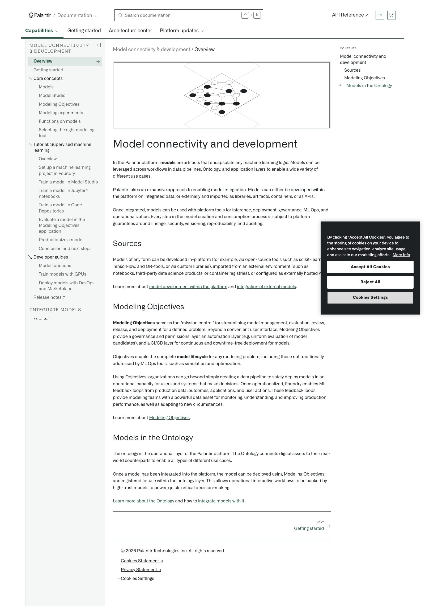

# Palantir

## Captura de pantalla

---

Search

[Palantir](//www.palantir.com)

- Documentation

  - [Documentation](/docs/foundry/)
  - [Apollo](/docs/apollo/)
  - [Gotham](/docs/gotham/)

Search documentation

Search

karat

+

K

[API Reference ↗](/docs/foundry/api-reference/)Send feedback

en

enjpkrzh

ABXY

ABXYABXYABXYABXYABXYABXY

- Capabilities

  - [AI Platform (AIP)](/docs/foundry/aip/overview/)
  - [Data connectivity & integration](/docs/foundry/data-integration/overview/)
  - [Model connectivity & development](/docs/foundry/model-integration/overview/)
  - [Ontology building](/docs/foundry/ontology/overview/)
  - [Developer toolchain](/docs/foundry/dev-toolchain/overview/)
  - [Use case development](/docs/foundry/app-building/overview/)
  - [Observability](/docs/foundry/observability/overview/)
  - [Analytics](/docs/foundry/analytics/overview/)
  - [Product delivery](/docs/foundry/devops/overview/)
  - [Security & governance](/docs/foundry/security/overview/)
  - [Management & enablement](/docs/foundry/administration/overview/)
- [Getting started](/docs/foundry/getting-started/overview/)
- [Architecture center](/docs/foundry/architecture-center/overview/)
- Platform updates

  - [Announcements](/docs/foundry/announcements/)
  - [Release notes](/docs/foundry/announcements/release-notes/)

[Model connectivity & development](/docs/foundry/model-integration/overview/)[Overview](/docs/foundry/model-integration/overview/)

# Model connectivity and development

In the Palantir platform, **models** are artifacts that encapsulate any machine learning logic. Models can be leveraged across workflows in data pipelines, Ontology, and application layers to enable a wide variety of different use cases.

Palantir takes an expansive approach to enabling model integration. Models can either be developed within the platform on integrated data, or externally and imported as libraries, artifacts, containers, or as APIs.

Once integrated, models can be used with platform tools for inference, deployment, governance, ML Ops, and operationalization. Every step in the model creation and consumption process is subject to platform guarantees around lineage, security, versioning, reproducibility, and auditing.

## Sources

Models of any form can be developed in-platform (for example, via open-source tools such as scikit-learn, TensorFlow, and OR-tools, or via custom libraries), imported from an external environment (such as notebooks, third-party data science products, or container registries), or configured as externally hosted APIs.

Learn more about [model development within the platform](/docs/foundry/integrate-models/model-adapter-overview/) and [integration of external models](/docs/foundry/integrate-models/external-model-connection/).

## Modeling Objectives

**Modeling Objectives** serve as the "mission control" for streamlining model management, evaluation, review, release, and deployment for a defined problem. Beyond a convenient user interface, Modeling Objectives provide a governance and permissions layer, an automation layer (e.g. uniform evaluation of model candidates), and a CI/CD layer for continuous and downtime-free deployment for models.

Objectives enable the complete **model lifecycle** for any modeling problem, including those not traditionally addressed by ML Ops tools, such as simulation and optimization.

Using Objectives, organizations can go beyond simply creating a data pipeline to safely deploy models in an operational capacity for users and systems that make decisions. Once operationalized, Foundry enables ML feedback loops from production data, outcomes, applications, and user actions. These feedback loops provide modeling teams with a powerful data asset for monitoring, understanding, and improving production performance, as well as adapting to new circumstances.

Learn more about [Modeling Objectives](/docs/foundry/model-integration/objectives/).

## Models in the Ontology

The ontology is the operational layer of the Palantir platform. The Ontology connects digital assets to their real-world counterparts to enable all types of different use cases.

Once a model has been integrated into the platform, the model can be deployed using Modeling Objectives and registered for use within the ontology layer. This allows operational interactive workflows to be backed by high-trust models to power, quick, critical decision-making.

[Learn more about the Ontology](/docs/foundry/ontology/overview/) and how to [integrate models with it](/docs/foundry/functions/functions-on-models/).

[NEXTGetting started

→](/docs/foundry/model-integration/getting-started/)

By clicking “Accept All Cookies”, you agree to the storing of cookies on your device to enhance site navigation, analyze site usage, and assist in our marketing efforts. [More Info](https://www.palantir.com/cookie-statement/)

Accept All Cookies Reject All

Cookies Settings

.png)

## Privacy Preference Center

- ### Your Privacy
- ### Strictly Necessary Cookies
- ### Targeting Cookies

#### Your Privacy

When you visit any website, it may store or retrieve information on your browser, mostly in the form of cookies. This information might be about you, your preferences, or your device, and is mostly used to make the site work as you expect. The information does not usually identify you directly, but it can give you a more personalized web experience. Because we respect your right to privacy, you can choose not to allow some types of cookies. Click on the different category headings to learn more and change our default settings. Blocking some types of cookies may impact your experience of the site and the services we are able to offer.
\
[More information](https://www.palantir.com/cookie-statement/)

#### Strictly Necessary Cookies

Always Active

These cookies are necessary for the website to function and cannot be switched off in our systems. They are usually only set in response to actions made by you which amount to a request for services, such as setting your privacy preferences, logging in or filling in forms. You can set your browser to block or alert you about these cookies, but some parts of the site will not then work. These cookies do not store any personally identifiable information.

Cookies Details

#### Targeting Cookies

Targeting Cookies

These cookies may be set through our site by our advertising partners. They may be used by those companies to build a profile of your interests and show you relevant adverts on other sites. They do not store directly personal information, but are based on uniquely identifying your browser and internet device. If you do not allow these cookies, you will experience less targeted advertising.

Cookies Details

Back Button

### Cookie List

Consent Leg.Interest

checkbox label label

checkbox label label

checkbox label label

Clear

- checkbox label label

Apply Cancel

Confirm My Choices

Reject All Allow All

