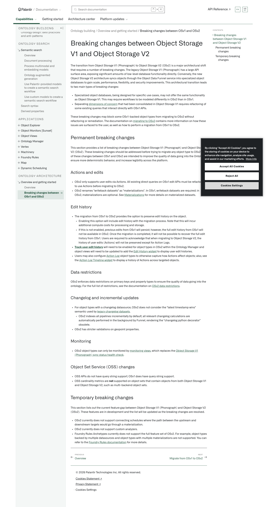

# Palantir

## Captura de pantalla

---

Search

[Palantir](//www.palantir.com)

- Documentation

  - [Documentation](/docs/foundry/)
  - [Apollo](/docs/apollo/)
  - [Gotham](/docs/gotham/)

Search documentation

Search

karat

+

K

[API Reference ↗](/docs/foundry/api-reference/)Send feedback

en

enjpkrzh

ABXY

ABXYABXYABXYABXYABXYABXY

- Capabilities

  - [AI Platform (AIP)](/docs/foundry/aip/overview/)
  - [Data connectivity & integration](/docs/foundry/data-integration/overview/)
  - [Model connectivity & development](/docs/foundry/model-integration/overview/)
  - [Ontology building](/docs/foundry/ontology/overview/)
  - [Developer toolchain](/docs/foundry/dev-toolchain/overview/)
  - [Use case development](/docs/foundry/app-building/overview/)
  - [Observability](/docs/foundry/observability/overview/)
  - [Analytics](/docs/foundry/analytics/overview/)
  - [Product delivery](/docs/foundry/devops/overview/)
  - [Security & governance](/docs/foundry/security/overview/)
  - [Management & enablement](/docs/foundry/administration/overview/)
- [Getting started](/docs/foundry/getting-started/overview/)
- [Architecture center](/docs/foundry/architecture-center/overview/)
- Platform updates

  - [Announcements](/docs/foundry/announcements/)
  - [Release notes](/docs/foundry/announcements/release-notes/)

[Ontology building](/docs/foundry/ontology/overview/)[Overview and getting started](/docs/foundry/object-backend/overview/)[Breaking changes between OSv1 and OSv2](/docs/foundry/object-backend/object-storage-v2-breaking-changes/)

# Breaking changes between Object Storage V1 and Object Storage V2

The transition from Object Storage V1 (Phonograph) to Object Storage V2 (OSv2) is a major architectural shift that requires a number of breaking changes. The legacy Object Storage V1 (Phonograph) has a large API surface area, exposing significant amounts of low-level database functionality directly. Conversely, the new Object Storage V2 architecture syncs objects through the Object Data Funnel service into specialized object databases to gain scale, performance, flexibility, and security improvements. This architectural transition leads to two main types of breaking changes:

- Specialized object databases, being designed for specific use cases, may not offer the same functionality as Object Storage V1. This may require workflows to be modeled differently in OSv2 than in OSv1.
- Separating [dimensions of concern](/docs/foundry/object-backend/overview/#object-storage-v2-architecture) that had been consolidated in Object Storage V1 requires refactoring of some existing queries that interact directly with OSv1 APIs.

These breaking changes may block some OSv1-backed object types from migrating to OSv2 without refactoring or remediation. The documentation on [migrating to OSv2](/docs/foundry/object-backend/osv1-osv2-migration/) contains more information on how these issues are surfaced to the user, as well as how to perform a migration from OSv1 to OSv2.

## Permanent breaking changes

This section provides a list of breaking changes between Object Storage V1 (Phonograph) and Object Storage V2 (OSv2). These breaking changes should be addressed before trying to migrate any object type to OSv2. All of these changes between OSv1 and OSv2 are intended to improve the quality of data going into the Ontology, ensure more deterministic behavior, and increase legibility across the platform.

### Actions and edits

- OSv2 only supports user edits via Actions. All existing direct queries on OSv1 edit APIs must be refactored to use Actions before migrating to OSv2.
- OSv2 renames "writeback datasets" as "materializations". In OSv1, writeback datasets are required; in OSv2, materializations are optional. See [Materializations](/docs/foundry/object-edits/materializations/) for more details on materialized datasets.

### Edit history

- The migration from OSv1 to OSv2 provides the option to preserve edit history on the object.
  - Enabling this option will include edit history with the migration process. Note that this will incur additional compute costs for processing and storage.
  - If this is not enabled, previous edits from OSv1 will persist; however, the full edit history from OSv1 will not be available in OSv2. Once the migration is completed, it will not be possible to recover the full edit history from OSv1. Users are required to acknowledge that when migrating to Object Storage V2, the history of user edits (Actions) will not be preserved except for Action Logs.
- [**Track user edit history**](/docs/foundry/object-edits/user-edit-history/) will need to be enabled for object types in OSv2 within the Ontology Manager and object views will need to be updated to add the [Edit History widget](/docs/foundry/object-views/widgets-properties-links/#edit-history) to display user edit histories.
- Users may also configure [Action Log](/docs/foundry/action-types/action-log/) object types to otherwise capture how Actions affect objects; also, see the [Action Log Timeline widget](/docs/foundry/action-types/action-log/#action-log-timeline) to display a history of Actions across targeted objects.

### Data restrictions

OSv2 enforces data restrictions on primary keys and property types to ensure the quality of data going into the ontology. For the full list of restrictions, see the documentation on [OSv2 data restrictions](/docs/foundry/object-indexing/data-restrictions/).

### Changelog and incremental updates

- For object types with a changelog datasource, OSv2 does not consider the "latest timestamp wins" semantic used by [legacy changelog datasets](/docs/foundry/building-pipelines/maintaining-incremental-performance/#changelog-datasets).
  - OSv2 indexes all pipelines incrementally by default; all relevant changelog calculations are automatically performed in the background by Funnel, rendering the "changelog python decorator" obsolete.
- OSv2 has stricter validations on geopoint properties.

### Monitoring

- OSv2 object types can only be monitored by [monitoring views](/docs/foundry/monitoring-views/overview/), which replaces the [Object Storage V1 (Phonograph) sync status health check](/docs/foundry/health-checks/checks-reference/#sync-status).

### Object Set Service (OSS) changes

- OSS APIs do not have query string support; OSv1 does have query string support.
- OSS cardinality metrics are **not** supported on object sets that contain objects from both Object Storage V1 and Object Storage V2, such as multi-backend object sets.

## Temporary breaking changes

This section lists out the current feature gap between Object Storage V1 (Phonograph) and Object Storage V2 (OSv2). These features are in development and the list will be updated as the breaking changes are resolved.

- OSv2 currently does not support connecting schedules where the path between the upstream and downstream targets would go through a materialization.
- OSv2 currently does not support custom analyzers.
- Foundry Rules Archetypes currently does not support the full feature set of OSv2. For example, object types backed by multiple datasources and object types with multiple materializations are not supported. You can refer to the [Foundry Rules documentation](/docs/foundry/foundry-rules/rule-logic/#inputs) for more details.

[←

PREVIOUSOverview](/docs/foundry/object-backend/overview/)

[NEXTMigrate from OSv1 to OSv2

→](/docs/foundry/object-backend/osv1-osv2-migration/)

By clicking “Accept All Cookies”, you agree to the storing of cookies on your device to enhance site navigation, analyze site usage, and assist in our marketing efforts. [More Info](https://www.palantir.com/cookie-statement/)

Accept All Cookies Reject All

Cookies Settings

.png)

## Privacy Preference Center

- ### Your Privacy
- ### Strictly Necessary Cookies
- ### Targeting Cookies

#### Your Privacy

When you visit any website, it may store or retrieve information on your browser, mostly in the form of cookies. This information might be about you, your preferences, or your device, and is mostly used to make the site work as you expect. The information does not usually identify you directly, but it can give you a more personalized web experience. Because we respect your right to privacy, you can choose not to allow some types of cookies. Click on the different category headings to learn more and change our default settings. Blocking some types of cookies may impact your experience of the site and the services we are able to offer.
\
[More information](https://www.palantir.com/cookie-statement/)

#### Strictly Necessary Cookies

Always Active

These cookies are necessary for the website to function and cannot be switched off in our systems. They are usually only set in response to actions made by you which amount to a request for services, such as setting your privacy preferences, logging in or filling in forms. You can set your browser to block or alert you about these cookies, but some parts of the site will not then work. These cookies do not store any personally identifiable information.

Cookies Details

#### Targeting Cookies

Targeting Cookies

These cookies may be set through our site by our advertising partners. They may be used by those companies to build a profile of your interests and show you relevant adverts on other sites. They do not store directly personal information, but are based on uniquely identifying your browser and internet device. If you do not allow these cookies, you will experience less targeted advertising.

Cookies Details

Back Button

### Cookie List

Consent Leg.Interest

checkbox label label

checkbox label label

checkbox label label

Clear

- checkbox label label

Apply Cancel

Confirm My Choices

Reject All Allow All

