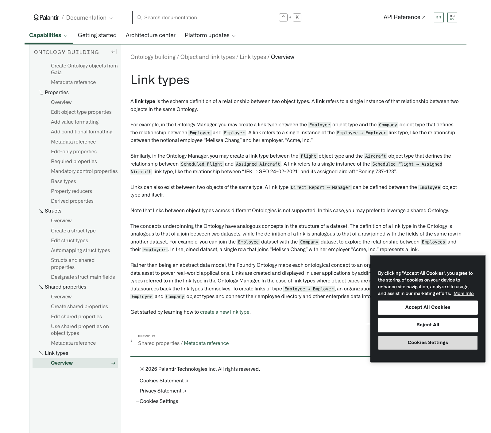

# Palantir

## Captura de pantalla

---

Search

[Palantir](//www.palantir.com)

- Documentation

  - [Documentation](/docs/foundry/)
  - [Apollo](/docs/apollo/)
  - [Gotham](/docs/gotham/)

Search documentation

Search

karat

+

K

[API Reference ↗](/docs/foundry/api-reference/)Send feedback

en

enjpkrzh

ABXY

ABXYABXYABXYABXYABXYABXY

- Capabilities

  - [AI Platform (AIP)](/docs/foundry/aip/overview/)
  - [Data connectivity & integration](/docs/foundry/data-integration/overview/)
  - [Model connectivity & development](/docs/foundry/model-integration/overview/)
  - [Ontology building](/docs/foundry/ontology/overview/)
  - [Developer toolchain](/docs/foundry/dev-toolchain/overview/)
  - [Use case development](/docs/foundry/app-building/overview/)
  - [Observability](/docs/foundry/observability/overview/)
  - [Analytics](/docs/foundry/analytics/overview/)
  - [Product delivery](/docs/foundry/devops/overview/)
  - [Security & governance](/docs/foundry/security/overview/)
  - [Management & enablement](/docs/foundry/administration/overview/)
- [Getting started](/docs/foundry/getting-started/overview/)
- [Architecture center](/docs/foundry/architecture-center/overview/)
- Platform updates

  - [Announcements](/docs/foundry/announcements/)
  - [Release notes](/docs/foundry/announcements/release-notes/)

[Ontology building](/docs/foundry/ontology/overview/)Object and link types[Link types](/docs/foundry/object-link-types/link-types-overview/)[Overview](/docs/foundry/object-link-types/link-types-overview/)

# Link types

A **link type** is the schema definition of a relationship between two object types. A **link** refers to a single instance of that relationship between two objects in the same Ontology.

For example, in the Ontology Manager, you may create a link type between the `Employee` object type and the `Company` object type that defines the relationship between `Employee` and `Employer`. A link refers to a single instance of the `Employee → Employer` link type, like the relationship between the notional employee “Melissa Chang” and her employer, “Acme, Inc.”

Similarly, in the Ontology Manager, you may create a link type between the `Flight` object type and the `Aircraft` object type that defines the relationship between `Scheduled Flight` and `Assigned Aircraft`. A link refers to a single instance of the `Scheduled Flight → Assigned Aircraft` link type, like the relationship between “JFK → SFO 24-02-2021” and its assigned aircraft “Boeing 737-123”.

Links can also exist between two objects of the same type. A link type `Direct Report ↔ Manager` can be defined between the `Employee` object type and itself.

Note that links between object types across different Ontologies is not supported. In this case, you may prefer to leverage a shared Ontology.

The concepts underpinning the Ontology have analogous concepts in the structure of a dataset. The definition of a link type in the Ontology is analogous to that of a join between two datasets, while the definition of a link is analogous to that of a row joined with the fields of the same row in another dataset. For example, you can join the `Employee` dataset with the `Company` dataset to explore the relationship between `Employees` and their `Employers`. In the joined dataset, a single row that joins “Melissa Chang” with her employer “Acme, Inc.” represents a link.

Rather than being an abstract data model, the Foundry Ontology maps each ontological concept to an organization's actual data, enabling this data asset to power real-world applications. Links are created and displayed in user applications by adding backing datasources to the object types referred to in the link type in the Ontology Manager. In the case of link types where object types are related with a many-to-many cardinality, datasources back the link types themselves. To create links of type `Employee → Employer`, an organization will add backing datasources to the `Employee` and `Company` object types and connect their employee directory and other enterprise data into the Ontology.

Get started by learning how to [create a new link type](/docs/foundry/object-link-types/create-link-type/).

[←

PREVIOUSShared properties / Metadata reference](/docs/foundry/object-link-types/shared-property-metadata/)

[NEXTCreate a link type

→](/docs/foundry/object-link-types/create-link-type/)

By clicking “Accept All Cookies”, you agree to the storing of cookies on your device to enhance site navigation, analyze site usage, and assist in our marketing efforts. [More Info](https://www.palantir.com/cookie-statement/)

Accept All Cookies Reject All

Cookies Settings

.png)

## Privacy Preference Center

- ### Your Privacy
- ### Strictly Necessary Cookies
- ### Targeting Cookies

#### Your Privacy

When you visit any website, it may store or retrieve information on your browser, mostly in the form of cookies. This information might be about you, your preferences, or your device, and is mostly used to make the site work as you expect. The information does not usually identify you directly, but it can give you a more personalized web experience. Because we respect your right to privacy, you can choose not to allow some types of cookies. Click on the different category headings to learn more and change our default settings. Blocking some types of cookies may impact your experience of the site and the services we are able to offer.
\
[More information](https://www.palantir.com/cookie-statement/)

#### Strictly Necessary Cookies

Always Active

These cookies are necessary for the website to function and cannot be switched off in our systems. They are usually only set in response to actions made by you which amount to a request for services, such as setting your privacy preferences, logging in or filling in forms. You can set your browser to block or alert you about these cookies, but some parts of the site will not then work. These cookies do not store any personally identifiable information.

Cookies Details

#### Targeting Cookies

Targeting Cookies

These cookies may be set through our site by our advertising partners. They may be used by those companies to build a profile of your interests and show you relevant adverts on other sites. They do not store directly personal information, but are based on uniquely identifying your browser and internet device. If you do not allow these cookies, you will experience less targeted advertising.

Cookies Details

Back Button

### Cookie List

Consent Leg.Interest

checkbox label label

checkbox label label

checkbox label label

Clear

- checkbox label label

Apply Cancel

Confirm My Choices

Reject All Allow All

