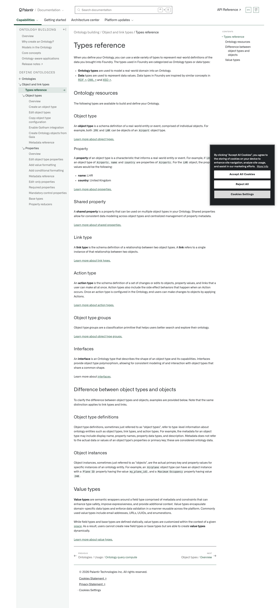

# Palantir

## Captura de pantalla

---

Search

[Palantir](//www.palantir.com)

- Documentation

  - [Documentation](/docs/foundry/)
  - [Apollo](/docs/apollo/)
  - [Gotham](/docs/gotham/)

Search documentation

Search

karat

+

K

[API Reference ↗](/docs/foundry/api-reference/)Send feedback

en

enjpkrzh

ABXY

ABXYABXYABXYABXYABXYABXY

- Capabilities

  - [AI Platform (AIP)](/docs/foundry/aip/overview/)
  - [Data connectivity & integration](/docs/foundry/data-integration/overview/)
  - [Model connectivity & development](/docs/foundry/model-integration/overview/)
  - [Ontology building](/docs/foundry/ontology/overview/)
  - [Developer toolchain](/docs/foundry/dev-toolchain/overview/)
  - [Use case development](/docs/foundry/app-building/overview/)
  - [Observability](/docs/foundry/observability/overview/)
  - [Analytics](/docs/foundry/analytics/overview/)
  - [Product delivery](/docs/foundry/devops/overview/)
  - [Security & governance](/docs/foundry/security/overview/)
  - [Management & enablement](/docs/foundry/administration/overview/)
- [Getting started](/docs/foundry/getting-started/overview/)
- [Architecture center](/docs/foundry/architecture-center/overview/)
- Platform updates

  - [Announcements](/docs/foundry/announcements/)
  - [Release notes](/docs/foundry/announcements/release-notes/)

[Ontology building](/docs/foundry/ontology/overview/)Object and link types[Types reference](/docs/foundry/object-link-types/type-reference/)

# Types reference

When you define your Ontology, you can use a wide variety of types to represent real-world definitions of the data you brought into Foundry. The types used in Foundry are categorized as *Ontology* types or *data* types:

- **Ontology types** are used to model a real-world domain into an Ontology.
- **Data** types are used to represent data values. Data types in Foundry are inspired by similar concepts in [RDF ↗](https://w3c.github.io/rdf-concepts/spec/#section-Datatypes), [OWL ↗](https://www.w3.org/TR/owl-ref/#Datatype) and [XSD ↗](https://www.w3.org/TR/xmlschema-2/#datatype).

## Ontology resources

The following types are available to build and define your Ontology.

### Object type

An **object type** is a schema definition of a real-world entity or event, comprised of individual objects. For example, both `JFK` and `LHR` can be objects of an `Airport` object type.

[Learn more about object types.](/docs/foundry/object-link-types/object-types-overview/)

#### Property

A **property** of an object type is a characteristic that informs a real-world entity or event. For example, if `LHR` is an object type of `Airports`, `name` and `country` are properties of `Airports`. For the `LHR` object, the property values would be the following:

- **name:** LHR
- **country:** United Kingdom

[Learn more about properties.](/docs/foundry/object-link-types/properties-overview/)

### Shared property

A **shared property** is a property that can be used on multiple object types in your Ontology. Shared properties allow for consistent data modeling across object types and centralized management of property metadata.

[Learn more about shared properties.](/docs/foundry/object-link-types/shared-property-overview/)

### Link type

A **link type** is the schema definition of a relationship between two object types. A **link** refers to a single instance of that relationship between two objects.

[Learn more about link types.](/docs/foundry/object-link-types/link-types-overview/)

### Action type

An **action type** is the schema definition of a set of changes or edits to objects, property values, and links that a user can make all at once. Action types also include the side effect behaviors that happen when an Action occurs. Once an action type is configured in the Ontology, end users can make changes to objects by applying Actions.

[Learn more about action types.](/docs/foundry/action-types/overview/)

### Object type groups

Object type groups are a classification primitive that helps users better search and explore their ontology.

[Learn more about object type groups.](/docs/foundry/object-link-types/type-groups/)

### Interfaces

An **interface** is an Ontology type that describes the shape of an object type and its capabilities. Interfaces provide object type polymorphism, allowing for consistent modeling of and interaction with object types that share a common shape.

Learn more about [interfaces](/docs/foundry/interfaces/interface-overview/).

## Difference between object types and objects

To clarify the difference between object types and objects, examples are provided below. Note that the same distinction applies to link types and links.

### Object type definitions

Object type definitions, sometimes just referred to as "object types", refer to type-level information about ontology entities such as object types, link types, and action types. For example, the metadata for an object type may include display name, property names, property data types, and description. Metadata does not refer to the actual data or values of an object type’s properties or primary key; these are considered ontology data.

### Object instances

Object instances, sometimes just referred to as "objects", are the actual primary key and property values for specific instances of an ontology entity. For example, an `Airplane` object type can have an object instance with a `Plane ID` property having the value `my_plane_id1`, and a `Maximum Occupancy` property having value `240`.

## Value types

**Value types** are semantic wrappers around a field type comprised of metadata and constraints that can enhance type safety, improve expressiveness, and provide additional context. Value types encapsulate domain-specific data types and enforce data validation in a manner reusable across the platform. Commonly used value types include email addresses, URLs, UUIDs, and enumerations.

While field types and base types are defined statically, value types are customized within the context of a given [space](/docs/foundry/security/orgs-and-spaces/). As a result, users cannot create new field types or base types but are able to create **value types** dynamically.

[Learn more about value types.](/docs/foundry/object-link-types/value-types-overview/)

[←

PREVIOUSOntologies / Usage / Ontology query compute](/docs/foundry/ontologies/query-compute-usage/)

[NEXTObject types / Overview

→](/docs/foundry/object-link-types/object-types-overview/)

By clicking “Accept All Cookies”, you agree to the storing of cookies on your device to enhance site navigation, analyze site usage, and assist in our marketing efforts. [More Info](https://www.palantir.com/cookie-statement/)

Accept All Cookies Reject All

Cookies Settings

.png)

## Privacy Preference Center

- ### Your Privacy
- ### Strictly Necessary Cookies
- ### Targeting Cookies

#### Your Privacy

When you visit any website, it may store or retrieve information on your browser, mostly in the form of cookies. This information might be about you, your preferences, or your device, and is mostly used to make the site work as you expect. The information does not usually identify you directly, but it can give you a more personalized web experience. Because we respect your right to privacy, you can choose not to allow some types of cookies. Click on the different category headings to learn more and change our default settings. Blocking some types of cookies may impact your experience of the site and the services we are able to offer.
\
[More information](https://www.palantir.com/cookie-statement/)

#### Strictly Necessary Cookies

Always Active

These cookies are necessary for the website to function and cannot be switched off in our systems. They are usually only set in response to actions made by you which amount to a request for services, such as setting your privacy preferences, logging in or filling in forms. You can set your browser to block or alert you about these cookies, but some parts of the site will not then work. These cookies do not store any personally identifiable information.

Cookies Details

#### Targeting Cookies

Targeting Cookies

These cookies may be set through our site by our advertising partners. They may be used by those companies to build a profile of your interests and show you relevant adverts on other sites. They do not store directly personal information, but are based on uniquely identifying your browser and internet device. If you do not allow these cookies, you will experience less targeted advertising.

Cookies Details

Back Button

### Cookie List

Consent Leg.Interest

checkbox label label

checkbox label label

checkbox label label

Clear

- checkbox label label

Apply Cancel

Confirm My Choices

Reject All Allow All

