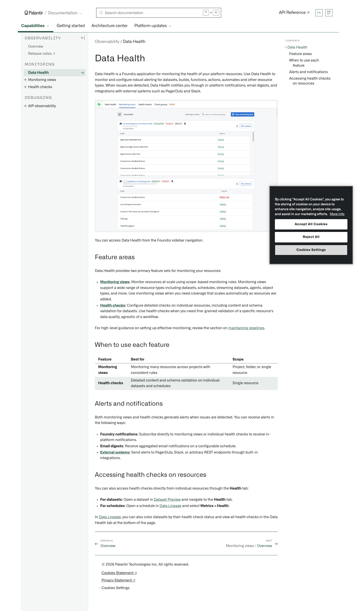
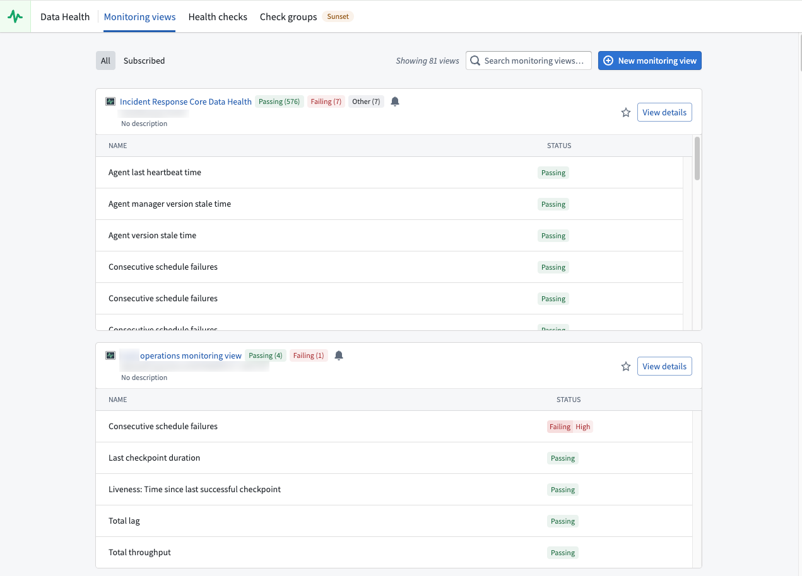

# Palantir

## Captura de pantalla

---

Search

[Palantir](//www.palantir.com)

- Documentation

  - [Documentation](/docs/foundry/)
  - [Apollo](/docs/apollo/)
  - [Gotham](/docs/gotham/)

Search documentation

Search

karat

+

K

[API Reference ↗](/docs/foundry/api-reference/)Send feedback

en

enjpkrzh

ABXY

ABXYABXYABXYABXYABXYABXY

- Capabilities

  - [AI Platform (AIP)](/docs/foundry/aip/overview/)
  - [Data connectivity & integration](/docs/foundry/data-integration/overview/)
  - [Model connectivity & development](/docs/foundry/model-integration/overview/)
  - [Ontology building](/docs/foundry/ontology/overview/)
  - [Developer toolchain](/docs/foundry/dev-toolchain/overview/)
  - [Use case development](/docs/foundry/app-building/overview/)
  - [Observability](/docs/foundry/observability/overview/)
  - [Analytics](/docs/foundry/analytics/overview/)
  - [Product delivery](/docs/foundry/devops/overview/)
  - [Security & governance](/docs/foundry/security/overview/)
  - [Management & enablement](/docs/foundry/administration/overview/)
- [Getting started](/docs/foundry/getting-started/overview/)
- [Architecture center](/docs/foundry/architecture-center/overview/)
- Platform updates

  - [Announcements](/docs/foundry/announcements/)
  - [Release notes](/docs/foundry/announcements/release-notes/)

[Observability](/docs/foundry/observability/overview/)[Data Health](/docs/foundry/observability/data-health/)

# Data Health

Data Health is a Foundry application for monitoring the health of your platform resources. Use Data Health to monitor and configure robust alerting for datasets, builds, functions, actions, automates and other resource types. When issues are detected, Data Health notifies you through in-platform notifications, email digests, and integrations with external systems such as PagerDuty and Slack.

You can access Data Health from the Foundry sidebar navigation.

## Feature areas

Data Health provides two primary feature sets for monitoring your resources:

- **[Monitoring views](/docs/foundry/monitoring-views/overview/):** Monitor resources at scale using scope-based monitoring rules. Monitoring views support a wide range of resource types including datasets, schedules, streaming datasets, agents, object types, and more. Use monitoring views when you need coverage that scales automatically as resources are added.
- **[Health checks](/docs/foundry/health-checks/overview/):** Configure detailed checks on individual resources, including content and schema validation for datasets. Use health checks when you need fine-grained validation of a specific resource's data quality, agnostic of a workflow.

For high-level guidance on setting up effective monitoring, review the section on [maintaining pipelines](/docs/foundry/maintaining-pipelines/overview/).

## When to use each feature

| Feature | Best for | Scope |
| --- | --- | --- |
| **Monitoring views** | Monitoring many resources across projects with consistent rules | Project, folder, or single resource |
| **Health checks** | Detailed content and schema validation on individual datasets and schedules | Single resource |

## Alerts and notifications

Both monitoring views and health checks generate alerts when issues are detected. You can receive alerts in the following ways:

- **Foundry notifications:** Subscribe directly to monitoring views or individual health checks to receive in-platform notifications.
- **Email digests:** Receive aggregated email notifications on a configurable schedule.
- **[External systems](/docs/foundry/monitoring-views/external-systems/):** Send alerts to PagerDuty, Slack, or arbitrary REST endpoints through built-in integrations.

## Accessing health checks on resources

You can also access health checks directly from individual resources through the **Health** tab:

- **For datasets:** Open a dataset in [Dataset Preview](/docs/foundry/dataset-preview/overview/) and navigate to the **Health** tab.
- **For schedules:** Open a schedule in [Data Lineage](/docs/foundry/data-lineage/overview/) and select **Metrics > Health**.

In [Data Lineage](/docs/foundry/data-lineage/overview/), you can also color datasets by their health check status and view all health checks in the Data Health tab at the bottom of the page.

[←

PREVIOUSOverview](/docs/foundry/observability/overview/)

[NEXTMonitoring views / Overview

→](/docs/foundry/monitoring-views/overview/)

By clicking “Accept All Cookies”, you agree to the storing of cookies on your device to enhance site navigation, analyze site usage, and assist in our marketing efforts. [More Info](https://www.palantir.com/cookie-statement/)

Accept All Cookies Reject All

Cookies Settings

.png)

## Privacy Preference Center

- ### Your Privacy
- ### Strictly Necessary Cookies
- ### Targeting Cookies

#### Your Privacy

When you visit any website, it may store or retrieve information on your browser, mostly in the form of cookies. This information might be about you, your preferences, or your device, and is mostly used to make the site work as you expect. The information does not usually identify you directly, but it can give you a more personalized web experience. Because we respect your right to privacy, you can choose not to allow some types of cookies. Click on the different category headings to learn more and change our default settings. Blocking some types of cookies may impact your experience of the site and the services we are able to offer.
\
[More information](https://www.palantir.com/cookie-statement/)

#### Strictly Necessary Cookies

Always Active

These cookies are necessary for the website to function and cannot be switched off in our systems. They are usually only set in response to actions made by you which amount to a request for services, such as setting your privacy preferences, logging in or filling in forms. You can set your browser to block or alert you about these cookies, but some parts of the site will not then work. These cookies do not store any personally identifiable information.

Cookies Details

#### Targeting Cookies

Targeting Cookies

These cookies may be set through our site by our advertising partners. They may be used by those companies to build a profile of your interests and show you relevant adverts on other sites. They do not store directly personal information, but are based on uniquely identifying your browser and internet device. If you do not allow these cookies, you will experience less targeted advertising.

Cookies Details

Back Button

### Cookie List

Consent Leg.Interest

checkbox label label

checkbox label label

checkbox label label

Clear

- checkbox label label

Apply Cancel

Confirm My Choices

Reject All Allow All

