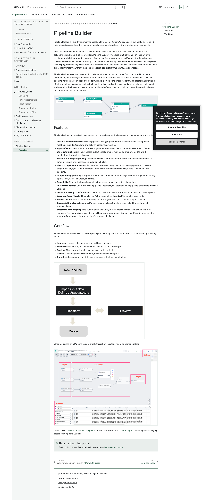
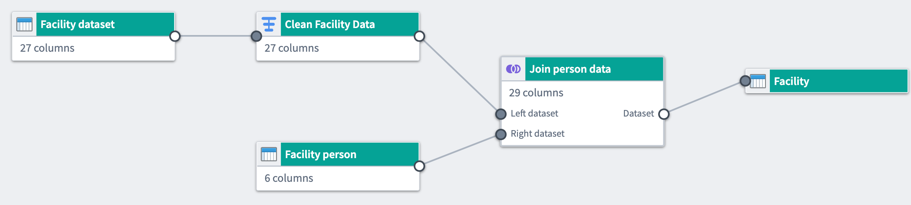
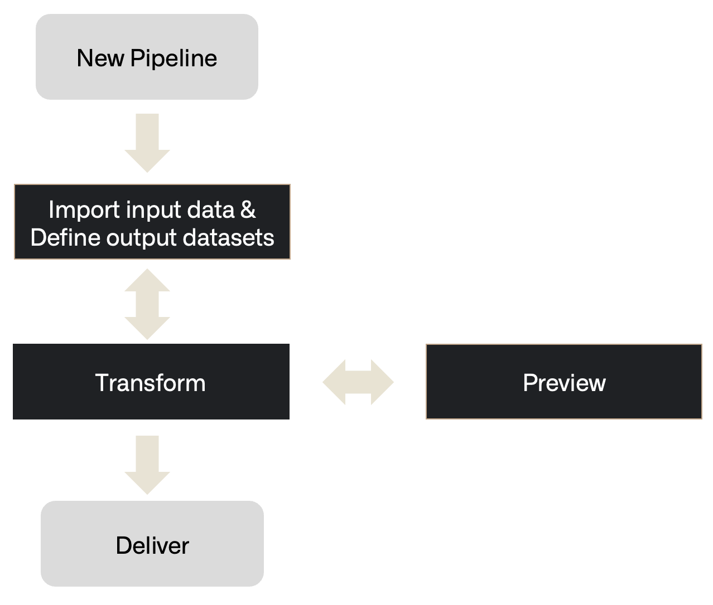
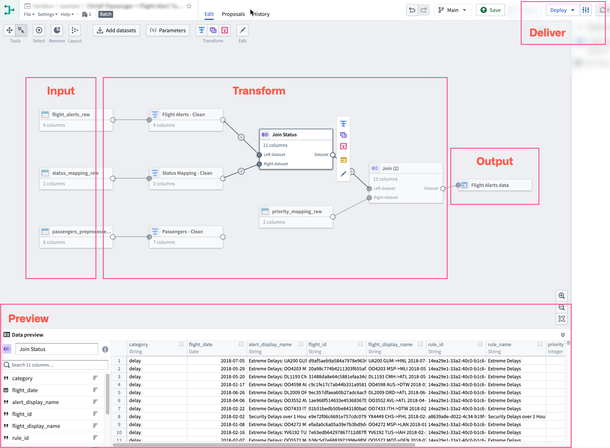

# Palantir

## Captura de pantalla

---

Search

[Palantir](//www.palantir.com)

- Documentation

  - [Documentation](/docs/foundry/)
  - [Apollo](/docs/apollo/)
  - [Gotham](/docs/gotham/)

Search documentation

Search

karat

+

K

[API Reference ↗](/docs/foundry/api-reference/)Send feedback

en

enjpkrzh

ABXY

ABXYABXYABXYABXYABXYABXY

- Capabilities

  - [AI Platform (AIP)](/docs/foundry/aip/overview/)
  - [Data connectivity & integration](/docs/foundry/data-integration/overview/)
  - [Model connectivity & development](/docs/foundry/model-integration/overview/)
  - [Ontology building](/docs/foundry/ontology/overview/)
  - [Developer toolchain](/docs/foundry/dev-toolchain/overview/)
  - [Use case development](/docs/foundry/app-building/overview/)
  - [Observability](/docs/foundry/observability/overview/)
  - [Analytics](/docs/foundry/analytics/overview/)
  - [Product delivery](/docs/foundry/devops/overview/)
  - [Security & governance](/docs/foundry/security/overview/)
  - [Management & enablement](/docs/foundry/administration/overview/)
- [Getting started](/docs/foundry/getting-started/overview/)
- [Architecture center](/docs/foundry/architecture-center/overview/)
- Platform updates

  - [Announcements](/docs/foundry/announcements/)
  - [Release notes](/docs/foundry/announcements/release-notes/)

[Data connectivity & integration](/docs/foundry/data-integration/overview/)[Pipeline Builder](/docs/foundry/pipeline-builder/overview/)[Overview](/docs/foundry/pipeline-builder/overview/)

# Pipeline Builder

Pipeline Builder is Foundry's primary application for data integration. You can use Pipeline Builder to build data integration pipelines that transform raw data sources into clean outputs ready for further analysis.

With Pipeline Builder and a robust backend model, users who code and users who do not code can collaborate jointly on a pipeline workflow. Pipeline Builder leverages both Spark and Flink as part of its architecture while incorporating a variety of advanced features supported by Palantir-developed custom libraries and services. Instead of writing code that requires lengthy health checks, Pipeline Builder integrates various programming languages beneath a streamlined builder point-and-click interface through which users apply data transforms without the need for specialized programming language knowledge.

Pipeline Builder uses a next-generation data transformation backend specifically designed to act as an intermediary between logic creation and execution. As users describe the pipeline they want to build, the backend writes transform code and performs checks on pipeline integrity, identifying refactoring errors and offering solutions to ensure a healthy build. With the backend acting as a middle layer between logic creation and execution, builders can solve schema problems before a pipeline is built and save time previously spent on computation and code checks.

## Features

Pipeline Builder includes features focusing on comprehensive pipeline creation, maintenance, and control.

- **Intuitive user interface:** Users write pipelines using graph and form-based interfaces that provide feedback, including join keys and column casting suggestions.
- **Type-safe functions:** Functions are strongly typed and can flag errors immediately instead of at build time.
- **Strict output checks:** If the expected output checks are not met, builds are prevented to avoid unintentional downstream breaks.
- **Automatic build path pruning:** Pipeline Builder will prune transform paths that are not connected to outputs to avoid unnecessary computation in builds.
- **Abstract implementation details:** Users focus on describing their end-to-end pipeline and desired outputs. Builds, syncs, and other orchestrations are handled automatically by the Pipeline Builder backend.
- **Independent pipeline logic:** Pipeline Builder can connect to different logic execution engines, including Spark, Flink, Azure instances, and more.
- **Reusability:** Pipeline logic can be easily extracted and reused for different pipelines.
- **Full version control:** Users can draft a pipeline separately, collaborate on one pipeline, or revert to previous versions.
- **Media processing transformations:** Users can pass media sets as transform inputs within their pipeline.
- **Large Language Models (LLMs):** Leverage the power of LLMs and AIP to transform your data.
- **Trained models:** Import machine learning models to generate predictions within your pipeline.
- **Geospatial transformations:** Use Pipeline Builder to load, transform, and yield different forms of geospatial data.
- **Streaming capability:** Pipeline Builder offers the ability to write pipelines that execute with real-time latencies. This feature is not available on all Foundry environments. Contact your Palantir representative if your workflow requires the availability of streaming pipelines.

## Workflow

Pipeline Builder follows a workflow comprising the following steps from importing data to delivering a healthy build.

- **Inputs:** Add a new data source or add additional datasets.
- **Transform:** Transform, join, or union data towards the desired output.
- **Preview:** After applying transformations, preview the output.
- **Deliver:** Once the pipeline is complete, build the pipeline outputs.
- **Outputs:** Add an object type, link type, or dataset output for your pipeline.

When visualized on a Pipeline Builder graph, this is how the steps might be demonstrated:

Learn how to [create a simple batch pipeline](/docs/foundry/building-pipelines/create-batch-pipeline-pb/), or learn more about the [core concepts](/docs/foundry/pipeline-builder/core-concepts/) of building and managing pipelines in Pipeline Builder.

Palantir Learning portal

Try to build out your first pipeline in a course on [learn.palantir.com ↗](https://learn.palantir.com/deep-dive-building-your-first-pipeline).

[←

PREVIOUSWorkflows / SQL in Foundry / Compute usage](/docs/foundry/sql-warehousing/compute-usage/)

[NEXTCore concepts

→](/docs/foundry/pipeline-builder/core-concepts/)

By clicking “Accept All Cookies”, you agree to the storing of cookies on your device to enhance site navigation, analyze site usage, and assist in our marketing efforts. [More Info](https://www.palantir.com/cookie-statement/)

Accept All Cookies Reject All

Cookies Settings

.png)

## Privacy Preference Center

- ### Your Privacy
- ### Strictly Necessary Cookies
- ### Targeting Cookies

#### Your Privacy

When you visit any website, it may store or retrieve information on your browser, mostly in the form of cookies. This information might be about you, your preferences, or your device, and is mostly used to make the site work as you expect. The information does not usually identify you directly, but it can give you a more personalized web experience. Because we respect your right to privacy, you can choose not to allow some types of cookies. Click on the different category headings to learn more and change our default settings. Blocking some types of cookies may impact your experience of the site and the services we are able to offer.
\
[More information](https://www.palantir.com/cookie-statement/)

#### Strictly Necessary Cookies

Always Active

These cookies are necessary for the website to function and cannot be switched off in our systems. They are usually only set in response to actions made by you which amount to a request for services, such as setting your privacy preferences, logging in or filling in forms. You can set your browser to block or alert you about these cookies, but some parts of the site will not then work. These cookies do not store any personally identifiable information.

Cookies Details

#### Targeting Cookies

Targeting Cookies

These cookies may be set through our site by our advertising partners. They may be used by those companies to build a profile of your interests and show you relevant adverts on other sites. They do not store directly personal information, but are based on uniquely identifying your browser and internet device. If you do not allow these cookies, you will experience less targeted advertising.

Cookies Details

Back Button

### Cookie List

Consent Leg.Interest

checkbox label label

checkbox label label

checkbox label label

Clear

- checkbox label label

Apply Cancel

Confirm My Choices

Reject All Allow All

