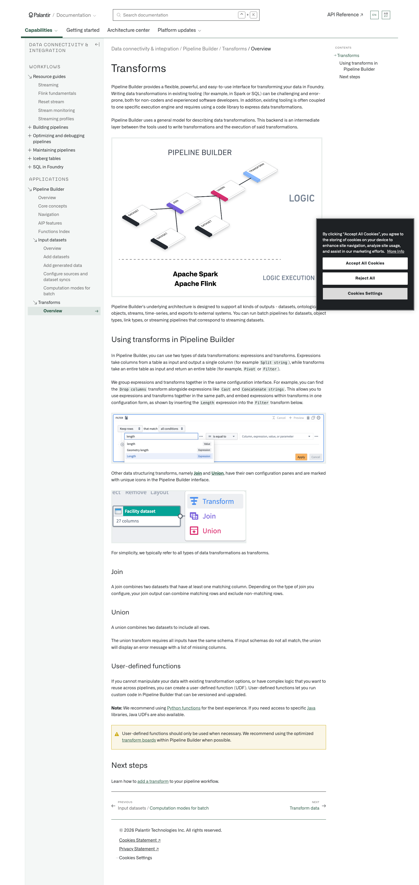
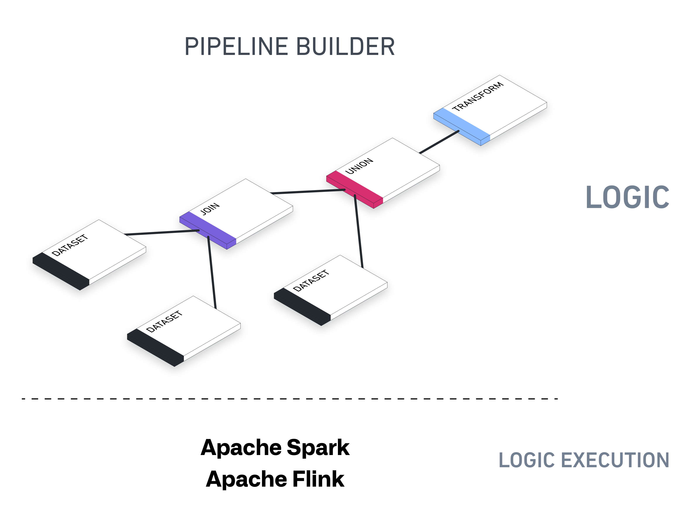
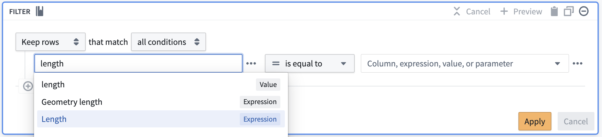
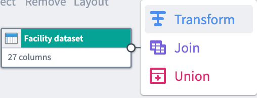

# Palantir

## Captura de pantalla

---

Search

[Palantir](//www.palantir.com)

- Documentation

  - [Documentation](/docs/foundry/)
  - [Apollo](/docs/apollo/)
  - [Gotham](/docs/gotham/)

Search documentation

Search

karat

+

K

[API Reference ↗](/docs/foundry/api-reference/)Send feedback

en

enjpkrzh

ABXY

ABXYABXYABXYABXYABXYABXY

- Capabilities

  - [AI Platform (AIP)](/docs/foundry/aip/overview/)
  - [Data connectivity & integration](/docs/foundry/data-integration/overview/)
  - [Model connectivity & development](/docs/foundry/model-integration/overview/)
  - [Ontology building](/docs/foundry/ontology/overview/)
  - [Developer toolchain](/docs/foundry/dev-toolchain/overview/)
  - [Use case development](/docs/foundry/app-building/overview/)
  - [Observability](/docs/foundry/observability/overview/)
  - [Analytics](/docs/foundry/analytics/overview/)
  - [Product delivery](/docs/foundry/devops/overview/)
  - [Security & governance](/docs/foundry/security/overview/)
  - [Management & enablement](/docs/foundry/administration/overview/)
- [Getting started](/docs/foundry/getting-started/overview/)
- [Architecture center](/docs/foundry/architecture-center/overview/)
- Platform updates

  - [Announcements](/docs/foundry/announcements/)
  - [Release notes](/docs/foundry/announcements/release-notes/)

[Data connectivity & integration](/docs/foundry/data-integration/overview/)[Pipeline Builder](/docs/foundry/pipeline-builder/overview/)[Transforms](/docs/foundry/pipeline-builder/transforms-overview/)[Overview](/docs/foundry/pipeline-builder/transforms-overview/)

# Transforms

Pipeline Builder provides a flexible, powerful, and easy-to-use interface for transforming your data in Foundry. Writing data transformations in existing tooling (for example, in Spark or SQL) can be challenging and error-prone, both for non-coders and experienced software developers. In addition, existing tooling is often coupled to one specific execution engine and requires using a code library to express data transformations.

Pipeline Builder uses a general model for describing data transformations. This backend is an intermediate layer between the tools used to write transformations and the execution of said transformations.

Pipeline Builder's underlying architecture is designed to support all kinds of outputs - datasets, ontological objects, streams, time-series, and exports to external systems. You can run batch pipelines for datasets, object types, link types, or streaming pipelines that correspond to streaming datasets.

## Using transforms in Pipeline Builder

In Pipeline Builder, you can use two types of data transformations: expressions and transforms. Expressions take columns from a table as input and output a single column (for example `Split string`), while transforms take an entire table as input and return an entire table (for example, `Pivot` or `Filter`).

We group expressions and transforms together in the same configuration interface. For example, you can find the `Drop columns` transform alongside expressions like `Cast` and `Concatenate strings`. This allows you to use expressions and transforms together in the same path, and embed expressions within transforms in one configuration form, as shown by inserting the `Length` expression into the `Filter` transform below.

Other data structuring transforms, namely [**Join**](#join) and [**Union**](#union), have their own configuration panes and are marked with unique icons in the Pipeline Builder interface.

For simplicity, we typically refer to all types of data transformations as transforms.

### Join

A join combines two datasets that have at least one matching column. Depending on the type of join you configure, your join output can combine matching rows and exclude non-matching rows.

### Union

A union combines two datasets to include all rows.

The union transform requires all inputs have the same schema. If input schemas do not all match, the union will display an error message with a list of missing columns.

### User-defined functions

If you cannot manipulate your data with existing transformation options, or have complex logic that you want to reuse across pipelines, you can create a user-defined function (UDF). User-defined functions let you run custom code in Pipeline Builder that can be versioned and upgraded.

**Note:** We recommend using [Python functions](/docs/foundry/functions/python-functions-builder/) for the best experience. If you need access to specific [Java](/docs/foundry/transforms-java/user-defined-functions/) libraries, Java UDFs are also available.

User-defined functions should only be used when necessary. We recommend using the optimized [transform boards](/docs/foundry/pipeline-builder/transforms-transform-data/) within Pipeline Builder when possible.

## Next steps

Learn how to [add a transform](/docs/foundry/pipeline-builder/transforms-transform-data/) to your pipeline workflow.

[←

PREVIOUSInput datasets / Computation modes for batch](/docs/foundry/pipeline-builder/datasets-computation-modes-for-batch/)

[NEXTTransform data

→](/docs/foundry/pipeline-builder/transforms-transform-data/)

By clicking “Accept All Cookies”, you agree to the storing of cookies on your device to enhance site navigation, analyze site usage, and assist in our marketing efforts. [More Info](https://www.palantir.com/cookie-statement/)

Accept All Cookies Reject All

Cookies Settings

.png)

## Privacy Preference Center

- ### Your Privacy
- ### Strictly Necessary Cookies
- ### Targeting Cookies

#### Your Privacy

When you visit any website, it may store or retrieve information on your browser, mostly in the form of cookies. This information might be about you, your preferences, or your device, and is mostly used to make the site work as you expect. The information does not usually identify you directly, but it can give you a more personalized web experience. Because we respect your right to privacy, you can choose not to allow some types of cookies. Click on the different category headings to learn more and change our default settings. Blocking some types of cookies may impact your experience of the site and the services we are able to offer.
\
[More information](https://www.palantir.com/cookie-statement/)

#### Strictly Necessary Cookies

Always Active

These cookies are necessary for the website to function and cannot be switched off in our systems. They are usually only set in response to actions made by you which amount to a request for services, such as setting your privacy preferences, logging in or filling in forms. You can set your browser to block or alert you about these cookies, but some parts of the site will not then work. These cookies do not store any personally identifiable information.

Cookies Details

#### Targeting Cookies

Targeting Cookies

These cookies may be set through our site by our advertising partners. They may be used by those companies to build a profile of your interests and show you relevant adverts on other sites. They do not store directly personal information, but are based on uniquely identifying your browser and internet device. If you do not allow these cookies, you will experience less targeted advertising.

Cookies Details

Back Button

### Cookie List

Consent Leg.Interest

checkbox label label

checkbox label label

checkbox label label

Clear

- checkbox label label

Apply Cancel

Confirm My Choices

Reject All Allow All

