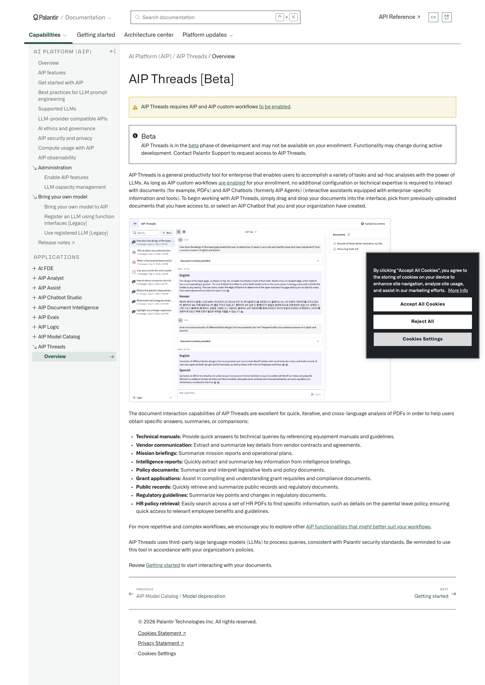
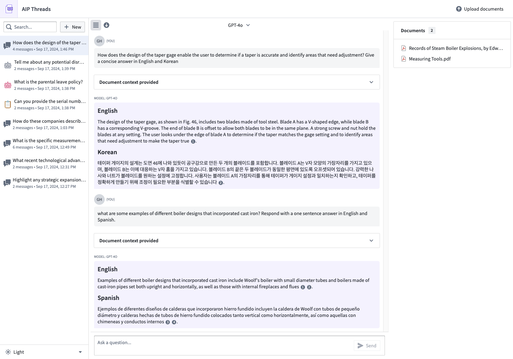

# Palantir

## Captura de pantalla

---

Search

[Palantir](//www.palantir.com)

- Documentation

  - [Documentation](/docs/foundry/)
  - [Apollo](/docs/apollo/)
  - [Gotham](/docs/gotham/)

Search documentation

Search

karat

+

K

[API Reference ↗](/docs/foundry/api-reference/)Send feedback

en

enjpkrzh

ABXY

ABXYABXYABXYABXYABXYABXY

- Capabilities

  - [AI Platform (AIP)](/docs/foundry/aip/overview/)
  - [Data connectivity & integration](/docs/foundry/data-integration/overview/)
  - [Model connectivity & development](/docs/foundry/model-integration/overview/)
  - [Ontology building](/docs/foundry/ontology/overview/)
  - [Developer toolchain](/docs/foundry/dev-toolchain/overview/)
  - [Use case development](/docs/foundry/app-building/overview/)
  - [Observability](/docs/foundry/observability/overview/)
  - [Analytics](/docs/foundry/analytics/overview/)
  - [Product delivery](/docs/foundry/devops/overview/)
  - [Security & governance](/docs/foundry/security/overview/)
  - [Management & enablement](/docs/foundry/administration/overview/)
- [Getting started](/docs/foundry/getting-started/overview/)
- [Architecture center](/docs/foundry/architecture-center/overview/)
- Platform updates

  - [Announcements](/docs/foundry/announcements/)
  - [Release notes](/docs/foundry/announcements/release-notes/)

[AI Platform (AIP)](/docs/foundry/aip/overview/)[AIP Threads](/docs/foundry/threads/overview/)[Overview](/docs/foundry/threads/overview/)

# AIP Threads [Beta]

AIP Threads requires AIP and AIP custom workflows [to be enabled](/docs/foundry/aip/enable-aip-features/#enable-aip-features).

Beta

AIP Threads is in the [beta](/docs/foundry/platform-overview/development-life-cycle/) phase of development and may not be available on your enrollment. Functionality may change during active development. Contact Palantir Support to request access to AIP Threads.

AIP Threads is a general productivity tool for enterprise that enables users to accomplish a variety of tasks and ad-hoc analyses with the power of LLMs. As long as AIP custom workflows [are enabled](/docs/foundry/aip/enable-aip-features/) for your enrollment, no additional configuration or technical expertise is required to interact with documents (for example, PDFs) and AIP Chatbots (formerly AIP Agents) (interactive assistants equipped with enterprise-specific information and tools). To begin working with AIP Threads, simply drag and drop your documents into the interface, pick from previously uploaded documents that you have access to, or select an AIP Chatbot that you and your organization have created.

The document interaction capabilities of AIP Threads are excellent for quick, iterative, and cross-language analysis of PDFs in order to help users obtain specific answers, summaries, or comparisons:

- **Technical manuals:** Provide quick answers to technical queries by referencing equipment manuals and guidelines.
- **Vendor communication:** Extract and summarize key details from vendor contracts and agreements.
- **Mission briefings:** Summarize mission reports and operational plans.
- **Intelligence reports:** Quickly extract and summarize key information from intelligence briefings.
- **Policy documents:** Summarize and interpret legislative texts and policy documents.
- **Grant applications:** Assist in compiling and understanding grant requisites and compliance documents.
- **Public records:** Quickly retrieve and summarize public records and regulatory documents.
- **Regulatory guidelines:** Summarize key points and changes in regulatory documents.
- **HR policy retrieval:** Easily search across a set of HR PDFs to find specific information, such as details on the parental leave policy, ensuring quick access to relevant employee benefits and guidelines.

For more repetitive and complex workflows, we encourage you to explore other [AIP functionalities that might better suit your workflows](/docs/foundry/chatbot-studio/overview/).

AIP Threads uses third-party large language models (LLMs) to process queries, consistent with Palantir security standards. Be reminded to use this tool in accordance with your organization's policies.

Review [Getting started](/docs/foundry/threads/getting-started/) to start interacting with your documents.

[←

PREVIOUSAIP Model Catalog / Model deprecation](/docs/foundry/model-catalog/model-deprecation/)

[NEXTGetting started

→](/docs/foundry/threads/getting-started/)

By clicking “Accept All Cookies”, you agree to the storing of cookies on your device to enhance site navigation, analyze site usage, and assist in our marketing efforts. [More Info](https://www.palantir.com/cookie-statement/)

Accept All Cookies Reject All

Cookies Settings

.png)

## Privacy Preference Center

- ### Your Privacy
- ### Strictly Necessary Cookies
- ### Targeting Cookies

#### Your Privacy

When you visit any website, it may store or retrieve information on your browser, mostly in the form of cookies. This information might be about you, your preferences, or your device, and is mostly used to make the site work as you expect. The information does not usually identify you directly, but it can give you a more personalized web experience. Because we respect your right to privacy, you can choose not to allow some types of cookies. Click on the different category headings to learn more and change our default settings. Blocking some types of cookies may impact your experience of the site and the services we are able to offer.
\
[More information](https://www.palantir.com/cookie-statement/)

#### Strictly Necessary Cookies

Always Active

These cookies are necessary for the website to function and cannot be switched off in our systems. They are usually only set in response to actions made by you which amount to a request for services, such as setting your privacy preferences, logging in or filling in forms. You can set your browser to block or alert you about these cookies, but some parts of the site will not then work. These cookies do not store any personally identifiable information.

Cookies Details

#### Targeting Cookies

Targeting Cookies

These cookies may be set through our site by our advertising partners. They may be used by those companies to build a profile of your interests and show you relevant adverts on other sites. They do not store directly personal information, but are based on uniquely identifying your browser and internet device. If you do not allow these cookies, you will experience less targeted advertising.

Cookies Details

Back Button

### Cookie List

Consent Leg.Interest

checkbox label label

checkbox label label

checkbox label label

Clear

- checkbox label label

Apply Cancel

Confirm My Choices

Reject All Allow All

