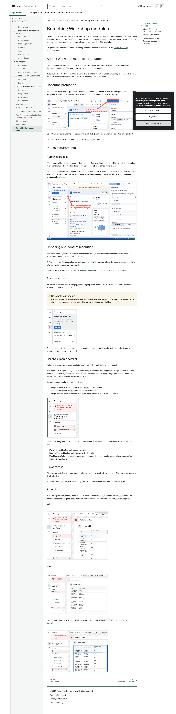
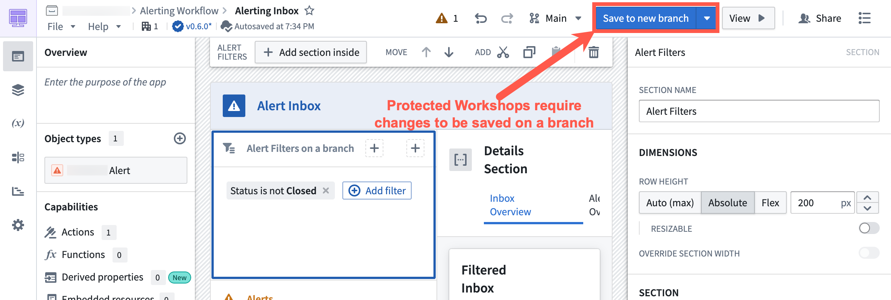
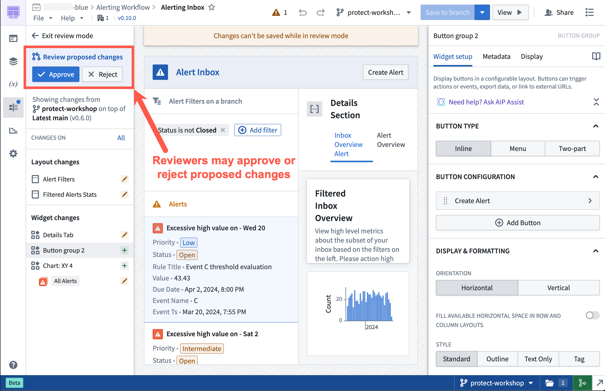
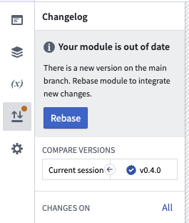
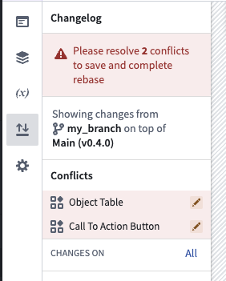
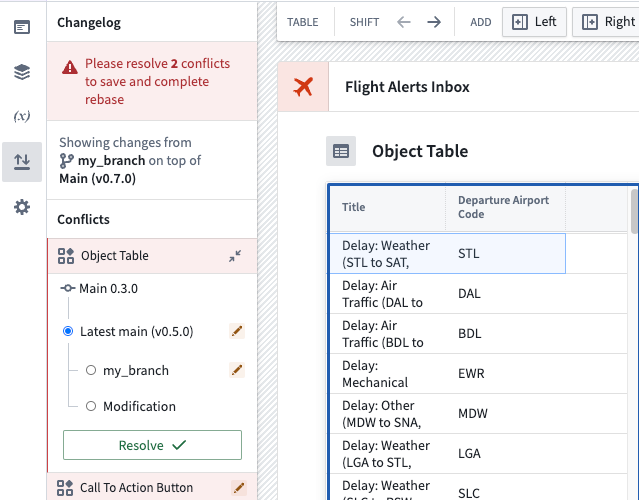
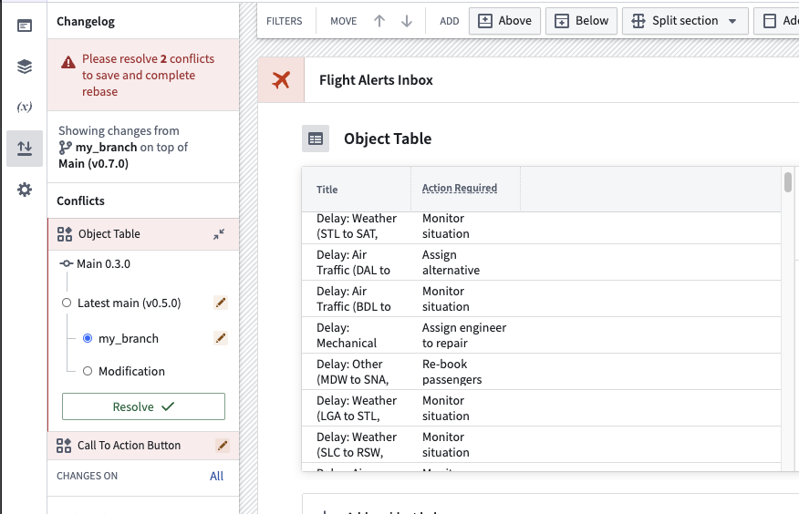

# Palantir

## Captura de pantalla

---

Search

[Palantir](//www.palantir.com)

- Documentation

  - [Documentation](/docs/foundry/)
  - [Apollo](/docs/apollo/)
  - [Gotham](/docs/gotham/)

Search documentation

Search

karat

+

K

[API Reference ↗](/docs/foundry/api-reference/)Send feedback

en

enjpkrzh

ABXY

ABXYABXYABXYABXYABXYABXY

- Capabilities

  - [AI Platform (AIP)](/docs/foundry/aip/overview/)
  - [Data connectivity & integration](/docs/foundry/data-integration/overview/)
  - [Model connectivity & development](/docs/foundry/model-integration/overview/)
  - [Ontology building](/docs/foundry/ontology/overview/)
  - [Developer toolchain](/docs/foundry/dev-toolchain/overview/)
  - [Use case development](/docs/foundry/app-building/overview/)
  - [Observability](/docs/foundry/observability/overview/)
  - [Analytics](/docs/foundry/analytics/overview/)
  - [Product delivery](/docs/foundry/devops/overview/)
  - [Security & governance](/docs/foundry/security/overview/)
  - [Management & enablement](/docs/foundry/administration/overview/)
- [Getting started](/docs/foundry/getting-started/overview/)
- [Architecture center](/docs/foundry/architecture-center/overview/)
- Platform updates

  - [Announcements](/docs/foundry/announcements/)
  - [Release notes](/docs/foundry/announcements/release-notes/)

[Use case development](/docs/foundry/app-building/overview/)[Workshop](/docs/foundry/workshop/overview/)[Branching Workshop modules](/docs/foundry/workshop/branching-integration/)

# Branching Workshop modules

Workshop integrates with Global Branching so you can develop modules and their configurations safely and in isolation. This page covers how to work with Workshop modules on branches, including adding resources to a branch, resource protection and approvals, and rebasing and conflict resolution.

For general information on Global Branching concepts and workflows, refer to the [Global Branching documentation](/docs/foundry/global-branching/overview/).

## Adding Workshop modules to a branch

To add a Workshop module to a branch, use the branch selector to switch to that branch, open the module, then save any changes. The module is now a resource on the branch.

If your Workshop module contains non-Workshop elements for which Global Branching is not available, such as Quiver dashboards, these elements will not be modifiable on a branch.

## Resource protection

When on the `main` branch, protected Workshop modules show a **Save to new branch** option instead of **Save and publish**, requiring all changes to be made on a branch rather than directly to `main`.

Select **Save to new branch** to open the new-branch dialog. Name the branch and select an ontology for it.

When you are ready to merge your changes to `main`, [create a proposal](/docs/foundry/global-branching/core-concepts/#create-and-prepare-a-proposal).

## Merge requirements

### Approval process

After a proposal is created, assigned reviewers are notified to review the changes. Navigating to the branched version of the Workshop module directs reviewers to the **Changelog** tab in Workshop.

Within the **Changelog** tab, reviewers can see the changes made to the module. Reviewers can then approve or reject the change by selecting the appropriate **Approve** or **Reject** button on the left panel in the **Review proposed changes** section.

## Rebasing and conflict resolution

Workshop rebasing enables multiple builders to edit a single module at the same time without needing to worry about overriding each other's changes.

Before you merge Workshop changes on a branch into `main`, you must rebase if a change occurred on `main` after the module was saved on a branch.

The rebasing user interface uses the [Changelog panel](/docs/foundry/workshop/changelog/) to depict the changes made in the module.

### Start the rebase

If a rebase is required before merging, the **Changelog** panel displays a visual notification dot. Select the panel to show an option that begins the rebase.

Save before rebasing

Unsaved Workshop edits are not preserved through a rebase. Save your changes to the branch before starting the rebase; any in-progress edits that have not been saved will be lost.

Rebasing applies the changes made on the branch to the latest `main` version of the module. Resolve any merge conflicts manually to proceed.

### Resolve a merge conflict

A change is marked as a merge conflict when it is edited on both `main` and the branch.

Workshop auto-merges changes that do not overlap. A change is only flagged as a merge conflict when the same widget, variable, section, or layout position was edited on both `main` and your branch; for those, you must pick a version manually as described below.

Common examples of merge conflicts include:

- A widget or variable was modified on both `main` and your branch.
- A section was deleted on `main` and edited on the branch.
- A widget was moved from location `A` to `B` on `main` and from `A` to `C` on your branch.

To resolve a merge conflict, switch between three states to test how each option affects the module in real time:

- **Main:** The modification as it appears on `main`.
- **Branch:** The modification as it appears on the branch.
- **Modification:** Edits you make to the component during the rebase, useful for combining changes from `main` with your branch.

### Finish rebase

When you are satisfied with how your module looks and have resolved any merge conflicts, save the module to finish rebasing.

After this is complete, you can safely merge your Workshop changes from your branch into `main`.

### Example

In the example below, a merge conflict occurs in the object table widget during a rebase. `main` adds a new column, `Departure airport code`, while the current working branch adds a column, `Action required`.

**Main:**

**Branch:**

To keep both columns, first select `main`, then manually add the `Action required` column to resolve the conflict.

[←

PREVIOUSKiosk mode](/docs/foundry/workshop/kiosk-mode/)

[NEXTScenarios / Overview

→](/docs/foundry/workshop/scenarios-overview/)

By clicking “Accept All Cookies”, you agree to the storing of cookies on your device to enhance site navigation, analyze site usage, and assist in our marketing efforts. [More Info](https://www.palantir.com/cookie-statement/)

Accept All Cookies Reject All

Cookies Settings

.png)

## Privacy Preference Center

- ### Your Privacy
- ### Strictly Necessary Cookies
- ### Targeting Cookies

#### Your Privacy

When you visit any website, it may store or retrieve information on your browser, mostly in the form of cookies. This information might be about you, your preferences, or your device, and is mostly used to make the site work as you expect. The information does not usually identify you directly, but it can give you a more personalized web experience. Because we respect your right to privacy, you can choose not to allow some types of cookies. Click on the different category headings to learn more and change our default settings. Blocking some types of cookies may impact your experience of the site and the services we are able to offer.
\
[More information](https://www.palantir.com/cookie-statement/)

#### Strictly Necessary Cookies

Always Active

These cookies are necessary for the website to function and cannot be switched off in our systems. They are usually only set in response to actions made by you which amount to a request for services, such as setting your privacy preferences, logging in or filling in forms. You can set your browser to block or alert you about these cookies, but some parts of the site will not then work. These cookies do not store any personally identifiable information.

Cookies Details

#### Targeting Cookies

Targeting Cookies

These cookies may be set through our site by our advertising partners. They may be used by those companies to build a profile of your interests and show you relevant adverts on other sites. They do not store directly personal information, but are based on uniquely identifying your browser and internet device. If you do not allow these cookies, you will experience less targeted advertising.

Cookies Details

Back Button

### Cookie List

Consent Leg.Interest

checkbox label label

checkbox label label

checkbox label label

Clear

- checkbox label label

Apply Cancel

Confirm My Choices

Reject All Allow All

