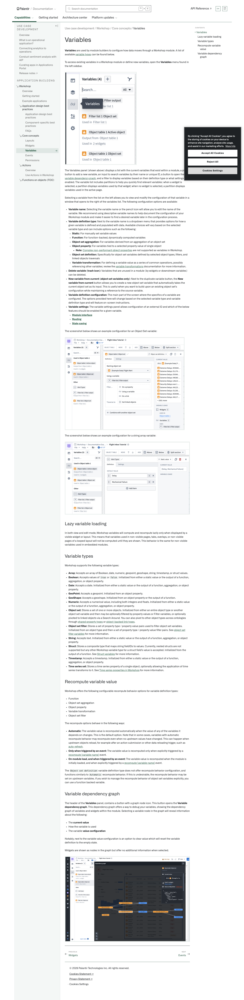
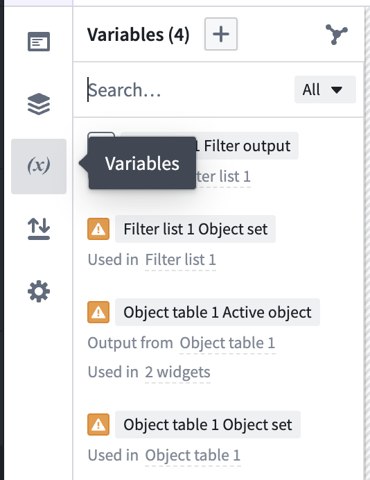
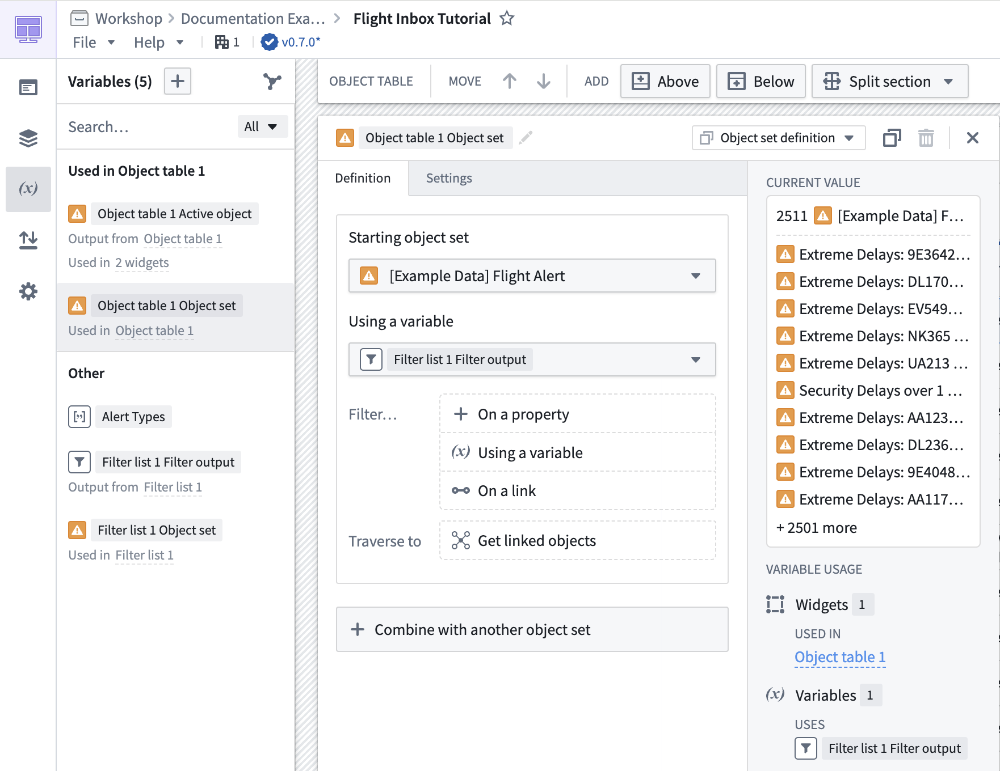
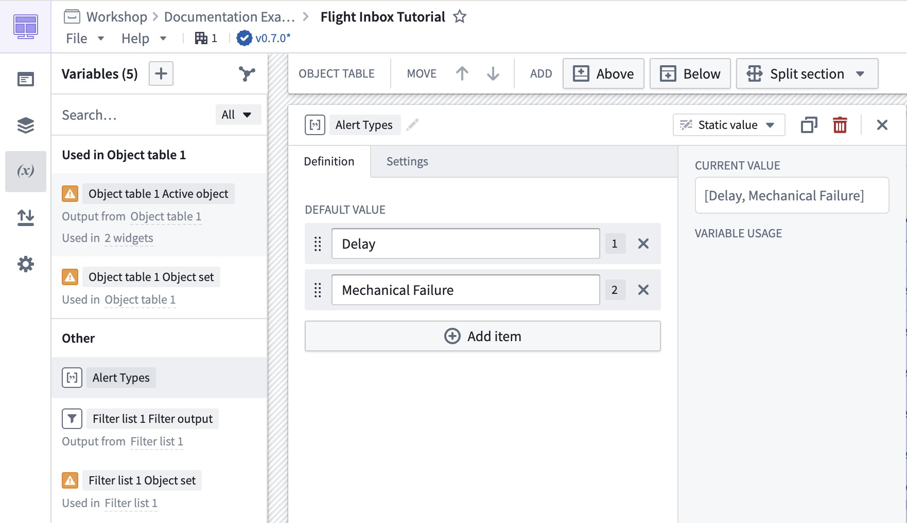
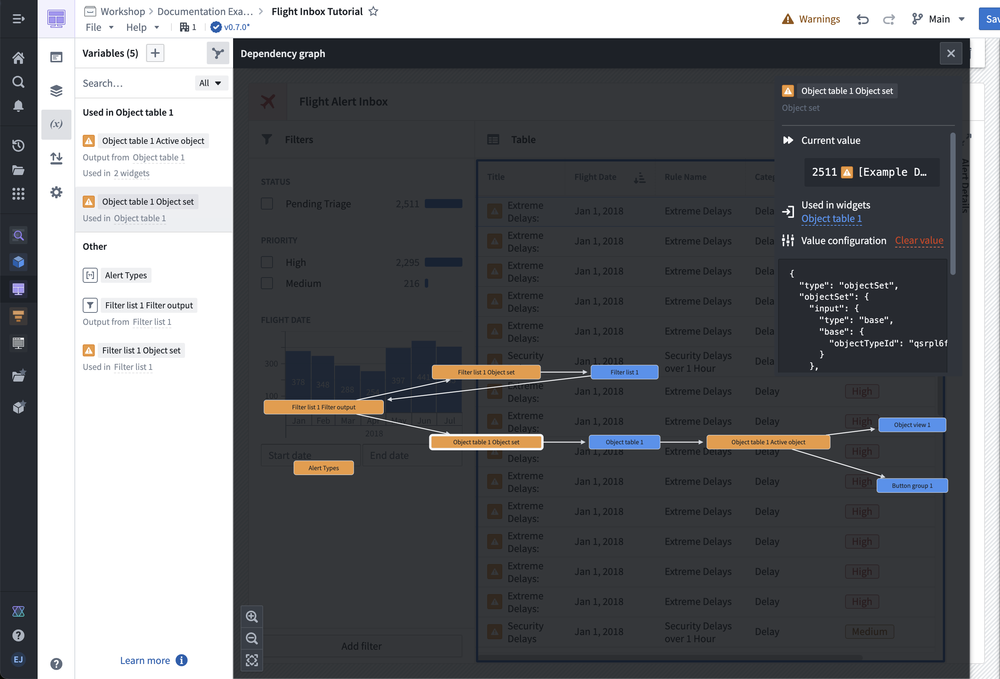

# Palantir

## Captura de pantalla

---

Search

[Palantir](//www.palantir.com)

- Documentation

  - [Documentation](/docs/foundry/)
  - [Apollo](/docs/apollo/)
  - [Gotham](/docs/gotham/)

Search documentation

Search

karat

+

K

[API Reference ↗](/docs/foundry/api-reference/)Send feedback

en

enjpkrzh

ABXY

ABXYABXYABXYABXYABXYABXY

- Capabilities

  - [AI Platform (AIP)](/docs/foundry/aip/overview/)
  - [Data connectivity & integration](/docs/foundry/data-integration/overview/)
  - [Model connectivity & development](/docs/foundry/model-integration/overview/)
  - [Ontology building](/docs/foundry/ontology/overview/)
  - [Developer toolchain](/docs/foundry/dev-toolchain/overview/)
  - [Use case development](/docs/foundry/app-building/overview/)
  - [Observability](/docs/foundry/observability/overview/)
  - [Analytics](/docs/foundry/analytics/overview/)
  - [Product delivery](/docs/foundry/devops/overview/)
  - [Security & governance](/docs/foundry/security/overview/)
  - [Management & enablement](/docs/foundry/administration/overview/)
- [Getting started](/docs/foundry/getting-started/overview/)
- [Architecture center](/docs/foundry/architecture-center/overview/)
- Platform updates

  - [Announcements](/docs/foundry/announcements/)
  - [Release notes](/docs/foundry/announcements/release-notes/)

[Use case development](/docs/foundry/app-building/overview/)[Workshop](/docs/foundry/workshop/overview/)Core concepts[Variables](/docs/foundry/workshop/concepts-variables/)

# Variables

**Variables** are used by module builders to configure how data moves through a Workshop module. A list of available [variable types](#variable-types) can be found below.

To access existing variables in a Workshop module or define new variables, open the **Variables** menu found in the left sidebar.

The Variables panel (shown above) displays a list with the current variables that exist within a module, a plus **+** button to add a new variable, an input to search variables by their name or unique ID, a button to open the [variable dependency graph](#variable-dependency-graph), and a filter to display variables based on their definition type or what settings are enabled. The variable list includes partitions to help you quickly find relevant variables: when a widget is selected, a partition displays variables used by that widget; when no widget is selected, a partition displays variables used in the active page.

Selecting a variable from the list on the left allows you to view and modify the configuration of that variable in a window that opens to the right of the variables list. The following configuration options are available:

- **Variable name:** Selecting the variable name or the pencil icon will allow you to edit the name of the variable. We recommend using descriptive variable names to help document the configuration of your Workshop module and make it easier to find a desired variable later in the configuration process.
- **Variable definition type:** Next to the variable name is a dropdown menu that provides options for how a given variable is defined and populated with data. Available choices will vary based on the selected variable type and can include options such as the following:
  - **Static:** For manually set variable values
  - **Function:** For function-backed, dynamically computed variables
  - **Object set aggregation:** For variables derived from an aggregation of an object set
  - **Object property:** For variables tied to a selected property value of single object
    - **Note:** [Complex non-performant object properties](/docs/foundry/workshop/unsupported-object-properties/) are not supported as variables in Workshop.
  - **Object set definition:** Specifically for object set variables defined by selected object types, filters, and linked objects traversals
  - **Variable transformation:** For defining a variable value as a series of common operations, possibly referencing other variables; review the [variable transformations](/docs/foundry/workshop/variable-transformations/) documentation for more information.
- **Delete variable (trash icon):** Variables that are unused in a module (by widgets or downstream variables) can be deleted.
- **New variable from current (object set variables only):** Next to the duplicate variable button, the **New variable from current** button allows you to create a new object set variable that automatically takes the current object set as its input. This is useful when you want to build upon an existing object set's configuration while maintaining a reference to the source variable.
- **Variable definition configuration:** The main part of the screen where the specifics of a variable are configured. The options provided here will change based on the selected variable type and variable definition type and will feature on-screen instructions.
- **Variable settings:** The variable settings panel allows configuration of an external ID and which of the below features should be enabled for a given variable.
  - **[Module interface](/docs/foundry/workshop/module-interface/)**
  - **[Routing](/docs/foundry/workshop/routing/)**
  - **[State saving](/docs/foundry/workshop/state-saving/)**

The screenshot below shows an example configuration for an Object Set variable:

The screenshot below shows an example configuration for a string array variable:

## Lazy variable loading

In both view and edit mode, Workshop variables will compute and recompute lazily only when displayed by a visible widget or layout. This means that variables used in non-visible pages, tabs, overlays, or non-visible pages of a looped layout will not be computed until they are shown. This behavior is the same for non-visible variables used in embedded modules.

## Variable types

Workshop supports the following variable types:

- **Array:** Accepts an array of Boolean, date, numeric, geopoint, geoshape, string, timestamp, or struct values.
- **Boolean:** Accepts values of `true` or `false`. Initialized from either a static value or the output of a function, aggregation, or object property.
- **Date:** Accepts a date. Initialized from either a static value or the output of a function, aggregation, or object property.
- **GeoPoint:** Accepts a geopoint. Initialized from an object property.
- **GeoShape:** Accepts a geoshape. Initialized from an object property or the output of a function.
- **Numeric:** Accepts a numerical value, including both integers and floats. Initialized from either a static value or the output of a function, aggregation, or object property.
- **Object set:** Stores a set of one or more objects. Initialized from either an entire object type or another object set variable and then may be optionally filtered by property values or Filter variables, or optionally pivoted to linked objects via a Search Around. You can also pivot to other object types across ontologies through [shared property types](/docs/foundry/object-link-types/shared-property-overview/) or [object-backed link types](/docs/foundry/object-link-types/create-link-type/#object-backed-links).
- **Object set filter:** Stores a set of property type / property value pairs used to filter object set variables. Initialized from an object type and then a set of property type / property value filter pairs. See [object set filter variables](/docs/foundry/workshop/object-set-filter-variables/) for more information.
- **String:** Accepts text. Initialized from either a static value or the output of a function, aggregation, or object property.
- **Struct:** Stores a composite type that maps string fieldIDs to values. Currently, nested structs are not supported but any other Workshop variable type for a struct field's value is accepted. Initialized from the output of a function. See [Struct variables](/docs/foundry/workshop/struct-variables/) for more information.
- **Timestamp:** Accepts a timestamp. Initialized from either a static value or the output of a function, aggregation, or object property.
- **Time series set:** Stores a time series property of a single object, optionally allowing the application of time series transforms to it. See [Time series properties in Workshop](/docs/foundry/workshop/time-series-properties/#time-series-transforms) for more information.

## Recompute variable value

Workshop offers the following configurable recompute behavior options for variable definition types:

- Function
- Object set aggregation
- Object property
- Variable transformation
- Object set filter

The recompute options behave in the following ways:

- **Automatic:** The variable value is recomputed automatically when the value of any of the variables it depends on changes. This is the default option. Note that in some cases, variables with automatic recompute behavior may recompute even when no upstream values have changed. This can happen when upstream objects reload, for example after an action submission or other data reloading trigger, such as [auto-refresh](/docs/foundry/workshop/auto-refresh/).
- **Only when triggered by an event:** The variable value is recomputed only when explicitly triggered by a [recompute {variable name}](/docs/foundry/workshop/concepts-events/#recompute-variable-name) event.
- **On module load, and when triggered by an event:** The variable value is recomputed when the module is initially loaded, and when explicitly triggered by a [recompute {variable name}](/docs/foundry/workshop/concepts-events/#recompute-variable-name) event.

The `Object set definition` variable definition type does not offer recompute behavior configuration, and functions similarly to `Automatic` recompute behavior. If this is undesirable, the recompute behavior may be set on upstream variables. If you wish to manage the recompute behavior of object set variables explicitly, you can use a function backed variable.

## Variable dependency graph

The header of the **Variables** panel, contains a button with a graph node icon. This button opens the **Variable dependency graph**. This dependency graph offers a way to debug your variables, showing the dependency graph of variables and widgets within the module. Selecting a variable node in the graph will reveal information about the following:

- The **current value**
- How the variable is used
- The variable **value configuration**

Notably, next to the variable value configuration is an option to clear value which will reset the variable definition to the empty state.

Widgets are shown as nodes in the graph but offer no additional information when selected.

[←

PREVIOUSWidgets](/docs/foundry/workshop/concepts-widgets/)

[NEXTEvents

→](/docs/foundry/workshop/concepts-events/)

By clicking “Accept All Cookies”, you agree to the storing of cookies on your device to enhance site navigation, analyze site usage, and assist in our marketing efforts. [More Info](https://www.palantir.com/cookie-statement/)

Accept All Cookies Reject All

Cookies Settings

.png)

## Privacy Preference Center

- ### Your Privacy
- ### Strictly Necessary Cookies
- ### Targeting Cookies

#### Your Privacy

When you visit any website, it may store or retrieve information on your browser, mostly in the form of cookies. This information might be about you, your preferences, or your device, and is mostly used to make the site work as you expect. The information does not usually identify you directly, but it can give you a more personalized web experience. Because we respect your right to privacy, you can choose not to allow some types of cookies. Click on the different category headings to learn more and change our default settings. Blocking some types of cookies may impact your experience of the site and the services we are able to offer.
\
[More information](https://www.palantir.com/cookie-statement/)

#### Strictly Necessary Cookies

Always Active

These cookies are necessary for the website to function and cannot be switched off in our systems. They are usually only set in response to actions made by you which amount to a request for services, such as setting your privacy preferences, logging in or filling in forms. You can set your browser to block or alert you about these cookies, but some parts of the site will not then work. These cookies do not store any personally identifiable information.

Cookies Details

#### Targeting Cookies

Targeting Cookies

These cookies may be set through our site by our advertising partners. They may be used by those companies to build a profile of your interests and show you relevant adverts on other sites. They do not store directly personal information, but are based on uniquely identifying your browser and internet device. If you do not allow these cookies, you will experience less targeted advertising.

Cookies Details

Back Button

### Cookie List

Consent Leg.Interest

checkbox label label

checkbox label label

checkbox label label

Clear

- checkbox label label

Apply Cancel

Confirm My Choices

Reject All Allow All

