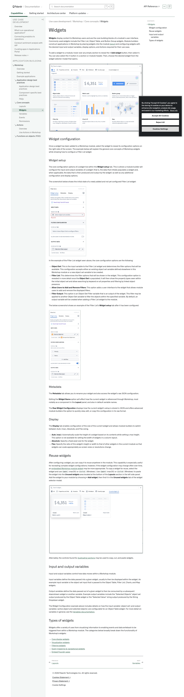
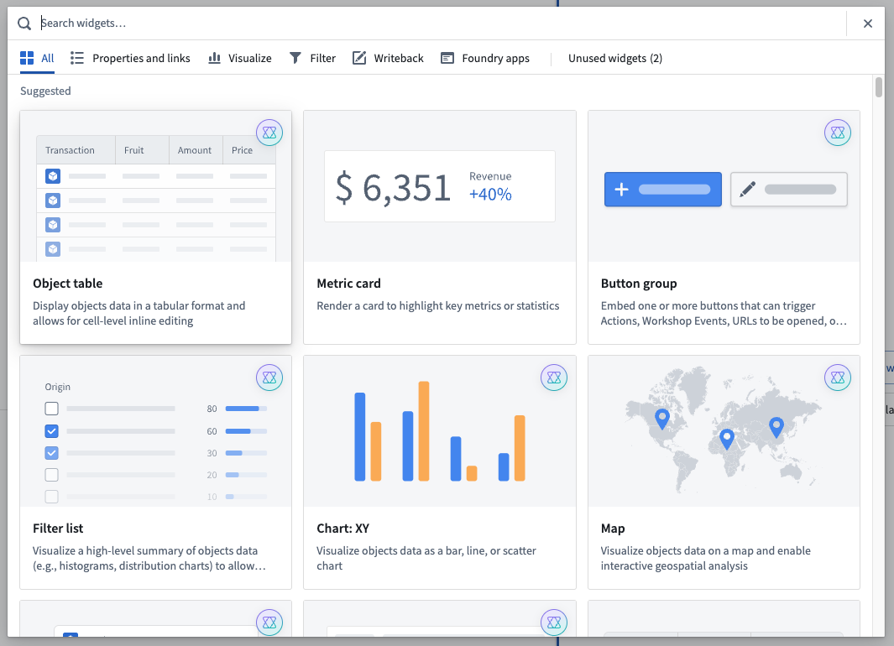
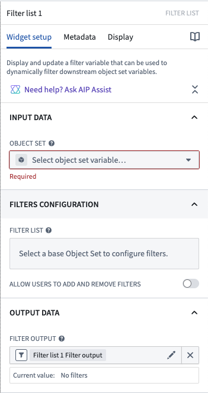
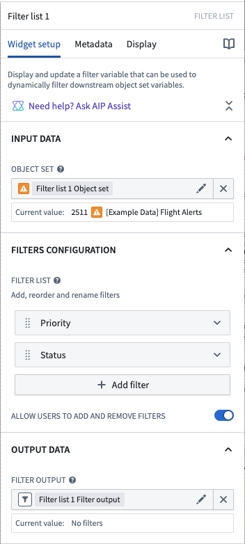
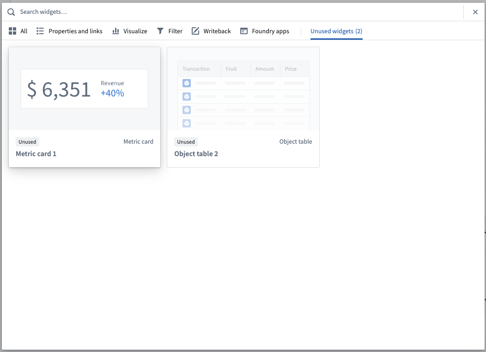

# Palantir

## Captura de pantalla

---

Search

[Palantir](//www.palantir.com)

- Documentation

  - [Documentation](/docs/foundry/)
  - [Apollo](/docs/apollo/)
  - [Gotham](/docs/gotham/)

Search documentation

Search

karat

+

K

[API Reference ↗](/docs/foundry/api-reference/)Send feedback

en

enjpkrzh

ABXY

ABXYABXYABXYABXYABXYABXY

- Capabilities

  - [AI Platform (AIP)](/docs/foundry/aip/overview/)
  - [Data connectivity & integration](/docs/foundry/data-integration/overview/)
  - [Model connectivity & development](/docs/foundry/model-integration/overview/)
  - [Ontology building](/docs/foundry/ontology/overview/)
  - [Developer toolchain](/docs/foundry/dev-toolchain/overview/)
  - [Use case development](/docs/foundry/app-building/overview/)
  - [Observability](/docs/foundry/observability/overview/)
  - [Analytics](/docs/foundry/analytics/overview/)
  - [Product delivery](/docs/foundry/devops/overview/)
  - [Security & governance](/docs/foundry/security/overview/)
  - [Management & enablement](/docs/foundry/administration/overview/)
- [Getting started](/docs/foundry/getting-started/overview/)
- [Architecture center](/docs/foundry/architecture-center/overview/)
- Platform updates

  - [Announcements](/docs/foundry/announcements/)
  - [Release notes](/docs/foundry/announcements/release-notes/)

[Use case development](/docs/foundry/app-building/overview/)[Workshop](/docs/foundry/workshop/overview/)Core concepts[Widgets](/docs/foundry/workshop/concepts-widgets/)

# Widgets

**Widgets** display content to Workshop users and are the core building blocks of a module’s user interface. Commonly used widgets include the Filter List, Object Table, and Button Group widgets. Module builders construct applications in Workshop by placing widgets into the module [layout](/docs/foundry/workshop/concepts-layouts/) and configuring widgets with the desired input and output variables, display options, and Actions required for their use case.

To add a widget to a module, hover over any empty section to reveal the **+ Add widget** button, then select it. You can also select the **+** button in a section or module header. Then, choose the desired widget from the widget selector modal that opens.

## Widget configuration

Once a widget has been added to a Workshop module, select the widget to reveal its configuration options on the right side of the screen. The example below will explain the general core concepts of Workshop widgets while showing how to configure a Filter List widget.

### Widget setup

The core configuration options of a widget live within the **Widget setup** tab. This is where a module builder will configure the input and output variables of a widget (that is, the data that initially populates a widget and, when applicable, the data that is then produced and output by the widget) as well as any additional configuration and display options.

The screenshot below shows the initial state of a newly added and not yet configured Filter List widget:

In the example of the Filter List widget seen above, the core configuration options are the following:

- **Object Set:** This is the input variable to the Filter List widget and determines the filter options that will be available. This configuration accepts either an existing object set variable defined elsewhere in this Workshop module or a new object set variable to be created.
- **Filter List:** This determines the filter options that will be shown in the widget. This configuration option is revealed in more detail once the **Object Set** is populated; it will then show the property types seen within the initial object set and allow searching by keyword on all properties and filtering by linked object presence.
- **Allow Users to Add and Remove Filters:** This option adds a user interface to the widget that allows module users to add and remove the displayed filters.
- **Filter Output:** This option is an Object Set Filter variable that is an output of the widget. This filter may be applied to another Object Set variable to filter the objects within the specified variable. By default, an output variable will be created when adding a Filter List widget to the module.

The below screenshot shows an example of the Filter List’s **Widget setup** tab after it has been configured:

### Metadata

The **Metadata** tab allows you to rename your widget and also access the widget’s raw JSON configuration.

Editing the **Widget Name** option will affect how the current widget is referenced through Workshop, most notably as a component in the **Layout** panel, and also in default variable names.

The **Raw Widget Configuration** displays how the current widget’s setup is stored in JSON and offers advanced module builders the option to quickly view, edit, or copy this configuration in its raw format.

### Display

The **Display** tab enables configuration of the size of the current widget and allows module builders to switch between Auto (max), Absolute, and Flex sizing.

- **Auto (max):** Automatically scale the height of a widget based on its contents while setting a max height. This option is not available for setting the width of widgets in a column layout.
- **Absolute:** Specify a fixed pixel size for the widget.
- **Flex:** Specify the ratio of this widget's height or width to that of other widgets in the current module so that widgets can scale appropriately as screen sizes or resolutions change.

## Reuse widgets

After configuring a widget, you can copy it to reuse anywhere in the module. This capability is especially useful for recreating complex widget configurations; however, if the widget configuration may change often over time, an [embedded Workshop module widget](/docs/foundry/workshop/embedded-modules/) may be more appropriate. To copy a widget for reuse, select the widget and use `Cmd+C` (macOS) or `Ctrl+C` (Windows). Use `Cmd+V` (macOS) or `Ctrl+V` (Windows) to paste the widget into the **Unused widgets** area located at the bottom of the **Layouts** section in the left side panel. Add the widget to your module by choosing **+ Add widget**, then find it in the **Unused widgets** tab of the widget selector modal.

Alternately, the controls found for [duplicating sections](/docs/foundry/workshop/concepts-layouts/#duplicating-sections) may be used to copy, cut, and paste widgets.

## Input and output variables

Input and output variables control how data moves within a Workshop module.

Input variables define the data passed into a given widget, usually to then be displayed within the widget. An example input variable is the object set input that is passed to the Object Table, Filter List, Charts, and Map widgets.

Output variables define the data passed out of a given widget to then be consumed by a subsequent downstream widget or another variable. Example output variables include the “Selected Objects” object set output produced by the Object Table widget or the "Selected Value“ string output produced by the String Dropdown widget.

The Widget Configuration example above includes details on how the input variable (object set) and output variables (active object and selected objects) are configurable for an Object Table widget. For more detail on variables in general, see the [Variables documentation](/docs/foundry/workshop/concepts-variables/).

## Types of widgets

Widgets offer a variety of uses from visualizing information to enabling events and data writeback to be triggered from within a Workshop module. The categories below broadly break down the functionality of Workshop’s widgets:

- [Core display widgets](/docs/foundry/workshop/widgets-core-display/)
- [Visualization widgets](/docs/foundry/workshop/widgets-visualization/)
- [Filtering widgets](/docs/foundry/workshop/widgets-filtering/)
- [Event-triggering & navigational widgets](/docs/foundry/workshop/widgets-event-navigational/)
- [Embed Foundry apps](/docs/foundry/workshop/widgets-embed-foundry-apps/)

[←

PREVIOUSLayouts](/docs/foundry/workshop/concepts-layouts/)

[NEXTVariables

→](/docs/foundry/workshop/concepts-variables/)

By clicking “Accept All Cookies”, you agree to the storing of cookies on your device to enhance site navigation, analyze site usage, and assist in our marketing efforts. [More Info](https://www.palantir.com/cookie-statement/)

Accept All Cookies Reject All

Cookies Settings

.png)

## Privacy Preference Center

- ### Your Privacy
- ### Strictly Necessary Cookies
- ### Targeting Cookies

#### Your Privacy

When you visit any website, it may store or retrieve information on your browser, mostly in the form of cookies. This information might be about you, your preferences, or your device, and is mostly used to make the site work as you expect. The information does not usually identify you directly, but it can give you a more personalized web experience. Because we respect your right to privacy, you can choose not to allow some types of cookies. Click on the different category headings to learn more and change our default settings. Blocking some types of cookies may impact your experience of the site and the services we are able to offer.
\
[More information](https://www.palantir.com/cookie-statement/)

#### Strictly Necessary Cookies

Always Active

These cookies are necessary for the website to function and cannot be switched off in our systems. They are usually only set in response to actions made by you which amount to a request for services, such as setting your privacy preferences, logging in or filling in forms. You can set your browser to block or alert you about these cookies, but some parts of the site will not then work. These cookies do not store any personally identifiable information.

Cookies Details

#### Targeting Cookies

Targeting Cookies

These cookies may be set through our site by our advertising partners. They may be used by those companies to build a profile of your interests and show you relevant adverts on other sites. They do not store directly personal information, but are based on uniquely identifying your browser and internet device. If you do not allow these cookies, you will experience less targeted advertising.

Cookies Details

Back Button

### Cookie List

Consent Leg.Interest

checkbox label label

checkbox label label

checkbox label label

Clear

- checkbox label label

Apply Cancel

Confirm My Choices

Reject All Allow All

