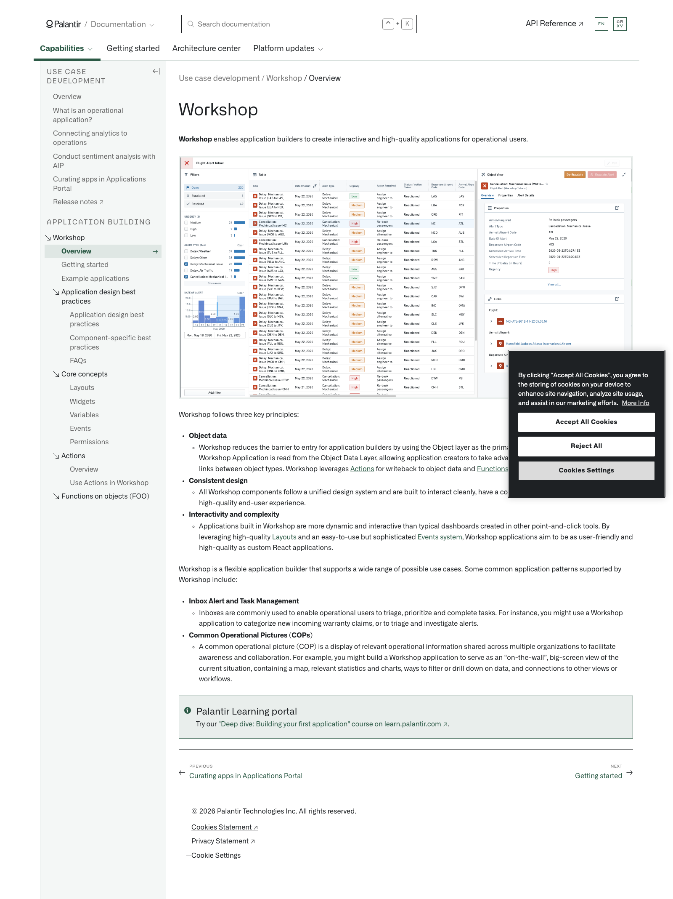
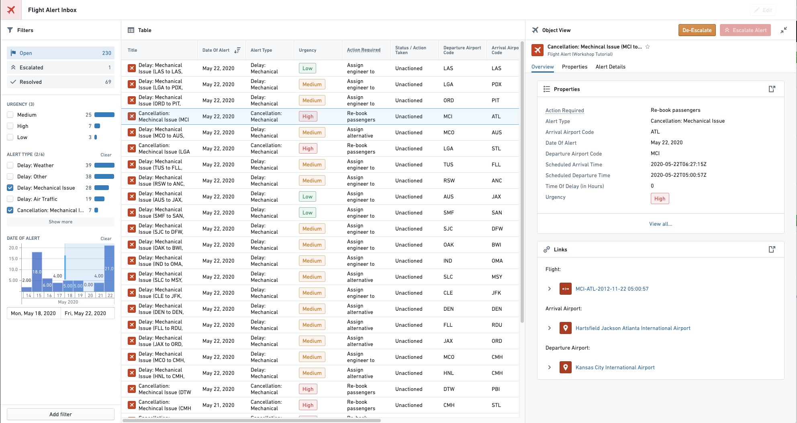

# Palantir

## Captura de pantalla

---

Search

[Palantir](//www.palantir.com)

- Documentation

  - [Documentation](/docs/foundry/)
  - [Apollo](/docs/apollo/)
  - [Gotham](/docs/gotham/)

Search documentation

Search

karat

+

K

[API Reference ↗](/docs/foundry/api-reference/)Send feedback

en

enjpkrzh

ABXY

ABXYABXYABXYABXYABXYABXY

- Capabilities

  - [AI Platform (AIP)](/docs/foundry/aip/overview/)
  - [Data connectivity & integration](/docs/foundry/data-integration/overview/)
  - [Model connectivity & development](/docs/foundry/model-integration/overview/)
  - [Ontology building](/docs/foundry/ontology/overview/)
  - [Developer toolchain](/docs/foundry/dev-toolchain/overview/)
  - [Use case development](/docs/foundry/app-building/overview/)
  - [Observability](/docs/foundry/observability/overview/)
  - [Analytics](/docs/foundry/analytics/overview/)
  - [Product delivery](/docs/foundry/devops/overview/)
  - [Security & governance](/docs/foundry/security/overview/)
  - [Management & enablement](/docs/foundry/administration/overview/)
- [Getting started](/docs/foundry/getting-started/overview/)
- [Architecture center](/docs/foundry/architecture-center/overview/)
- Platform updates

  - [Announcements](/docs/foundry/announcements/)
  - [Release notes](/docs/foundry/announcements/release-notes/)

[Use case development](/docs/foundry/app-building/overview/)[Workshop](/docs/foundry/workshop/overview/)[Overview](/docs/foundry/workshop/overview/)

# Workshop

**Workshop** enables application builders to create interactive and high-quality applications for operational users.

Workshop follows three key principles:

- **Object data**
  - Workshop reduces the barrier to entry for application builders by using the Object layer as the primary building block. All data in a Workshop Application is read from the Object Data Layer, allowing application creators to take advantage of rich characteristics such as links between object types. Workshop leverages [Actions](/docs/foundry/workshop/actions-use/) for writeback to object data and [Functions](/docs/foundry/workshop/functions-use/) for business logic on object data.
- **Consistent design**
  - All Workshop components follow a unified design system and are built to interact cleanly, have a consistent look and feel, and provide a high-quality end-user experience.
- **Interactivity and complexity**
  - Applications built in Workshop are more dynamic and interactive than typical dashboards created in other point-and-click tools. By leveraging high-quality [Layouts](/docs/foundry/workshop/concepts-layouts/) and an easy-to-use but sophisticated [Events system](/docs/foundry/workshop/concepts-events/), Workshop applications aim to be as user-friendly and high-quality as custom React applications.

Workshop is a flexible application builder that supports a wide range of possible use cases. Some common application patterns supported by Workshop include:

- **Inbox Alert and Task Management**
  - Inboxes are commonly used to enable operational users to triage, prioritize and complete tasks. For instance, you might use a Workshop application to categorize new incoming warranty claims, or to triage and investigate alerts.
- **Common Operational Pictures (COPs)**
  - A common operational picture (COP) is a display of relevant operational information shared across multiple organizations to facilitate awareness and collaboration. For example, you might build a Workshop application to serve as an “on-the-wall”, big-screen view of the current situation, containing a map, relevant statistics and charts, ways to filter or drill down on data, and connections to other views or workflows.

Palantir Learning portal

Try our ["Deep dive: Building your first application" course on learn.palantir.com ↗](https://learn.palantir.com/deep-dive-building-your-first-application).

[←

PREVIOUSCurating apps in Applications Portal](/docs/foundry/app-building/curating-apps/)

[NEXTGetting started

→](/docs/foundry/workshop/getting-started/)

By clicking “Accept All Cookies”, you agree to the storing of cookies on your device to enhance site navigation, analyze site usage, and assist in our marketing efforts. [More Info](https://www.palantir.com/cookie-statement/)

Accept All Cookies Reject All

Cookies Settings

.png)

## Privacy Preference Center

- ### Your Privacy
- ### Strictly Necessary Cookies
- ### Targeting Cookies

#### Your Privacy

When you visit any website, it may store or retrieve information on your browser, mostly in the form of cookies. This information might be about you, your preferences, or your device, and is mostly used to make the site work as you expect. The information does not usually identify you directly, but it can give you a more personalized web experience. Because we respect your right to privacy, you can choose not to allow some types of cookies. Click on the different category headings to learn more and change our default settings. Blocking some types of cookies may impact your experience of the site and the services we are able to offer.
\
[More information](https://www.palantir.com/cookie-statement/)

#### Strictly Necessary Cookies

Always Active

These cookies are necessary for the website to function and cannot be switched off in our systems. They are usually only set in response to actions made by you which amount to a request for services, such as setting your privacy preferences, logging in or filling in forms. You can set your browser to block or alert you about these cookies, but some parts of the site will not then work. These cookies do not store any personally identifiable information.

Cookies Details

#### Targeting Cookies

Targeting Cookies

These cookies may be set through our site by our advertising partners. They may be used by those companies to build a profile of your interests and show you relevant adverts on other sites. They do not store directly personal information, but are based on uniquely identifying your browser and internet device. If you do not allow these cookies, you will experience less targeted advertising.

Cookies Details

Back Button

### Cookie List

Consent Leg.Interest

checkbox label label

checkbox label label

checkbox label label

Clear

- checkbox label label

Apply Cancel

Confirm My Choices

Reject All Allow All

