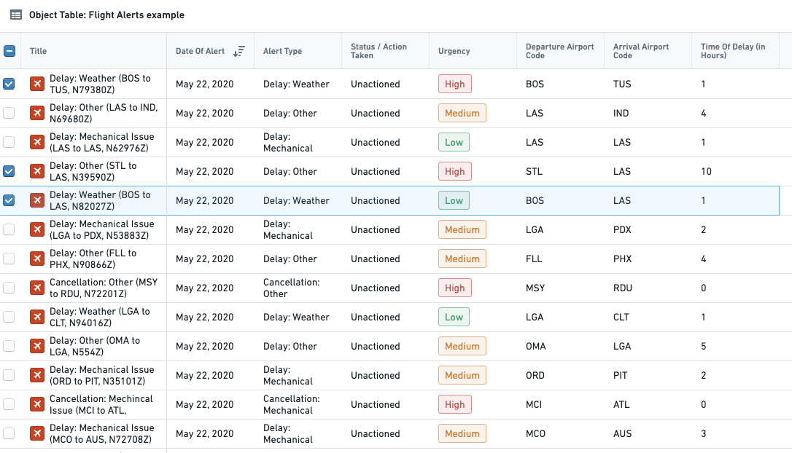
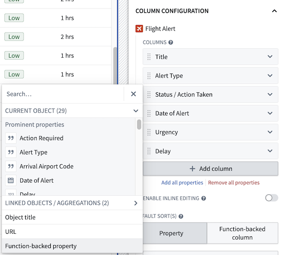
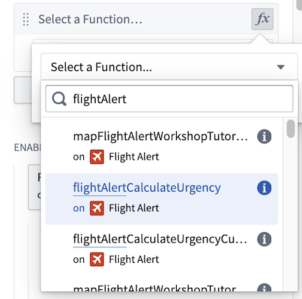
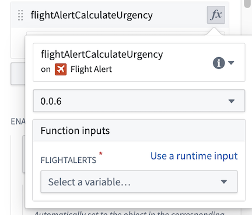
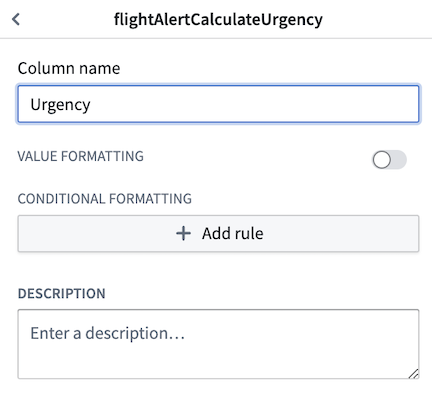
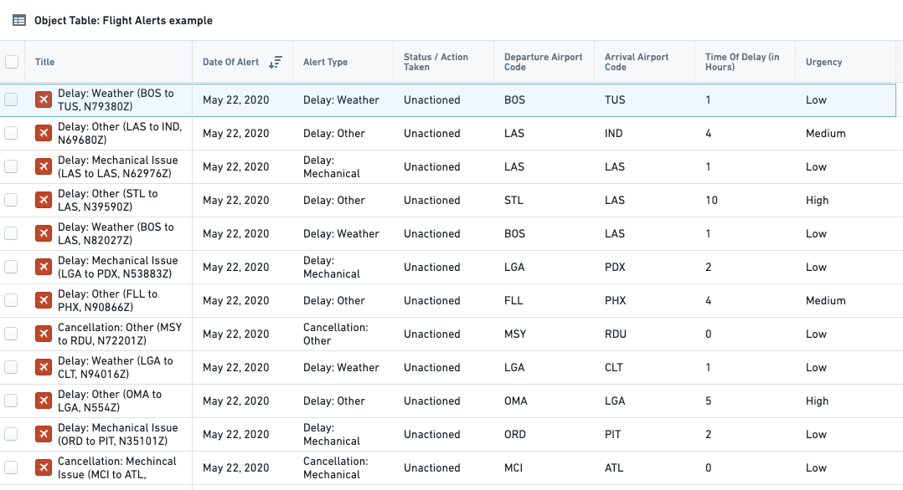

# Palantir

## Captura de pantalla


---

Search

[Palantir](//www.palantir.com)

- Documentation

  - [Documentation](/docs/foundry/)
  - [Apollo](/docs/apollo/)
  - [Gotham](/docs/gotham/)

Search documentation

Search

karat

+

K

[API Reference ↗](/docs/foundry/api-reference/)Send feedback

en

enjpkrzh

ABXY

ABXYABXYABXYABXYABXYABXY

- Capabilities

  - [AI Platform (AIP)](/docs/foundry/aip/overview/)
  - [Data connectivity & integration](/docs/foundry/data-integration/overview/)
  - [Model connectivity & development](/docs/foundry/model-integration/overview/)
  - [Ontology building](/docs/foundry/ontology/overview/)
  - [Developer toolchain](/docs/foundry/dev-toolchain/overview/)
  - [Use case development](/docs/foundry/app-building/overview/)
  - [Observability](/docs/foundry/observability/overview/)
  - [Analytics](/docs/foundry/analytics/overview/)
  - [Product delivery](/docs/foundry/devops/overview/)
  - [Security & governance](/docs/foundry/security/overview/)
  - [Management & enablement](/docs/foundry/administration/overview/)
- [Getting started](/docs/foundry/getting-started/overview/)
- [Architecture center](/docs/foundry/architecture-center/overview/)
- Platform updates

  - [Announcements](/docs/foundry/announcements/)
  - [Release notes](/docs/foundry/announcements/release-notes/)

[Use case development](/docs/foundry/app-building/overview/)[Workshop](/docs/foundry/workshop/overview/)[Core display widgets](/docs/foundry/workshop/widgets-core-display/)[Object Table](/docs/foundry/workshop/widgets-object-table/)

# Object Table

The **Object Table** widget is used to display object data in a tabular format. Module builders configuring an Object Table widget can use features including:

- Displaying data on one or multiple object types.
- Choosing which columns are displayed, including time series columns using time series properties, and derived columns generated on-the-fly via a Function.
- Sorting via one or multiple columns.
- Setting column size and row height.
- Displaying conditional formatting and numerical formatting options configured in the Ontology Manager.
- Allowing single- or multi-selection within the table.
- Inline editing to enable cell-level writeback within the table.
- Triggering Workshop Events upon row selection within the table.
- Adding custom row actions in the right-click menu.

The below screenshot shows an example of a configured Object Table displaying Flight Alert data:



## Configuration options

If your object has a property that stores a URL to an image, you can add the type class `hubble:icon` to display the image instead of the icon that was selected when setting up the object type. This feature allows you to show pictograms or images to show alongside your data.

For the Object Table widget, the core configuration options are the following:

- **Input data**

  - **Object set:** This is the input variable to the Object Table widget and determines the data that will be displayed within the Object Table. This allows a module builder to define a new object set variable or reuse an existing object set variable created elsewhere in this Workshop module.
- **Column configuration**

  - **Columns:** This section determines the columns that will be displayed within the Object Table. This configuration option is revealed in more detail to show the property types seen within the initial object set, once that object set is populated. In addition, special column types allow module builders to display linked objects, parameterized URL links, time series data, and derived columns generated on-the-fly with a function. Users in **View** mode can also choose to configure the columns shown to them. By selecting **Configure columns** from the arrow next to a column header, viewers can choose the columns and the order to display them in the Object Table. Review the [time series properties](#time-series-properties) section below for more information on time series data, and the [function-backed columns](#function-backed-columns) section for more information on how to configure derived columns.

    The displayed column name is a text field that defaults to the object type's property name when added.
    If the object type's property name is later updated in the Ontology, the displayed column name in the Object Table will not automatically change.
  - **Unsupported property types:** Certain large properties (for example, Geoshape and Vector) are not loaded by default to preserve performance. In View mode, users can select the "..." overflow on a cell to load an unsupported property's value on demand. In the widget editor, unsupported properties are marked with a warning icon and tooltip to indicate potential performance impact.
  - **Enable inline editing:** When enabled, this toggle allows configuration of cell-level edits within the Object Table. See the [Inline Edits (cell-level writeback)](#inline-edits-cell-level-writeback) section below for more information on how to configure this advanced feature.
  - **Default sort(s):** This setting allows one or more default sorts to be applied to the table. Module builders can sort on both visible property types shown within the table or hidden property types not displayed. If no sort is applied, the data is not sorted. We recommend specifying a sort where necessary.
- **Right-click menu**

  - **Enable export to CSV:** When enabled, this toggle allows a user to export object table data to CSV format from a row's right-click menu. This feature supports exporting function-backed columns and linked object properties and is capable of exporting up to 10,000 rows at a time.
  - **Enable export to Excel:** When enabled, this toggle allows a user to export object table data to Excel format from a row's right-click menu. Note that this feature supports exporting up to 200,000 rows at a time.
  - **Customize right-click menu:** This option enables module builders to configure a row's right-click menu with custom actions. See the [custom right-click menu](#custom-right-click-menu) section below for more information on how to configure this feature.
- **Selection**

  - **Active object:** This is the first of two output variables in the Object Table and outputs an object set of the currently active / highlighted object. This object set can then be used in downstream widgets within the current module.
  - **Disable active object auto-selection:** By default, the first row in the table is automatically set as the active object at load time. Disabling this setting prevents this and results in an empty active object at load time. Note that auto-selection only triggers when the widget is visible; if the Object Table is within a collapsed section, auto-selection will not occur until the section is expanded and the widget becomes visible.
  - **Enable multi-select:** When enabled, this toggle allows multiple objects to be checked / selected in the table and output via the **Selected objects** object set variable.
  - **Selected objects:** This is the second of two output variables in the Object Table and outputs an object set of the currently checked / selected objects. This object set can then be used in downstream widgets within the current module. Note: this output variable will only be in use and populated if the **Enable multi-select** toggle is set to true.
  - **On active object selection:** This option enables module builders to configure Workshop events to trigger when a row is selected in the table (for example, causing a drawer with a more detailed object view to appear).
- **Display & formatting**

  - **Number of lines to display per row:** This number controls the height of each table row.
  - **Enable value wrapping:** When enabled, allows text content to wrap within cells. This option supports wrapping for struct properties and arrays of struct properties. When content is too long to display fully, struct values show ellipsis truncation with hover tooltips displaying the complete value.
  - **Number of frozen columns:** This number determines the number of frozen columns that are anchored to the left of the table and will remain visible when a user scrolls to the right.
  - **Empty state message:** Configure what is displayed by the widget if the object set backing the widget is empty. By **Default**, the widget will display a generic table icon alongside a "No objects found" message. To customize the display icon and message, select the **Custom** option.
  - **Custom "No value" display:** When enabled, override what is displayed in the table when there is no value for a cell. By default, "No value" will be displayed.
  - **Combine multiple object types:** This setting only affects tables displaying multiple object types. When disabled, each object type will be displayed within its own tab. When enabled, all object types will be displayed within a single table and, across object types, property types that share both display names and IDs will be combined into a single column. Note that this option is not available when **Enable inline editing** is set to true.
  - **Variable-backed column visibility:** When enabled, allows control over which columns are visible using a string array variable containing the API names of visible columns. This array variable also controls the order that columns appear in. If the string array is empty, all configured columns will be shown in the table.
  - **Fit columns horizontally:** When enabled, columns will auto-resize to fill the current width of the table.
  - **Enable narrow headers:** When enabled, table headers will narrow from 50 pixels to 30 pixels.
  - **Conditional formatting colors entire cell:** When enabled, conditional formatting will color an entire cell. Note: conditional formatting is configured within the Ontology Manager for normal property types and from within the Object Table widget configuration panel for function-backed properties.
  - **Hide column configuration:** When enabled, hides the **Configure columns** option present in view mode from the table's header menu.
  - **Show security markings:** When enabled, [property security markings](/docs/foundry/security/property-security-markings/) render as a condensed gray pill with an expanded window view on selection.
- **Scenarios**

  - **Scenario to load data from:** Select the Scenario to load data for the Object Table. This input also affects what objects appear and their respective order in the Object Table.
  - **Compare against Scenarios:** Enable this toggle to select the Scenario array variable to compare data from. This will compare the data in the table to values from the Scenarios in the array by displaying the values side-by-side in columns which have modifications.
  - See the [Scenarios documentation](/docs/foundry/workshop/scenarios-overview/) for more information.

### Save user column configuration

To save a user's column configuration, take the following steps to use a string array variable with state saving:

1. Ensure that [state saving is enabled](/docs/foundry/workshop/state-saving/).
2. Enable **Variable-backed column visibility** with a new static string array variable (the array variable can be empty). This will store which columns are visible, as well as their order.
3. Add an external ID for the string array variable in the **Settings** panel and ensure it is enabled for use with state saving.

## Function-backed columns

The tutorial below references a Flight Alert object type that may not be available in your Foundry environment. Use the below as a guide and then follow along by using a comparable object type from your Foundry instance. To learn more about Functions, see the dedicated [Functions documentation](/docs/foundry/functions/overview/).

### Summary

To create a function that returns one or more function-backed columns, you will need to meet the following specifications:

1. The function’s input parameters must include an `ObjectSet<ObjectType>` parameter (and can optionally include other input parameters). This `ObjectSet<ObjectType>` parameter will enable the objects displayed in the table to be passed into the function to then generate the desired derived column. Note that an `ObjectType[]` parameter will also work here, but this less performant option is not recommended.
2. The function's return type must be a map from the object type to a value or custom type, enabling the function to return a mapping of object to value or custom type that may include one or more fields:

   - In [TypeScript v1](/docs/foundry/functions/typescript-v1-getting-started/), use `FunctionsMap<ObjectType, CustomType>`.
   - In [TypeScript v2](/docs/foundry/functions/typescript-v2-getting-started/), use `Record<ObjectSpecifier<ObjectType>, CustomType>`.
   - In [Python](/docs/foundry/functions/python-getting-started/), use `dict[ObjectType, CustomType]`.

   [Learn more about custom types.](/docs/foundry/functions/types-reference/#structcustom-type)

Once a function that meets the above criteria is configured and published, you can successfully configure a function-backed property column within the Object Table configuration. See [below](#features-of-function-backed-properties) for a more detailed tutorial.

### Features of function-backed properties

The Object Table widget supports the display of function-backed properties which are calculated on-the-fly via Functions. This offers module builders considerable flexibility to display columns that could, for example:

- Calculate the sum, difference, or other mathematical operation between two or more other properties.
- Showcase the output of a statistical model that updates based on data entry elsewhere in the Workshop module.
- Display properties from linked objects
- Change what is displayed based on user input elsewhere in the Workshop module.

### Configure a single function-backed property

This example uses a function-backed property to help users view and work with the priority of a `Flight Alert` ticket. Here, the goal is to examine an existing property called `Time of Delay` (in Hours) and, from this property, generate a new, function-backed column called `Urgency`. The derived `Urgency` column marks long delays (over 4 hours) as "High" urgency, moderate delays (between 2 and 4 hours) as "Medium" urgency, and shorter delays (of less than 2 hours) as "Low" urgency. This `Urgency` derived property should make it easier for users to quickly scan the Object Table and determine which alerts to action first.

To configure this function-backed property, the first step is to configure a function that takes in the expected input (for example, an object set of `Flight Alert` objects) and returns the expected map output required by the Object Table for a function-backed property (for example, a map of `Flight Alert` objects to urgency strings). In this example, the logic to calculate urgency is hardcoded into the function itself, as seen below:

TypeScript v1TypeScript v2Python

```
Copied!

1import { Function, FunctionsMap } from "@foundry/functions-api";
2import { FlightAlertWorkshopTutorial, ObjectSet } from "@foundry/ontology-api";
3
4export class MyFunctions {
5    @Function()
6    public flightAlertCalculateUrgency(flightAlerts: ObjectSet<FlightAlertWorkshopTutorial>):
7    FunctionsMap<FlightAlertWorkshopTutorial, string>{
8        const map = new FunctionsMap<FlightAlertWorkshopTutorial, string>();
9        flightAlerts.all().forEach(flightAlert => {
10            var hoursDelayed = flightAlert.timeOfDelayHours
11            if (hoursDelayed! > 4) {
12                map.set(flightAlert, "High")
13            }
14            else if (hoursDelayed! > 2) {
15                map.set(flightAlert, "Medium")
16            }
17            else {
18                map.set(flightAlert, "Low")
19            }
20        });
21        return map;
22    }
23}
```

```
Copied!

1import { ObjectSet, ObjectSpecifier } from "@osdk/client";
2import { FlightAlertWorkshopTutorial } from "@ontology/sdk";
3
4async function flightAlertCalculateUrgency(
5    flightAlerts: ObjectSet<FlightAlertWorkshopTutorial>
6): Promise<Record<ObjectSpecifier<FlightAlertWorkshopTutorial>, string>> {
7    const map: Record<ObjectSpecifier<FlightAlertWorkshopTutorial>, string> = {};
8    for await(const flightAlert of flightAlerts.asyncIter({"$select": ["timeOfDelayHours"]})) {
9        const hoursDelayed = flightAlert.timeOfDelayHours;
10        if (hoursDelayed! > 4) {
11            map[flightAlert.$objectSpecifier] = "High";
12        } else if (hoursDelayed! > 2) {
13            map[flightAlert.$objectSpecifier] = "Medium";
14        } else {
15            map[flightAlert.$objectSpecifier] = "Low";
16        }
17    }
18    return map;
19}
20
21export default flightAlertCalculateUrgency;
```

```
Copied!

1from functions.api import function
2from ontology_sdk.ontology.objects import FlightAlertWorkshopTutorial
3from ontology_sdk.ontology.object_sets import FlightAlertWorkshopTutorialObjectSet
4
5@function
6def flight_alert_calculate_urgency(
7    flight_alerts: FlightAlertWorkshopTutorialObjectSet,
8) -> dict[FlightAlertWorkshopTutorial, str]:
9    result = {}
10    for flight_alert in flight_alerts.iterate():
11        hours_delayed = flight_alert.time_of_delay_hours
12        if hours_delayed is not None and hours_delayed > 4:
13            result[flight_alert] = "High"
14        elif hours_delayed is not None and hours_delayed > 2:
15            result[flight_alert] = "Medium"
16        else:
17            result[flight_alert] = "Low"
18    return result
```

Once this function has been published, configure the `Urgency` derived property to be displayed in this Workshop module. First, within the Object Table's configuration panel in the Workshop module, select the **Add column** button and the option to add a **Function-backed property.**



Within the **Function-Backed Property** option that appears in the Columns list, select the "fx" Functions icon and then choose the desired function. In this example, we select the **flightAlertCalculateUrgency** function.



Next, confirm the function version and then configure the necessary inputs for the function. Let's choose **Use a runtime input** to pass only the objects currently displayed in the Object Table and thus optimize the performance of our function. Alternatively, you have the option to pass in an object set variable (that is, the same object set that backs the Object Table).

The **Use a runtime input** option will dynamically pass only the objects currently displayed in the Object Table (rather than an entire object set) into a derived column function and provide faster performance. The additional **Use a variable input** option allows passing in an entire object set variable instead (such as the input object set variable that backs the Object Table), but may result in slower performance.



Lastly, select the **Function-backed property** column cell to rename this column to something more descriptive like "Urgency".



The end result will be the following Object Table that calculates the new derived Urgency column on-the-fly and displays this valuable additional information to users.



### Configure multiple function-backed properties

Next, let's walk through a more advanced example to create a single function that produces multiple function-backed properties by using a custom return type. [Learn more about custom types.](/docs/foundry/functions/types-reference/#structcustom-type) There are several advantages to using a single function to return multiple function-backed properties, including increased performance and clearer organization of the related derived properties code.

In this example, use a function that takes in an `ObjectSet<FlightAlerts>`, traverses a `Departure Airport` link to retrieve a linked `Airport` object, and then returns three properties from that linked `Airport` object. This will enrich the data displayed in the Object Table to include relevant information from a linked object type.

To achieve this goal, first define a custom type to use within this function. This could look like the following:

TypeScript v1TypeScript v2Python

```
Copied!

1interface LinkedDepartureAirportProperties {
2    airport: string;
3    city: string;
4    country: string;
5}
```

```
Copied!

1interface LinkedDepartureAirportProperties {
2    airport: string;
3    city: string;
4    country: string;
5}
```

```
Copied!

1from dataclasses import dataclass
2
3@dataclass
4class LinkedDepartureAirportProperties:
5    airport: str
6    city: str
7    country: str
```

Then, use this custom type to write a function that returns three function-backed columns for `Airport`, `City`, and `Country`:

TypeScript v1TypeScript v2Python

```
Copied!

1import { Function, FunctionsMap } from "@foundry/functions-api";
2import { AirportObject, FlightAlertWorkshopTutorial, ObjectSet } from "@foundry/ontology-api";
3
4export class MyFunctions {
5    @Function()
6    public getColumnsFromLinkedDepartureAirport(flightAlerts: ObjectSet<FlightAlertWorkshopTutorial>):
7    FunctionsMap<FlightAlertWorkshopTutorial, LinkedDepartureAirportProperties> {
8        // Fetch all linked airports and store in dictionary, keyed by iata
9        const iataToAirport: { [iata: string]: AirportObject } = {};
10        flightAlerts.searchAroundDepartureAirport().all().forEach(airport => {
11            iataToAirport[airport.iata!] = airport;
12        });
13
14        const map = new FunctionsMap<FlightAlertWorkshopTutorial, LinkedDepartureAirportProperties>();
15        flightAlerts.all().forEach(alert => {
16            // Get airport for this alert
17            const airport = iataToAirport[alert.departureAirportCode!];
18            // Skip if airport not found
19            if (!airport) {
20                return;
21            }
22
23            map.set(alert, {
24                airport: airport.airport!,
25                city: airport.city!,
26                country: airport.country!,
27            });
28        });
29
30        return map;
31    }
32}
```

```
Copied!

1import { ObjectSet, ObjectSpecifier, Osdk } from "@osdk/client";
2import { AirportObject, FlightAlertWorkshopTutorial } from "@ontology/sdk";
3
4async function getColumnsFromLinkedDepartureAirport(
5    flightAlerts: ObjectSet<FlightAlertWorkshopTutorial>
6): Promise<Record<ObjectSpecifier<FlightAlertWorkshopTutorial>, LinkedDepartureAirportProperties>> {
7    // Fetch all linked airports and store in dictionary, keyed by iata
8    const iataToAirport: { [iata: string]: Osdk.Instance<AirportObject, never, "iata" | "airport" | "city" | "country"> } = {};
9    for await(const airport of flightAlerts.pivotTo("departureAirport").asyncIter({"$select": ["iata", "airport", "city", "country"]})) {
10        iataToAirport[airport.iata!] = airport;
11    }
12
13    const map: Record<ObjectSpecifier<FlightAlertWorkshopTutorial>, LinkedDepartureAirportProperties> = {};
14    for await(const alert of flightAlerts.asyncIter({"$select": ["departureAirportCode"]})) {
15        // Get airport for this alert
16        const airport = iataToAirport[alert.departureAirportCode!];
17        // Skip if airport not found
18        if (!airport) {
19            continue;
20        }
21
22        map[alert.$objectSpecifier] = {
23            airport: airport.airport!,
24            city: airport.city!,
25            country: airport.country!,
26        };
27    }
28
29    return map;
30}
31
32export default getColumnsFromLinkedDepartureAirport;
```

```
Copied!

1from functions.api import function
2from ontology_sdk.ontology.objects import AirportObject, FlightAlertWorkshopTutorial
3from ontology_sdk.ontology.object_sets import FlightAlertWorkshopTutorialObjectSet
4
5@function
6def get_columns_from_linked_departure_airport(
7    flight_alerts: FlightAlertWorkshopTutorialObjectSet,
8) -> dict[FlightAlertWorkshopTutorial, LinkedDepartureAirportProperties]:
9    # Fetch all linked airports and store in dictionary, keyed by iata
10    iata_to_airport: dict[str, AirportObject] = {}
11    for airport in flight_alerts.search_around_departure_airport().iterate():
12        iata_to_airport[airport.iata] = airport
13
14    result: dict[FlightAlertWorkshopTutorial, LinkedDepartureAirportProperties] = {}
15    for alert in flight_alerts.iterate():
16        # Get airport for this alert
17        airport = iata_to_airport.get(alert.departure_airport_code)
18        # Skip if airport not found
19        if airport is None:
20            continue
21
22        result[alert] = LinkedDepartureAirportProperties(
23            airport=airport.airport,
24            city=airport.city,
25            country=airport.country,
26        )
27
28    return result
```

Once the above function is [published](/docs/foundry/functions/getting-started/#publish-your-functions), it can be used to add derived columns within **Workshop**. Add a new `Function-backed property` column to your Object Table widget that contains `Flight Alert` objects as you did in the above section.

In the new column that appears in the column list, select the **fx** icon to choose the function that will back the derived column(s). In this example, select the `getColumnsFromLinkedDepartureAirport` function defined earlier in this tutorial.


Next, configure the input parameters to the selected function. In this example, the function takes a single input parameter, an object set of Flight Alert objects called `flightAlerts`. Let's choose the **Use a runtime input** option to pass the function the objects currently displayed in the Object Table.

The **Use a runtime input** option will dynamically pass only the objects currently displayed in the Object Table (rather than an entire object set) into the derived column function and thus provide faster performance. The additional **Use a variable input** option allows passing in an entire object set variable instead (such as the input object set variable that backs the Object Table), but may result in slower performance.


Once the above step is complete, the function should run successfully and display the three expected columns in the **Object Table:**`Departure Airport`, `Departure City`, and `Departure Country`. We can either stop here or edit the column display names or column order to improve how the columns are presented in the application.


## Time series properties

**Time series properties**, including data generated by **time series transforms**, can be viewed alongside regular properties in the Object Table. A time series property is an object property that stores a history of timestamped values. See [Time series properties in Workshop](/docs/foundry/workshop/time-series-properties/#time-series-transforms) for more information.

In the example below, the `Country` object has a conventional string property `Name`, which stores the name of the country, and a time series property `New Cases`, which stores a daily history of new COVID-19 cases observed in the country. The object table displays these two properties in the first two columns on the left, along with three time series derived from the `New Cases` property using time series transforms: `Case Acceleration`, `Weekly Cases`, and `Total Cases`. Each time series column displays the most recent observation in the time series on the left, and a sparkline visualizing the history of the time series on the right.


To illustrate how to configure a time series property column in the Object Table, we will walk through the set up of the `Weekly Cases` column. The panels on the right side of the screen are the upper and lower parts of the configuration of the `Weekly Cases` column. These are placed together on the same screen as the column itself, to give a holistic reference for the configuration and result.


### Time series transforms

First, we need to generate a time series of the weekly COVID-19 caseload using a **time series transform**. A time series transform performs a mathematical operation on input time series data to yield a new output time series. See [Time series properties in Workshop](/docs/foundry/workshop/time-series-properties/#time-series-transforms) for more information on time series transforms.

Here, we can use an aggregate transform to create the time series we need. The `Add transform` button opens a transform configuration, which we can set up to generate the time series we need.


### Time series summarizers

Next, we can use a **time series summarizer** (the red box) to generate the numeric value that is displayed in the column. A time series summarizer configures a summary statistic for time series data - that is, a value that reflects the state of the time series. Here, we use a single value summarizer to generate the value we want to display, which will be the last weekly average case count. See [Time series properties in Workshop](/docs/foundry/workshop/time-series-properties/#time-series-summarizers) for more information on time series summarizers.

We can then configure **value formatting** (the blue box), under the Format Number header, and **conditional formatting** (the green box), under the Conditional Formatting header, to style the display of this value. Value formatting controls how the figures in the value are displayed, while conditional formatting changes the display color using a value-based rule system. In this case, we want to use compact notation, and to display the value in red if the weekly average COVID-19 case count is more than 100. See [Formatting in Workshop](/docs/foundry/workshop/formatting/) for more information on value and conditional formatting.


### Sparklines

Finally, we can configure the sparkline visualization that will display the history of our weekly average cases time series.

The **time range** selector (the red box) lets us specify the time window we want to visualize the time series for. See [Time series properties in Workshop](/docs/foundry/workshop/time-series-properties/#time-ranges) for more information on time ranges.

We can also add **conditional formatting** (the blue box), under the Conditional Formatting header, to change the color of the sparkline using a value-based rule system. See [Formatting in Workshop](/docs/foundry/workshop/formatting/#conditional-formatting) for more information on conditional formatting.

Last, we can configure a **baseline** (the green box) to aid with interpretation of the sparkline. See [Time series properties in Workshop](/docs/foundry/workshop/time-series-properties/#baselines) for more information on configuring baselines.


## Inline edits (cell-level writeback)

Editing options for inline edits are defined via an action configured in the Ontology. For more information on actions, see the [actions tutorial](/docs/foundry/action-types/getting-started/). For further inline edit considerations, see the [actions inline edits documentation](/docs/foundry/action-types/inline-edits/).

### Summary

Enabling inline editing allows module users to modify cell-level data displayed within the Object Table and then save these edits to objects data. Editing options are defined via an action configured in the Ontology that must meet the following criteria to be compatible with inline edits:

- The action should either use a single "Modify object" rule or be function-backed.
- All modified properties within the action must be defined "from parameter" (not "as static value" or "from property of object parameter").
- Property parameters must be of single, primitive types (for example, boolean, integer, or string, not an object reference or array).
- Parameters' visibility options should not be set to "hidden" (as each parameter will be tied to a visible column with the table).

Additional notes:

- If a parameter has defined enumerated values from which a user can select, those options will be respected and displayed within an in-cell dropdown when a user modifies that parameter.
- If a parameter or action has validation criteria (for example, that a given number parameter must be between 1 and 10), these validation criteria will be enforced.
- A parameter's display options will not be respected during inline editing (such as text input vs. text area).
- For an easier configuration experience, action parameter IDs should match the property IDs displayed within the table. This will allow an automatic mapping of action parameters to table columns.
- For consistent display, Multipass user parameters should be map to columns / property types using Multipass value formatting within the ontology. For more information on value formatting, see the [Ontology documentation](/docs/foundry/object-link-types/value-formatting/).

### Configure and use inline edits

When configuring the Object Table widget, the toggle to **Enable inline editing** will appear within the **Column configuration** section below the **Columns** list. Setting this toggle to true will **Enable inline editing** and prompt you to select the action you already configured within the Ontology to modify the displayed object type. In the example below, inline editing is enabled through the **Flight Alert: Inline Editing** action. Beneath the action picker, the action parameters are mapped to the table columns through the displayed dropdown menus. You can also pass variables as action parameters that will get passed into the action automatically without the user needing to edit the field in the table.


After the above is configured, users can enter into editing mode with the **Edit table** button visible in the table footer. You can edit this button text with the **Custom button text** input field. You can also choose to have the table always be in inline editing mode by toggling on the **Enable edit mode by default** option. Once in edit mode, users can edit any modifiable column mapped to an action parameter, as seen below. Users can stage edits for up to 20 rows at a time for function-backed actions and up to 200 rows at a time for actions that are not function-backed. Any staged edits can be undone with the  **Undo** button (as seen in the left-most column of the table in the screenshot below).


Once you make your edits and are ready to submit your changes, you can press the **Submit** button in the bottom right corner of the table. A confirmation dialog will appear where you will again press **Submit** to submit your changes. If you prefer to use a one-click submit option and would like to disable this confirmation dialog, you can enable the **One-click submit** toggle.

## Custom right-click menu

### Summary

Adding custom row actions to the right-click menu allows users to run actions or events on an object that is right-clicked from the object table.

### Configure and use inline edits

To add custom row actions to the right-click menu, enable the **Customize right-click menu** toggle within the **Right-click menu** section. Setting this toggle to true will prompt you to create a right-clicked object which outputs the currently right-clicked object in the table. You can then add custom items to the menu by selecting **Add item**.


When you select **Add item**, a new menu will appear (as shown in the screenshot below) where you can customize how your menu item will be displayed within the right-click menu. You can also assign an action to your menu item by selecting an option from the **On click** dropdown menu. This allows you to choose whether your menu item triggers an action or an event. Additionally, you can use the right-clicked object you set up earlier within the action or event.


Once configured, you will see your changes when you right-click on a row in your Object Table.


[←

PREVIOUSOverview](/docs/foundry/workshop/widgets-core-display/)

[NEXTObject List

→](/docs/foundry/workshop/widgets-object-list/)

By clicking “Accept All Cookies”, you agree to the storing of cookies on your device to enhance site navigation, analyze site usage, and assist in our marketing efforts. [More Info](https://www.palantir.com/cookie-statement/)

Accept All Cookies Reject All

Cookies Settings

.png)

## Privacy Preference Center

- ### Your Privacy
- ### Strictly Necessary Cookies
- ### Targeting Cookies

#### Your Privacy

When you visit any website, it may store or retrieve information on your browser, mostly in the form of cookies. This information might be about you, your preferences, or your device, and is mostly used to make the site work as you expect. The information does not usually identify you directly, but it can give you a more personalized web experience. Because we respect your right to privacy, you can choose not to allow some types of cookies. Click on the different category headings to learn more and change our default settings. Blocking some types of cookies may impact your experience of the site and the services we are able to offer.
\
[More information](https://www.palantir.com/cookie-statement/)

#### Strictly Necessary Cookies

Always Active

These cookies are necessary for the website to function and cannot be switched off in our systems. They are usually only set in response to actions made by you which amount to a request for services, such as setting your privacy preferences, logging in or filling in forms. You can set your browser to block or alert you about these cookies, but some parts of the site will not then work. These cookies do not store any personally identifiable information.

Cookies Details

#### Targeting Cookies

Targeting Cookies

These cookies may be set through our site by our advertising partners. They may be used by those companies to build a profile of your interests and show you relevant adverts on other sites. They do not store directly personal information, but are based on uniquely identifying your browser and internet device. If you do not allow these cookies, you will experience less targeted advertising.

Cookies Details

Back Button

### Cookie List

Consent Leg.Interest

checkbox label label

checkbox label label

checkbox label label

Clear

- checkbox label label

Apply Cancel

Confirm My Choices

Reject All Allow All

[](https://www.onetrust.com/products/cookie-consent/)
